# Apache Kafka for Event-Driven Spring Boot Microservices

**Overview**

In this video course, you will learn how to use Apache Kafka to build Event-Driven Spring Boot Microservices.

What you will learn:
* What is Apache Kafka, and how to work with it using Command Line Interface(CLI)

You will learn how to use Kafka CLI to : 
* Start multiple Apache Kafka servers in a cluster,
* Work with Kafka Topics,
* Work with Kafka Producer to produce messages,
* Work with Kafka Consumer to consume messages.
  
You will learn how to create a basic Spring Boot Microservice that acts as a Kafka Producer. While working with this Microservice you will learn: 
* How to send Kafka messages synchronously,
* How to send Kafka messages asynchronously,
* How to work with Acknowledgements, Retries, Delivery and Request timeouts.

You will also learn how to create Kafka Consumer Spring Boot Microservice. While creating Consumer Microservice you will learn to: 
* Consume messages from Kafka topic,
* Handle and recover from errors,
* Work with Kafka Dead Letter Topic(DLT),
* Configure multiple consumer microservices to work as a group(Consumer Groups).
* Write Integration tests for Kafka Consumer and Kafka Producer.
* Learn how to implement the Saga design pattern.

All from the very beginning, to help you learn how to create Event-Driven Microservices with Apache Kafka and Spring Boot.

---
- [Apache Kafka for Event-Driven Spring Boot Microservices](#apache-kafka-for-event-driven-spring-boot-microservices)
  - [Introduction to Apache Kafka](#introduction-to-apache-kafka)
    - [What is a Microservice?](#what-is-a-microservice)
    - [Microservice vs Monolithic Application](#microservice-vs-monolithic-application)
    - [Microservices Communication](#microservices-communication)
    - [Event-Driven Architecture with Apache Kafka](#event-driven-architecture-with-apache-kafka)
    - [Apache Kafka for Microservices](#apache-kafka-for-microservices)
    - [Quiz 1](#quiz-1)
    - [Messages and Events in Apache Kafka](#messages-and-events-in-apache-kafka)
    - [Kafka Topic and Partitions](#kafka-topic-and-partitions)
    - [Ordering of Events in Apache Kafka](#ordering-of-events-in-apache-kafka)
    - [Quiz 2](#quiz-2)
  - [Apache Kafka Broker(s)](#apache-kafka-brokers)
    - [What is Apache Kafka broker?](#what-is-apache-kafka-broker)
    - [Apache Kafka broker: Leader and Follower roles and  Leadership balance](#apache-kafka-broker-leader-and-follower-roles-and--leadership-balance)
    - [Quiz 3](#quiz-3)
    - [Download Apache Kafka](#download-apache-kafka)
    - [Start single Apache Kafka broker with KRaft](#start-single-apache-kafka-broker-with-kraft)
    - [Multiple Kafka broker: Configuration Files](#multiple-kafka-broker-configuration-files)
    - [Multiple Kafka broker: Configuration Files](#multiple-kafka-broker-configuration-files-1)
    - [Starting multiple Kafka broker with KRaft](#starting-multiple-kafka-broker-with-kraft)
    - [Stopping Apache Kafka brokers](#stopping-apache-kafka-brokers)
  - [Kafka CLI: Topics](#kafka-cli-topics)
    - [Introduction to Kafka Topic CLI](#introduction-to-kafka-topic-cli)
    - [Creating a new Kafka topic](#creating-a-new-kafka-topic)
    - [List and describe Kafka topics](#list-and-describe-kafka-topics)
    - [Deleting Kafka Topic](#deleting-kafka-topic)
  - [Kafka CLI: Producers](#kafka-cli-producers)
    - [Introduction to Kafka Producer CLI](#introduction-to-kafka-producer-cli)
    - [Producing Kafka Message without a Key](#producing-kafka-message-without-a-key)
    - [Sending Kafka Message as a Key:Value Pair](#sending-kafka-message-as-a-keyvalue-pair)
  - [Kafka CLI: Consumers](#kafka-cli-consumers)
    - [Introduction to Kafka Consumer CLI](#introduction-to-kafka-consumer-cli)
    - [Consuming messages from Kafka topic from the beginning](#consuming-messages-from-kafka-topic-from-the-beginning)
    - [Consuming new Kafka messages only](#consuming-new-kafka-messages-only)
    - [Consuming Key:Value pair messages from Kafka topic](#consuming-keyvalue-pair-messages-from-kafka-topic)
    - [Consuming Kafka messages in order](#consuming-kafka-messages-in-order)
  - [Kafka Producer - Spring Boot Microservice](#kafka-producer---spring-boot-microservice)
    - [Introduction to Kafka Producer](#introduction-to-kafka-producer)
    - [Kafka Producer - Introduction to synchronous communication style](#kafka-producer---introduction-to-synchronous-communication-style)
    - [Kafka Producer - A use case for asynchronous communication style](#kafka-producer---a-use-case-for-asynchronous-communication-style)
    - [Quiz 4](#quiz-4)
    - [Creating a new Spring Boot project](#creating-a-new-spring-boot-project)
    - [Kafka Producer configuration properties](#kafka-producer-configuration-properties)
    - [Creating Kafka Topic](#creating-kafka-topic)
    - [Run Microservice to create a new Kafka topic](#run-microservice-to-create-a-new-kafka-topic)
    - [Creating Rest Controller](#creating-rest-controller)
    - [Creating a Service class](#creating-a-service-class)
    - [Creating an Event class](#creating-an-event-class)
    - [Kafka Producer: Send Message Asynchronously](#kafka-producer-send-message-asynchronously)
    - [Kafka Asynchronous Send. Trying how it works.](#kafka-asynchronous-send-trying-how-it-works)
    - [Kafka Producer: Send Message Synchronously](#kafka-producer-send-message-synchronously)
    - [Kafka Producer: Handle Exception in Rest Controller](#kafka-producer-handle-exception-in-rest-controller)
    - [Kafka Producer: Logging Record Metadata Information](#kafka-producer-logging-record-metadata-information)
    - [Kafka Synchronous Send. Trying how it works.](#kafka-synchronous-send-trying-how-it-works)
  - [Kafka Producer: Acknowledgements \& Retires](#kafka-producer-acknowledgements--retires)
    - [Kafka Producer Acknowledgement: Introduction](#kafka-producer-acknowledgement-introduction)
    - [Kafka Producer Retries: Introduction](#kafka-producer-retries-introduction)
    - [Configure Producer Acknowledgments in Spring Boot Microservice](#configure-producer-acknowledgments-in-spring-boot-microservice)
    - [The min.insync.replicas configuration](#the-mininsyncreplicas-configuration)
    - [Trying how the min.insync.replicas works](#trying-how-the-mininsyncreplicas-works)
    - [Kafka Producer Retries](#kafka-producer-retries)
    - [Trying how Kafka Producer Retries work](#trying-how-kafka-producer-retries-work)
    - [Kafka Producer Delivery \& Request Timeout](#kafka-producer-delivery--request-timeout)
    - [Trying how Kafka Producer Delivery \& Request Timeout works](#trying-how-kafka-producer-delivery--request-timeout-works)
    - [Quiz 5: Quiz: Kafka Producer Acknowledgements and Retries](#quiz-5-quiz-kafka-producer-acknowledgements-and-retries)
    - [Kafka Producer Spring Bean Configuration](#kafka-producer-spring-bean-configuration)
  - [Idempotent Producer in Kafka](#idempotent-producer-in-kafka)
    - [Introduction to Idempotent Kafka Producer](#introduction-to-idempotent-kafka-producer)
    - [Enable Kafka Producer Idempotence in application.properties](#enable-kafka-producer-idempotence-in-applicationproperties)
    - [Enable Kafka Producer Idempotence in Spring Bean](#enable-kafka-producer-idempotence-in-spring-bean)
  - [Kafka Consumer - Spring Boot Microservice](#kafka-consumer---spring-boot-microservice)
    - [Introduction to Kafka Consumer](#introduction-to-kafka-consumer)
    - [Creating a new Spring Boot project](#creating-a-new-spring-boot-project-1)
    - [Kafka Consumer Configuration Properties](#kafka-consumer-configuration-properties)
    - [Kafka Consumer with @KafkaEventListener and @KafkaHandler annotations](#kafka-consumer-with-kafkaeventlistener-and-kafkahandler-annotations)
    - [Creating the "core" module](#creating-the-core-module)
    - [Adding "core" project as a dependency](#adding-core-project-as-a-dependency)
    - [@KafkaHandler: Trying how it works](#kafkahandler-trying-how-it-works)
    - [Kafka Consumer Spring Bean Configuration](#kafka-consumer-spring-bean-configuration)
    - [Kafka Listener Container Factory](#kafka-listener-container-factory)
    - [Quiz 6: Quiz: Apache Kafka Consumer.](#quiz-6-quiz-apache-kafka-consumer)
  - [Kafka Consumer - Handle Deserializer Errors](#kafka-consumer---handle-deserializer-errors)
    - [Introduction to Error Handling in Kafka Consumer](#introduction-to-error-handling-in-kafka-consumer)
    - [Causing the deserialization problem](#causing-the-deserialization-problem)
    - [Kafka Consumer - ErrorHandlingDeserializer](#kafka-consumer---errorhandlingdeserializer)
    - [Trying how ErrorHandlingDeserializer works](#trying-how-errorhandlingdeserializer-works)
  - [Kafka Consumer - Dead Letter Topic(DLT)](#kafka-consumer---dead-letter-topicdlt)
    - [Introduction to Dead Letter Topic(DLT) in Kafka](#introduction-to-dead-letter-topicdlt-in-kafka)
    - [Handle errors: The DefaultErrorHandler and DeadLetterPublishingRecoverer classes](#handle-errors-the-defaulterrorhandler-and-deadletterpublishingrecoverer-classes)
    - [Create and Configure KafkaTemplate object](#create-and-configure-kafkatemplate-object)
    - [Dead Letter Topic in Kafka: Trying how it works](#dead-letter-topic-in-kafka-trying-how-it-works)
    - [Quiz 7: Dead Letter Topic in Kafka](#quiz-7-dead-letter-topic-in-kafka)
  - [Kafka Consumer - Exceptions and Retries](#kafka-consumer---exceptions-and-retries)
    - [Introduction to Exception handling in Kafka consumer and retries](#introduction-to-exception-handling-in-kafka-consumer-and-retries)
    - [Creating retryable and not retryable exceptions in Kafka](#creating-retryable-and-not-retryable-exceptions-in-kafka)
    - [Configure DefaultErrorHandler with a list of not retryable exceptions](#configure-defaulterrorhandler-with-a-list-of-not-retryable-exceptions)
    - [Trying how not retryable exception works](#trying-how-not-retryable-exception-works)
    - [Register RetryableException and define wait time interval](#register-retryableexception-and-define-wait-time-interval)
    - [Throwing a RetryableException](#throwing-a-retryableexception)
    - [Overview of a destination Microservice](#overview-of-a-destination-microservice)
    - [Trying how retry works](#trying-how-retry-works)
  - [Kafka Consumer - Multiple Consumers in a Consumer Group](#kafka-consumer---multiple-consumers-in-a-consumer-group)
    - [Introduction to Kafka Consumer Groups](#introduction-to-kafka-consumer-groups)
    - [Rebalancing and Partition Assignment in Apache Kafka](#rebalancing-and-partition-assignment-in-apache-kafka)
    - [Assigning Microservice to a consumer group in Kafka](#assigning-microservice-to-a-consumer-group-in-kafka)
    - [Starting up more Microservices](#starting-up-more-microservices)
    - [Trying how partitions assignment works in Kafka](#trying-how-partitions-assignment-works-in-kafka)
    - [Multiple consumers consuming messages from Kafka topic](#multiple-consumers-consuming-messages-from-kafka-topic)
    - [Quiz 8: Apache Kafka Consumer Groups](#quiz-8-apache-kafka-consumer-groups)
  - [Idempotent Consumer in Kafka](#idempotent-consumer-in-kafka)
    - [Idempotent Consumer - Introduction](#idempotent-consumer---introduction)
    - [Include a unique id into message header](#include-a-unique-id-into-message-header)
    - [Reading a unique id from message header](#reading-a-unique-id-from-message-header)
    - [Adding database-related dependencies](#adding-database-related-dependencies)
    - [Configure database connection details](#configure-database-connection-details)
    - [Creating JPA Entity](#creating-jpa-entity)
    - [Create JPA Repository](#create-jpa-repository)
    - [Storing a unique message id in a database table](#storing-a-unique-message-id-in-a-database-table)
    - [Check if Kafka message was processed earlier](#check-if-kafka-message-was-processed-earlier)
    - [Trying how it works](#trying-how-it-works)
  - [Apache Kafka Transactions](#apache-kafka-transactions)
    - [Introduction to Transactions in Apache Kafka](#introduction-to-transactions-in-apache-kafka)
    - [Enable Kafka Transactions in application.properties](#enable-kafka-transactions-in-applicationproperties)
    - [Enable Kafka Transactions in the @Bean method](#enable-kafka-transactions-in-the-bean-method)
    - [Apache Kafka and @Transactional annotation](#apache-kafka-and-transactional-annotation)
    - [Rollback transaction for specific exception](#rollback-transaction-for-specific-exception)
    - [Reading committed messages in Kafka Consumer](#reading-committed-messages-in-kafka-consumer)
    - [Trying how Kafka Transactions work](#trying-how-kafka-transactions-work)
    - [Apache Kafka local transactions with KafkaTemplate](#apache-kafka-local-transactions-with-kafkatemplate)
  - [Apache Kafka and Database transactions](#apache-kafka-and-database-transactions)
    - [Kafka \& Database transactions - Introduction](#kafka--database-transactions---introduction)
    - [Creating Jpa Transaction Manager](#creating-jpa-transaction-manager)
    - [Synchronized Transaction: Saving to database](#synchronized-transaction-saving-to-database)
    - [Enable logging for Kafka and Jpa Transaction Managers](#enable-logging-for-kafka-and-jpa-transaction-managers)
    - [Trying how synchronized transactions work](#trying-how-synchronized-transactions-work)
  - [Integration Testing - Kafka Producer](#integration-testing---kafka-producer)
    - [Test class annotations](#test-class-annotations)
    - [Creating an empty test method](#creating-an-empty-test-method)
    - [Different ways to execute test methods](#different-ways-to-execute-test-methods)
    - [Test method structure. Arrange, Act and Assert.](#test-method-structure-arrange-act-and-assert)
    - [Implementing the Arrange and Act sections](#implementing-the-arrange-and-act-sections)
    - [Kafka Consumer Configuration in a Test Class](#kafka-consumer-configuration-in-a-test-class)
    - [The setUp() and tearDown() methods](#the-setup-and-teardown-methods)
    - [The Assert section](#the-assert-section)
    - [Verify Kafka Producer Configuration Properties - Introduction](#verify-kafka-producer-configuration-properties---introduction)
    - [Test Method for Idempotent Kafka Producer](#test-method-for-idempotent-kafka-producer)
  - [Integration Testing - Kafka Consumer](#integration-testing---kafka-consumer)
    - [Creating a new test class](#creating-a-new-test-class)
    - [The 'Arrange' section](#the-arrange-section)
    - [Mocking objects](#mocking-objects)
    - [The 'Act' and 'Assert' sections](#the-act-and-assert-sections)
    - [Testing Kafka Consumer - Trying how it works](#testing-kafka-consumer---trying-how-it-works)
  - [Saga design pattern with Apache Kafka](#saga-design-pattern-with-apache-kafka)
    - [Coreography-Based Saga](#coreography-based-saga)
    - [Orchestration-Based Saga](#orchestration-based-saga)
    - [Quiz 9: Saga design pattern](#quiz-9-saga-design-pattern)
    - [Reserve Product in Stock - Introduction](#reserve-product-in-stock---introduction)

---
## Introduction to Apache Kafka
### What is a Microservice?
* Small autonomous application
* Responsible for specific functionality (search, email notification, SMS, notification)
* Loosely coupled, designed to scale and work in the cloud
---
### Microservice vs Monolithic Application
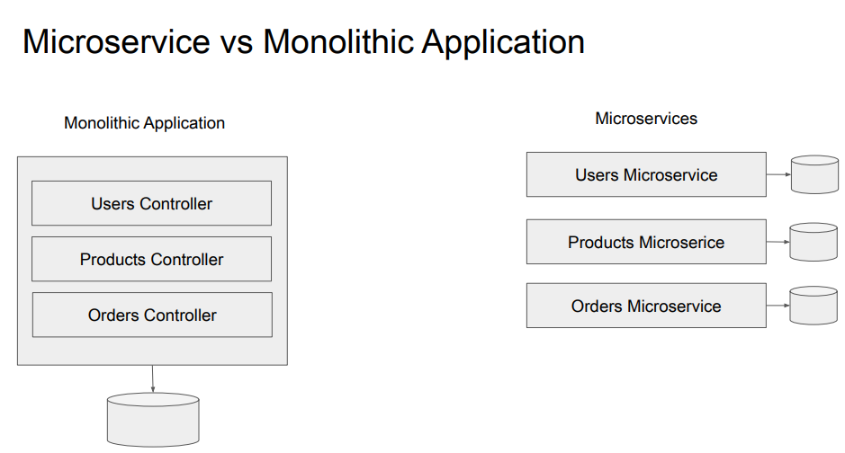
Monolithic:
* if you make a change to one controller you will need to rebuild and redeploy the entire application
* Uses a single database

Microservices
* Database per service pattern - each microservice works with its own database
* can be deployed independently and run on a separate server
---
### Microservices Communication
* One of the ways microservices can communicate with each other is by sending direct HTTP Request and wait for HTTP Response
* **Synchronous HTTP Request** - one microservice sends an HTTP Request to another and waits until it receives an HTTP Response
* **Asynchronous HTTP Request** - one microservice sends an HTTP Request to another and **will not wait** for an immediate request and will instead immediately continue executing the next job; the response will come later and it is callled Future Response
---
### Event-Driven Architecture with Apache Kafka
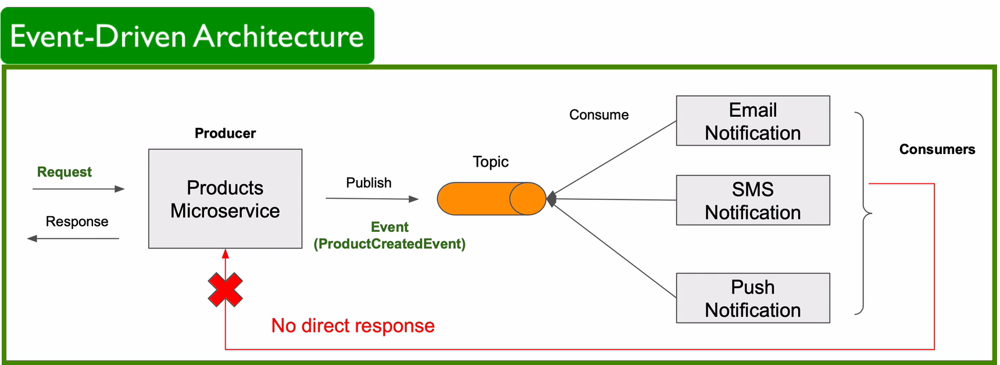
* If one microservice needs to contact multiple microservices, the direct HTTP Request/Response is no longer helpful
* Instead, we use **Apache Kafka** and **Event-Driven Architecture**
---
### Apache Kafka for Microservices
* **Apache Kafka** is a distributed event streaming platform that is used to collect, process, store and integrate data at scale

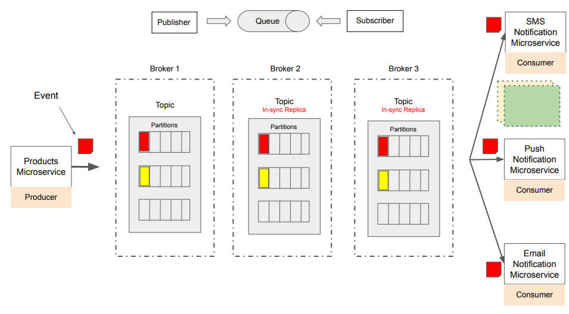
* if you lose one server you still have your data stored on other servers in kafka cluster
* a broker is a server that manages kafka topics, facilitates writes to partitions and handles replication
* topics store events
* producer publishes an event, this event gets stored in kafka topic, consumer microservices can read this event from that kafka topic
---
### Quiz 1
**Q1: What is Apache Kafka primarily used for?**  
**A: Distributed event streaming**  
Apache Kafka is primarily used as a distributed event streaming platform. It excels in collecting, processing, storing, and integrating large volumes of data in real-time. Kafka allows different systems and applications to publish (produce) and subscribe to (consume) streams of events, making it highly suitable for event-driven architectures.

**Q2: You can run multiple Apache Kafka servers in a cluster. True or False?**  
**A: True**   
Apache Kafka is designed to run as a cluster comprising multiple servers or nodes. This clustered environment is a fundamental aspect of Kafka's architecture, allowing it to achieve high availability, fault tolerance, and scalability. By running multiple servers in a cluster, Kafka can distribute the load and data across different nodes. This setup also ensures that if one server goes down, others in the cluster can continue to handle requests and process data, thereby maintaining the system's resilience and reliability.

**Q3: In the context of Apache Kafka, what is a Producer?**  
**A: A microservice that publishes events**  
This answer is correct. In Apache Kafka, a Producer is indeed a microservice, application, or process that publishes (produces) events or messages to Kafka topics. Producers send data to Kafka brokers, which then store the data in topics.  

**Q4: In the context of Apache Kafka, what is a Consumer?**   
**A: A microservice that consumes or reads events from Kafka topics**  
This answer is correct. In Apache Kafka, a Consumer is indeed a microservice or a process that consumes or reads events or messages from Kafka topics. Consumers subscribe to one or more Kafka topics and process the stream of records produced to those topics.

**Q5: In the context of Apache Kafka, what is a Broker?**   
**A: A server that manages Kafka topics, facilitates writes to partitions, and handles replication**  
In Apache Kafka, a Broker is indeed a server that performs several critical functions. It manages Kafka topics, handles the storage of data into topic partitions, manages replication of data for fault tolerance, and serves client requests (from both Producers and Consumers).

---
### Messages and Events in Apache Kafka
* In Apache Kafka, an event is an indication that something has happened
* Naming convention: `<Noun><PerformedAction><Event>`
* Kafka message carries event data inside (can be string, JSON, Avro, null)
* Kafka message is a key-value pair and has timestamp; can also have headers
---
### Kafka Topic and Partitions
* Topic is a place where kafka stored all published messages

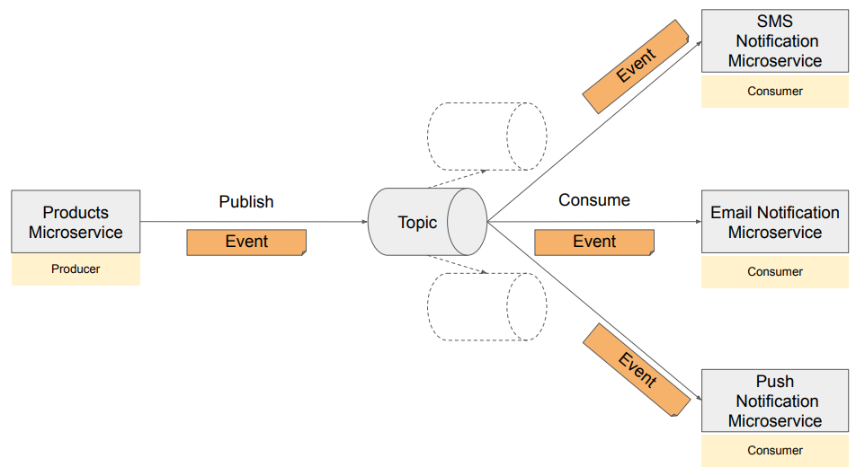
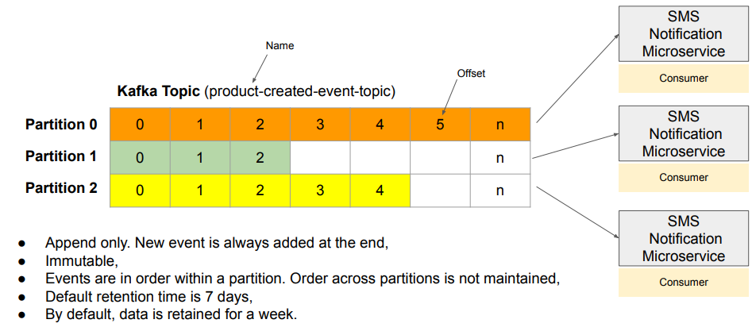

---
### Ordering of Events in Apache Kafka
* kafka will store events in the same partition with other events with the same message key

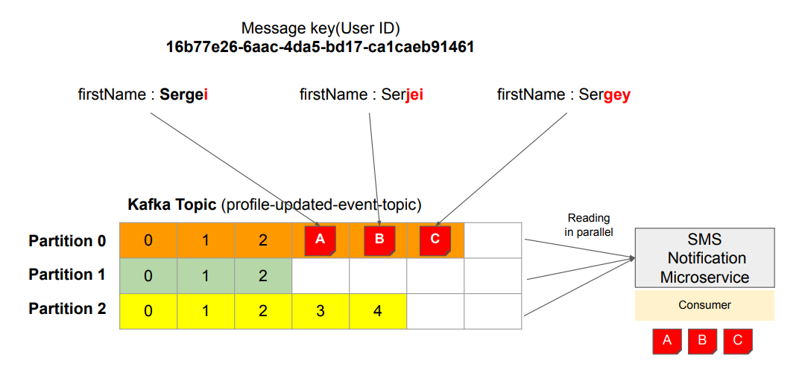

---
### Quiz 2
**Q1: What is a Kafka Topic primarily used for in the Kafka architecture?**   
**A: Organizing streams of messages for publish-subscribe systems**   
Kafka Topics are used to group, organize, and label your data streams so that you can easily send and receive data from them. For example, you can have a topic for weather data and another topic for traffic data. Producers can send data to any topic they want, and consumers can subscribe to any topic they are interested in.

**Q2: What does a Partition within a Kafka Topic represent?**   
**A: A division in the topic for load balancing and parallel processing**   
A topic is a category or a log for a stream of data. Partitions are used to split a topic into smaller pieces so that more than one server or consumer can handle the data at the same time. This helps to balance the workload and speed up the processing.

**Q3: How does Kafka ensure message ordering in a Topic Partition?**  
**A: By appending messages in the order they are sent within each partition**   
Kafka appends messages in the order they are sent within each partition. This means that the first message sent to a partition will be the first message read from that partition, and so on. Kafka does not use timestamps, random algorithms, or message size to order messages in a partition — it only considers the arrival time of messages from the producer.

**Q4: Can a single Kafka Topic have multiple Partitions?**  
**A: Yes**  
A Kafka Topic is like a folder where you can store and organize your data. A Kafka Topic can be divided into multiple smaller folders called partitions, which can be stored on different servers. This helps to distribute the workload and speed up the processing.

**Q5: How does Kafka ensure message ordering across partitions?**   
**A: By using a key for each message and partitioning by the hash of the key**   
Kafka uses keys to ensure message ordering across partitions. A key is an optional attribute of a message that can be used to group messages by some criteria. For example, you can use a user ID as a key to group messages by the same user. Kafka uses a hash function to map each key to a partition. This way, all messages with the same key will go to the same partition and will be ordered by their arrival time from the producer.  

**Q3: You can increase the number of partitions in a Kafka topic to scale. But once set, partitions can’t be reduced.**   
**A: True**   
As per the latest update of this quiz, the number of partitions can only be increased; decreasing the number of partitions is not possible.

---
## Apache Kafka Broker(s)
### What is Apache Kafka broker?
* you can think of it as Kafka server, a server that runs Kafka processes
* broker is a program that you run either on your physical computer or virtual machine
* starting multiple brokers in a cluster makes your system fault tolerant
* one broker will act as a leader and all other brokers will act as followers
* each broker hosts topics which stores events in partitions
---
### Apache Kafka broker: Leader and Follower roles and  Leadership balance
* followers replicate data from the leader in exact order it was written, maintaining data consistency
* leader is a single source of truth for all writes and reads in topic partition
* if the leader fails one of the followers can take over
* followers also allow you to scale your Kafka cluster horizontally
* each partition will have its own leader and its own follower
---
### Quiz 3
**Q1: What is the primary role of a broker in Apache Kafka?**   
**A: To store, manage, and distribute messages in the Kafka messaging system**    
A Kafka broker is an Apache Kafka component that stores, manages, and distributes messages in the Kafka messaging system. A broker hosts a set of partitions and handles incoming requests to write new events to those partitions or read events from them. It also handles replication of partitions between other brokers. This is the main function of a broker, as it enables Kafka to provide high-throughput, low-latency, and fault-tolerant data delivery.  

**Q2: How does Kafka ensure message durability?**   
**A: By replicating messages across multiple brokers**    
Kafka ensures message durability through replication. Each message published to a Kafka topic can be replicated across multiple brokers. This means that even if one broker fails, the data remains available on other brokers. Replication is a key feature in Kafka that guarantees high availability and durability of data.  

**Q3: What happens when a Kafka broker goes down?**   
**A: Kafka redistributes the load to other brokers**    
If a broker in a Kafka cluster goes down, Kafka redistributes the workload among the remaining brokers. This includes reassigning the leader for the partitions that were on the failed broker. Kafka’s distributed nature allows it to handle failures gracefully and maintain continuous operation.  

**Q4: What is the role of a Leader broker in a Kafka cluster?**   
**A: To handle all read and write requests for a specific partition**   
In Kafka, each partition of a topic has one leader broker. The leader handles all read and write requests for that partition. This centralizes data management, ensuring consistency and efficiency in data handling.  

**Q5: What is the role of a Follower broker in a Kafka cluster?**   
**A: To replicate data from the leader broker for the assigned partitions**   
The primary role of a follower broker is to replicate data from the leader broker for the assigned partitions. Followers continually fetch data from their leader to ensure data redundancy and high availability. If the leader broker fails, a follower can be elected as the new leader, ensuring the partition stays available and no data is lost.  

**Q6: What happens when a leader broker for a partition becomes unavailable?**    
**A: A follower broker is automatically elected as the new leader**   
Kafka’s high availability design includes automatic leader election. When a leader broker for a partition becomes unavailable, one of its follower brokers—already replicating the data—is promoted as the new leader. This guarantees continuous availability and accessibility of the partition.  

---
### Download Apache Kafka
* Download: https://kafka.apache.org/downloads
* Version 3.6.0

---
### Start single Apache Kafka broker with KRaft
Navigate to the kafka  folder
```
cd kafka_2.13-3.6.1/
```
Generate a unique ID for your Kafka cluster
```
./bin/kafka-storage.sh random-uuid
```
You should see something like this
```
kq23bZZYRbmYy2XQ0y2m4A
```
Format log directories using this unique ID
```
./bin/kafka-storage.sh format -t kq23bZZYRbmYy2XQ0y2m4A -c config/kraft/server.properties
```
Run:
```
./bin/kafka-server-start.sh config/kraft/server.properties
```
You should see
```
[2025-11-06 13:48:35,679] INFO [KafkaRaftServer nodeId=1] Kafka Server started (kafka.server.KafkaRaftServer)
```
To stop your current kafka server press:
```
CTRL + C
```
---
### Multiple Kafka broker: Configuration Files
Go to "C:\Users\sohai\kafka_2.13-3.6.1\config\kraft" and duplicate `server.properties` 3 times and rename them as shown in the image `server-1.properties`, `server-2.properties` and `server-3.properties`
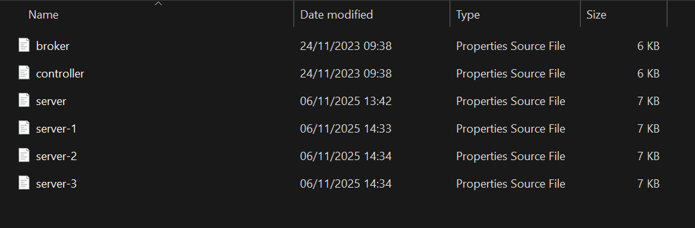

Open all 3 config files in a text editor and change the `node_id` for all 3 files
```
node.id=<INSERT SERVER NUMBER>
```
Change the listeners in server 2 to:
```
listeners=PLAINTEXT://:9094,CONTROLLER://:9095
```
Change the listeners in server 3 to:
```
listeners=PLAINTEXT://:9096,CONTROLLER://:9097
```
Change controller.quorom.voters in all 3 files to:
```
controller.quorum.voters=1@localhost:9093,2@localhost:9095,3@localhost:9097
```
Change the active listeners in server 2 to:
```
advertised.listeners=PLAINTEXT://localhost:9094
```
Change the active listeners in server 3 to:
```
advertised.listeners=PLAINTEXT://localhost:9096
```
In all 3 files change the log.dirs to:
```
log.dirs=/tmp/server-<INSERT SERVER NUMBER>/kraft-combined-logs
```

---
### Multiple Kafka broker: Configuration Files
In GitBash Run:
```
./bin/kafka-storage.sh random-uuid
```
You should see something like
```
f9R72gZhQi6L_dRJ4gvTWQ
```
Run
```
./bin/kafka-storage.sh format -t f9R72gZhQi6L_dRJ4gvTWQ -c config/kraft/server-1.properties
```
Then
```
./bin/kafka-storage.sh format -t f9R72gZhQi6L_dRJ4gvTWQ -c config/kraft/server-2.properties
```
Finally
```
./bin/kafka-storage.sh format -t f9R72gZhQi6L_dRJ4gvTWQ -c config/kraft/server-3.properties
```
You should see for all
```
Formatting /tmp/server-<INSERT SERVER NUMBER>/kraft-combined-logs with metadata.version 3.6-IV2.
```

---
### Starting multiple Kafka broker with KRaft

In 3 separate GitBash windows run:
```
./bin/kafka-server-start.sh config/kraft/server-<INSERT SERVER NUMBER>.properties
```
You should see all 3 up and running

---
### Stopping Apache Kafka brokers
* Stopping Producers and Consumers first
  * avoid losing messages
  * avoid errors
* Stopping Kafka Server
  * `CTRL + C`
  * `kafka-server-stop.sh` - graceful shutdown

Running in a new terminal:
```
./bin/windows/kafka-server-stop.bat
```
You should see for all 3 servers
```
Instance deletion successful.
```
---
## Kafka CLI: Topics
### Introduction to Kafka Topic CLI
Kafka CLI: `kafka-topics.sh` can be used to:
* create a new topic
* list
* describe
* delete
* modify

---
### Creating a new Kafka topic
Start your Kafka cluster
```
cd kafka_2.13-3.6.1/
./bin/kafka-storage.sh random-uuid
./bin/kafka-storage.sh format -t RomNcfLEQFeuXCGdC2UuGg -c config/kraft/server.properties
./bin/kafka-server-start.sh config/kraft/server.properties
```
Open a separate terminal and cd into bin folder
```
cd kafka_2.13-3.6.1/bin
```
To create a kafka topic run
```
./kafka-topics.sh --create --topic topic1 --partitions 3 --replication-factor 1 --bootstrap-server localhost:9092
```
To create a new topic just change the topic name
```
./kafka-topics.sh --create --topic topic2 --partitions 3 --replication-factor 1 --bootstrap-server localhost:9092
```
---
### List and describe Kafka topics
To list topics
```
./kafka-topics.sh --list --bootstrap-server localhost:9092
```
You should see
```
topic1
topic2
```
To describe topics
```
./kafka-topics.sh --describe --bootstrap-server localhost:9092
```
You should see
```
        Topic: topic1   Partition: 0    Leader: 1       Replicas: 1     Isr: 1
        Topic: topic1   Partition: 1    Leader: 1       Replicas: 1     Isr: 1
        Topic: topic1   Partition: 2    Leader: 1       Replicas: 1     Isr: 1
Topic: topic2   TopicId: 64TEESfASQuIWdJ1EusmHQ PartitionCount: 3       ReplicationFactor: 1    Configs: segment.bytes=1073741824
        Topic: topic2   Partition: 0    Leader: 1       Replicas: 1     Isr: 1
        Topic: topic2   Partition: 1    Leader: 1       Replicas: 1     Isr: 1
        Topic: topic2   Partition: 2    Leader: 1       Replicas: 1     Isr: 1
```
---
### Deleting Kafka Topic
To delete kafka topic whilst in the bin folder
```
./kafka-topics.sh --delete --topic topic1 --bootstrap-server localhost:9092
```
To confirm its gone run
```
./kafka-topics.sh --list --bootstrap-server localhost:9092
```

---
## Kafka CLI: Producers
### Introduction to Kafka Producer CLI
The main use of `kafka-console-producer.sh` script is to send a message to a particular Kafka topic:
* send message with a key
* send message without a key
* send multiple messages from a file 

---
### Producing Kafka Message without a Key
Start your kafka cluster and in a separate folder `cd` into your bin folder
```
cd kafka_2.13-3.6.1/bin
```
Run the following script
```
./kafka-console-producer.sh --bootstrap-server localhost:9092 --topic my-topic
```
* if you send a message to a topic like `Hello world` that does not exist kafka producer will respond with error but will also automatically create it
* best practice is to create the topic first then send the message

To stop sending messages press `CTRL + C`

---
### Sending Kafka Message as a Key:Value Pair
* messages sent with the same key are stored in the same partition so they are ordered

Run
```
./kafka-console-producer.sh --bootstrap-server localhost:9092 --topic my-topic --property "parse.key=true" --property "key.separator=:"
```
Then you can start sending messages as a key value pair
```
>firstName:Saif
```

---
## Kafka CLI: Consumers
### Introduction to Kafka Consumer CLI

The main use of `kafka-console-consumer.sh` is to fetch and display messages from a Kafka topic to your terminal
* read new messages only
* read all messages from the beginning

---
### Consuming messages from Kafka topic from the beginning
In a separate folder `cd` into your bin folder
```
cd kafka_2.13-3.6.1/bin
```
Run
```
./kafka-console-consumer.sh --topic my-topic --from-beginning --bootstrap-server localhost:9092
```
You should see all the messages sent in order

Open another window and run producer script
```
./kafka-console-producer.sh --bootstrap-server localhost:9092 --topic my-topic
```
Send a message like
```
>Hello world 5
```
You should see it show up in the other window below the list of previous messages (consumer)

Open a new window and run the same consumer script
```
./kafka-console-consumer.sh --topic my-topic --from-beginning --bootstrap-server localhost:9092
```
Go back to the producer window and send another message
```
>Hello world 6
```
You should see it show up in both consumer windows

---
### Consuming new Kafka messages only
Dont use the `--from-beginning` parameter
```
./kafka-console-consumer.sh --topic my-topic --bootstrap-server localhost:9092
```
Go back to the producer window and send another message
```
>Hello world 7
```
You should see that only `Hello world 7` is shown not any previous messages

---
### Consuming Key:Value pair messages from Kafka topic
Use `CTRL + C` to stop the producer script and then Run
```
./kafka-console-producer.sh --bootstrap-server localhost:9092 --topic my-topic --property "parse.key=true" --property "key.separator=:"
```
Stop one of the consumers using `CTRL + C` and then run in the consumer window
```
./kafka-console-consumer.sh --topic my-topic --bootstrap-server localhost:9092
```
In the producer window run
```
>firstName:Saif
```
You will see it in both consumer windows

Stop one of the consumers using `CTRL + C` and then run in the consumer window
```
./kafka-console-consumer.sh --topic my-topic --bootstrap-server localhost:9092 --property print.key=true
```
In the producer window run
```
>lastName:Ahmed
```
You should see in the consumer window the key and the value
```
lastName      Ahmed
```
To explicitly display all messages from the beginning with key and value 
```
./kafka-console-consumer.sh --topic my-topic --bootstrap-server localhost:9092 --property print.key=true --property print.value=true --from-beginning
```
You should see all the previous messages with a key and a value

To hide the value run
```
./kafka-console-consumer.sh --topic my-topic --bootstrap-server localhost:9092 --property print.key=true --property print.value=false --from-beginning
```
---
### Consuming Kafka messages in order
Create a new topic
```
./kafka-topics.sh --create --topic messages-order --partitions 3 --replication-factor 3 --bootstrap-server localhost:9092
```
You should see
```
Created topic messages-order
```
Run to produce messages
```
./kafka-console-producer.sh --topic messages-order --bootstrap-server localhost:9092 --property "parse.key=true" --property "key.separator=:"
```
Type these messages with the same key `1`
```
1:First message
1:Second message
1:Third message
1:Fourth message
1:Fifth message
1:Sixth message
```
Then send messages each with a different key
```
a:a
b:b
c:c
d:d
e:e
f:f
g:g
```
Press `CTRL + C` and Run
```
./kafka-console-consumer.sh --topic messages-order --bootstrap-server localhost:9092 --from-beginning --property print.key=true
```
You should see messages with the same key are ordered and those that have different keys are not ordered

---
## Kafka Producer - Spring Boot Microservice
### Introduction to Kafka Producer
* the primary role of kafka producer is to publish events or messages to one or more kafka topics
* we use spring for apache kafka library
* another responsibility of kafka producer is to serialize messages to binary format
* another responsibility is to specify topic name
* an optional responsibility is to specify topic partition
* another responsibility is to choose which partition to write event data to 
---
### Kafka Producer - Introduction to synchronous communication style
Communication Style
* Synchronous
* Asynchronous

Sending Message Synchronously
* sender sends a request and then waits for a response before proceeding
* if orders microservice wants to know that the order created event was successfully stored in kafka broker it will use kafka producer to send kafka message using synchronous communication style
* because kafka producer is waiting for a response it is blocked or put on hold until the response from kafka broker is received

---
### Kafka Producer - A use case for asynchronous communication style
Sending Messages Asynchronously
* kafka producer sends a message to kafka broker but it is not put on hold after and it is not blocked whilst waiting for response from kafka broker
* it will still receive a response from broker but at a later point

---
### Quiz 4

**Q1: What is the primary function of a Kafka Producer?** 
**A: To write data to Kafka topics**  
This answer is correct. The main role of a Kafka Producer is to write data to Kafka topics. Producers are client applications that send streams of data to topics within the Kafka cluster. The producer determines which topic the data should be sent to and can also specify a key that influences the partition within the topic to which the data is sent.  

**Q2: How does a Kafka Producer determine which partition to send a message to?**   
**A: Based on a provided message key or round-robin if no key is provided.**  
This answer is correct. Kafka Producers use a message key to determine which partition a message should be sent to within a topic. If a key is provided, Kafka consistently assigns all messages with that key to the same partition. If no key is provided, Kafka uses a round-robin method to distribute messages evenly across the available partitions.

**Q3: What library is typically used to integrate Kafka functionality into a Spring Boot application?**   
**A: Spring for Apache Kafka**  
This answer is correct. Spring for Apache Kafka is the library commonly used for integrating Kafka with a Spring Boot application. It simplifies the process of working with Kafka by providing a higher-level abstraction that fits well within the Spring ecosystem, making it easier to send and receive messages to and from Kafka topics.  

**Q4: In a Kafka Producer, what is the responsibility related to message serialization?**   
**A: To serialize messages into a binary format for transmission**  
This answer is correct. One of the key responsibilities of a Kafka Producer is to serialize messages into a binary format before they are transmitted over the network to Kafka brokers. Serialization converts the message data, which might be in various formats (like strings, objects, etc.), into a standard binary format that can be efficiently transmitted and stored in Kafka.  

**Q5: In the context of the Orders Microservice acting as a Kafka Producer, what characterizes the synchronous communication style with the Kafka Broker?**   
**A: The Orders Microservice sends an Order Created Event and waits for an acknowledgment from the Kafka Broker before responding back to the Mobile Application.**    
This answer is correct. This option accurately reflects the synchronous communication style as described. In synchronous communication, the sender (in this case, the Orders Microservice) waits for a response after sending a request (the Order Created Event) to ensure that the message was successfully stored in the Kafka Broker. This approach is used when the sender needs confirmation of successful message delivery, such as when creating an order, and it is crucial to know whether the operation was successful before proceeding.

**Q6: How does the Kafka Producer behave when sending a User LoggedIn Event to the Kafka Broker asynchronously?**  
**A: The Kafka Producer sends the User LoggedIn Event and continues its execution right away without waiting for an acknowledgment from the Kafka Broker**  
This answer is correct. This option correctly represents asynchronous communication. In asynchronous communication, the Kafka Producer sends the User LoggedIn Event to the Kafka Broker and then immediately proceeds with its next task without waiting for a response from the Kafka Broker. This approach allows for efficient processing, especially in scenarios where immediate confirmation of message delivery is not critical.  

---
### Creating a new Spring Boot project
Visit in broswer: https://start.spring.io/

The settings you must choose:
* Project - Maven
* Language - Java
* Spring Boot - Latest stable version (3.5.7)
* Project Metadata
  * Group - com.appsdeveloperblog.ws
  * Artifact - ProductsMicroservice
  * Name - ProductsMicroservice
  * Description - Products Microservice
  * Package name - com.appsdeveloperblog.ws.products
  * Packaging - Jar
  * Java - 17

Add the following dependencies:
* Spring Web
* Spring for Apache Kafka

Click on the generate button which will download it to your computer

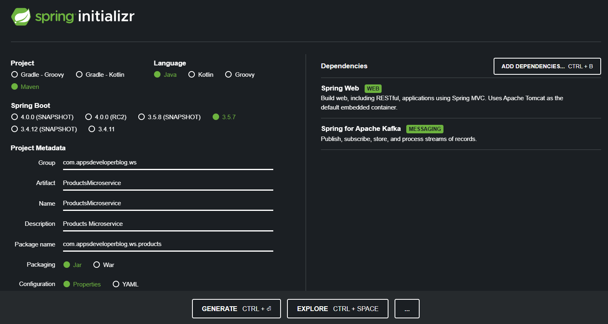

Unzip it to a folder called `Event-driven-microservices-with-apache-kafka`

Install the Spring Boot Tools Suite

Open the folder `Event-driven-microservices-with-apache-kafka`

---
### Kafka Producer configuration properties
Navigate to `ProductsMicroservices/src/main/resources/application.properties` and paste the following code:
```
server.port=0

spring.kafka.producer.bootstrap-servers=localhost:9092, localhost:9094
spring.kafka.producer.key-serializer=org.apache.kafka.common.serialization.StringSerializer
spring.kafka.producer.value-serializer=org.springframework.kafka.support.serializer.JsonSerializer
```

---
### Creating Kafka Topic

Create a new class `KafkaConfig.java` in the path: `src\main\java\com\appsdeveloperblog\KafkaConfig.java`

Paste the following content:
```
package com.appsdeveloperblog;

import java.util.Map;

import org.apache.kafka.clients.admin.NewTopic;
import org.springframework.context.annotation.Bean;
import org.springframework.context.annotation.Configuration;
import org.springframework.kafka.config.TopicBuilder;

@Configuration
public class KafkaConfig {

    @Bean
    NewTopic createTopic() {
        return TopicBuilder.name("product-created-events-topic")
                .partitions(3)
                .replicas(3)
                .configs(Map.of("min.insync.replicas", "2"))
                .build();
    }
}
```

---
### Run Microservice to create a new Kafka topic
Make sure your kafka service is up and running

Run `KafkaConfig.java` by starting the application

In a GitBash terminal, change directories to the kafka folder

To check if the topic exists run:
```
./bin/kafka-topics.sh --bootstrap-server localhost:9092 --describe --topic product-created-events-topic
```
You should see the new topic with 3 partitions 

---
### Creating Rest Controller
Create `ProductController.java` in the main root of your folder and put it to a package called `rest`

Paste this inside:
```
package com.appsdeveloperblog.ws.products.rest;

import org.springframework.http.HttpStatus;
import org.springframework.http.ResponseEntity;
import org.springframework.web.bind.annotation.PostMapping;
import org.springframework.web.bind.annotation.RequestBody;
import org.springframework.web.bind.annotation.RequestMapping;
import org.springframework.web.bind.annotation.RestController;

@RestController
@RequestMapping("/products") // http://localhost:<port>/products
public class ProductController {

    @PostMapping
    public ResponseEntity<String> createProduct(@RequestBody CreateProductRestModel product) {
        return ResponseEntity.status(HttpStatus.CREATED).body("");
    }
}
```
Hover over `CreateProductRestModel` and click create class

Paste this in:
```
package com.appsdeveloperblog.ws.products.rest;

import java.math.BigDecimal;

public class CreateProductRestModel {

    private String title;
    private BigDecimal price;
    private Integer quantity;

    public String getTitle() {
        return title;
    }

    public void setTitle(String title) {
        this.title = title;
    }

    public BigDecimal getPrice() {
        return price;
    }

    public void setPrice(BigDecimal price) {
        this.price = price;
    }

    public Integer getQuantity() {
        return quantity;
    }

    public void setQuantity(Integer quantity) {
        this.quantity = quantity;
    }
}
```

---
### Creating a Service class
Select the root package and create a new interface `ProductService`. Put it into a new package called `service`

Paste this in:
```
package com.appsdeveloperblog.ws.products.service;

import org.springframework.stereotype.Service;
import com.appsdeveloperblog.ws.products.rest.CreateProductRestModel;

@Service
public class ProductServiceImpl implements ProductService {

    @Override
    public String createProduct(CreateProductRestModel productRestModel) {
        // TODO Auto-generated method stub
        return null;
    }
}
```

In the same package create a new class `ProductServiceImpl`. Click on the add button and choose `ProductService`

Change `ProductController.java`:
```
package com.appsdeveloperblog.ws.products.rest;

import org.springframework.http.HttpStatus;
import org.springframework.http.ResponseEntity;
import org.springframework.web.bind.annotation.PostMapping;
import org.springframework.web.bind.annotation.RequestBody;
import org.springframework.web.bind.annotation.RequestMapping;
import org.springframework.web.bind.annotation.RestController;

import com.appsdeveloperblog.ws.products.service.ProductService;

@RestController
@RequestMapping("/products") // http://localhost:<port>/products
public class ProductController {

    ProductService productService;

    public ProductController(ProductService productService) {
        this.productService = productService;
    }

    @PostMapping
    public ResponseEntity<String> createProduct(@RequestBody CreateProductRestModel product) {
        
        String productId = productService.createProduct(product);
        
        return ResponseEntity.status(HttpStatus.CREATED).body("productId");
    }
}
```

---
### Creating an Event class
In the same service package create a class `ProductCreatedEvent` and package `service`

Paste:
```
package com.appsdeveloperblog.ws.products.service;

import java.math.BigDecimal;

public class ProductCreatedEvent {

    private String productId;
    private String title;
    private BigDecimal price;
    private Integer quantity;

    public ProductCreatedEvent() {
    }

    public ProductCreatedEvent(String productId, String title, BigDecimal price, Integer quantity) {
        this.productId = productId;
        this.title = title;
        this.price = price;
        this.quantity = quantity;
    }
}
```

Right click the mouse and click `Generate Getters and Setters...` and select all fields.

---
### Kafka Producer: Send Message Asynchronously

Open `ProductServiceImpl.java` and paste so it looks like this:
```
package com.appsdeveloperblog.ws.products.service;

import java.util.UUID;
import java.util.concurrent.CompletableFuture;

import org.apache.kafka.clients.producer.RecordMetadata;
import org.springframework.kafka.core.KafkaTemplate;
import org.springframework.kafka.support.SendResult;
import org.springframework.stereotype.Service;
import org.slf4j.Logger;
import org.slf4j.LoggerFactory;

import com.appsdeveloperblog.ws.products.rest.CreateProductRestModel;

@Service
public class ProductServiceImpl implements ProductService {

    KafkaTemplate<String, ProductCreatedEvent> kafkaTemplate;
    private final Logger LOGGER = LoggerFactory.getLogger(this.getClass());

    public ProductServiceImpl(KafkaTemplate<String, ProductCreatedEvent> kafkaTemplate) {
        this.kafkaTemplate = kafkaTemplate;
    }

    @Override
    public String createProduct(CreateProductRestModel productRestModel) {

        String productId = UUID.randomUUID().toString();

        // TODO: Persist Product Details into database table before publishing an Event

        ProductCreatedEvent productCreatedEvent = new ProductCreatedEvent(
            productId,
            productRestModel.getTitle(),
            productRestModel.getPrice(),
            productRestModel.getQuantity()
        );

        CompletableFuture<SendResult<String, ProductCreatedEvent>> future =
            kafkaTemplate.send("product-created-events-topic", productId, productCreatedEvent);

        future.whenComplete((result, exception) -> {

            if (exception != null) {
                LOGGER.error("Failed to send message: " + exception.getMessage());
            } else {
                LOGGER.info("Message sent successfully: " + result.getRecordMetadata());
            }

        });

        return productId;
    }
}
```

---
### Kafka Asynchronous Send. Trying how it works.

Add before `return productId;`

```
LOGGER.info("Returning product id")
```

Go to terminal window and make sure your kafka servers are running

Then run the consumer script
```
./bin/kafka-console-consumer.sh --topic product-created-events-topic --bootstrap-server localhost:9092 --property print.key=true
```

Go back and press the spring boot button to show the boot dashboard then start up ProductsMicroservice.

Go to Postman and create a new HTTP POST Request sent to ProductsMicroservice running on local host. 

Look at the logs to see that `Tomcat  started on port 58806` so that is the port we will use.

The link should be
```
http://localhost:58806/products
```
Click the body tab, select raw and JSON

Provide a JSON payload by typing the following code:
```
{
  "title": "iPhone 11",
  "price": 800,
  "quantity": 19
}
```

Click Send to send the request and you should see a successful response with the productId 

---
### Kafka Producer: Send Message Synchronously

1st way:
 Before `LOGGER.info` add 
 ```
future.join():
 ```

another way is:

Remove this block
```
future.whenComplete((result, exception) -> {

    if (exception != null) {
        LOGGER.error("Failed to send message: " + exception.getMessage());
    } else {
        LOGGER.info("Message sent successfully: " + result.getRecordMetadata());
    }

});
```
Then change
```
CompletableFuture<SendResult<String, ProductCreatedEvent>> future = kafkaTemplate.send("product-created-events-topic", productId, productCreatedEvent);
```
to
```
SendResult<String, ProductCreatedEvent> result = kafkaTemplate.send("product-created-events-topic", productId, productCreatedEvent).get();
```
then change
```
@Override
    public String createProduct(CreateProductRestModel productRestModel) {
```
to
```
@Override
    public String createProduct(CreateProductRestModel productRestModel) throws Exception {
```
then open `ProductService.java` and change
```
String createProduct(CreateProductRestModel productRestModel) throws Exception ;
```

---
### Kafka Producer: Handle Exception in Rest Controller

Open `ProductController.java` and fix the compile time error

Hover over the error message on `createProduct` and click `Surround with try/catch`

Create a new class in the same package as the controller called `ErrorMessage`

Paste so it looks like this
```
package com.appsdeveloperblog.ws.products.rest;

import java.util.Date;

public class ErrorMessage {
    
    private Date timestamp;
    private String message;
    private String details;
    
    public ErrorMessage() {
    }
    
    public ErrorMessage(Date timestamp, String message, String details) {
        super();
        this.timestamp = timestamp;
        this.message = message;
        this.details = details;
    }
}
```
Then right click and click `Source` then `Generate Getters and Setters...`. Select all fields and click `Generate`

Finally change `ProductController.java` so it looks like this
```
package com.appsdeveloperblog.ws.products.rest;

import java.util.Date;

import org.slf4j.LoggerFactory;

package com.appsdeveloperblog.ws.products.rest;
import org.springframework.http.HttpStatus;
import org.springframework.http.ResponseEntity;
import org.springframework.web.bind.annotation.PostMapping;
import org.springframework.web.bind.annotation.RequestBody;
import org.springframework.web.bind.annotation.RequestMapping;
import org.springframework.web.bind.annotation.RestController;

import com.appsdeveloperblog.ws.products.service.ProductService;

@RestController
@RequestMapping("/products") //http://localhost:<port>/products
public class ProductController {
    
    ProductService productService;
    private final Logger LOGGER = LoggerFactory.getLogger(this.getClass());
    
    public ProductController(ProductService productService) {
        this.productService = productService;
    }
    
    @PostMapping
    public ResponseEntity<Object> createProduct(@RequestBody CreateProductRestModel product) {
        
        String productId;
        try {
            productId = productService.createProduct(product);
        } catch (Exception e) {
            //e.printStackTrace();
            LOGGER.error(e.getMessage(), e);
            return ResponseEntity.status(HttpStatus.INTERNAL_SERVER_ERROR)
                    .body(new ErrorMessage(new Date(), e.getMessage(), "/products"));
        }
        
        return ResponseEntity.status(HttpStatus.CREATED).body(productId);
    }
}
```

---
### Kafka Producer: Logging Record Metadata Information

Open `ProductServiceImpl.java` and add this line before `SendResult<String, ProductCreatedEvent> result = kafkaTemplate.send("product-created-events-topic", productId, productCreatedEvent).get();`

```
LOGGER.info("Before publishing a ProductCreatedEvent");
```

Then after `SendResult<String, ProductCreatedEvent> result = kafkaTemplate.send("product-created-events-topic", productId, productCreatedEvent).get();` write

```
LOGGER.info("Partition: " + result.getRecordMetadata().partition());
LOGGER.info("Topic: " + result.getRecordMetadata().topic());
LOGGER.info("Offset: " + result.getRecordMetadata().offset());
```

---
### Kafka Synchronous Send. Trying how it works.

Ensure you have kafka servers running

Expand the spring boot dashboard and start up ProductMicroservice

Find the port number that it is running in the console and now go to terminal and start up kafka consumer script

```
./bin/kafka-console-consumer.sh --topic product-created-events-topic --bootstrap-server localhost:9092 --property print.key=true
```

Go to Postman and create a new HTTP POST Request sent to ProductsMicroservice running on local host. 

The link should be
```
http://localhost:<PORT-NUMBER>/products
```
Click the body tab, select raw and JSON

Provide a JSON payload by typing the following code:
```
{
  "title": "iPhone 11",
  "price": 800,
  "quantity": 19
}
```

Click Send to send the request and you should see a successful response

---
## Kafka Producer: Acknowledgements & Retires
### Kafka Producer Acknowledgement: Introduction

* **spring.kafka.producer.acks=all** Waits for an acknowledgement from all brokers.

* **spring.kafka.producer.acks=1** Waits for an acknowledgement from a leader broker only.

* **spring.kafka.producer.acks=0** Does not wait for an acknowledgement.

* Kafka producer will wait for acknowledgement not just from any broker but only from in-sync replicas
* you can configure the minimum number of replicas that you want to receive an acknowledgment from with `--config min.insync.replicas=`
---
### Kafka Producer Retries: Introduction

When kafka producer sends a message to a broker there can be:

* **No response** – if the producer is configured with `acks=0`  
* **Acknowledgement (ACK)** of Successful Storage  
* **Non-Retryable Error** – A permanent problem that is unlikely to be resolved by retries.  
* **Retryable Error** – A temporary problem that can be resolved by retrying the send operation.  

* `spring.kafka.producer.retries=10` How many times Kafka Producer will try to send a message before marking it as failed. Default value is `2147483647`.

`spring.kafka.producer.properties.retry.backoff.ms=1000` How long the producer will wait before attempting to retry a failed request. Default value is `100 ms`.

* `spring.kafka.producer.properties.delivery.timeout.ms=120000` The maximum time the Producer can spend trying to deliver the message. Default value is `120000 ms` (2 minutes).

```
delivery.timeout.ms >= linger.ms + request.timeout.ms
```

* `spring.kafka.producer.properties.linger.ms=0` The maximum time in milliseconds that the producer will wait and buffer data before sending a batch of messages.  
The default value is `0`.

* `spring.kafka.producer.properties.request.timeout.ms=30000` The maximum time to wait for a response from the broker after sending a request. The default value is `30000 ms`.
---
### Configure Producer Acknowledgments in Spring Boot Microservice

Open `application.properties` in `src/main/resources` and add one additional configuration used to configure acknowledgments mode for kafka producer

```
spring.kafka.producer.acks=1
```

* if we change `1` to `all` this will mean that producer will now wait for acknowledgment from all in-sync replicas
* this provides the strongest durability gurantee because it ensures that all replicas have received and persisted our message
---
### The min.insync.replicas configuration

Open a terminal window and `cd` into the kafka folder

to configure the minimum amount of in-sync replicas property at the time of creating a new topic:
```
/bin/kafka-topics.sh --create --topic insync-topic --partitions 3 --replication-factor 3 --bootstrap-server localhost:9092 --config min.insync.replicas=2
```

to configure minimum in-sync replicas for already existing topic which was `topic2`
```
./bin/kafka-configs.sh --bootstrap-server localhost:9092 --alter --entity-type topics --entity-name topic2 --add-config min.insync.replicas=2
```
---
### Trying how the min.insync.replicas works

run server 1,2 and 3 in separate windows

run the kafka consumer script
```
./bin/kafka-console-consumer.sh --topic topic2 --bootstrap-server localhost:9092
```

update `ProductServiceImpl.java` to send messages to topic 2:

from
```
SendResult<String, ProductCreatedEvent> result = kafkaTemplate.send("product-created-events-topic", productId, productCreatedEvent).get();
```
to:
```
SendResult<String, ProductCreatedEvent> result = kafkaTemplate.send("topic2", productId, productCreatedEvent).get();
```
Start up the microservice and copy the port number on which it is running on.

Open Postman and send the request and check it is successful in the terminal

Stop one server, send the request again and see that it is still successful.

Stop one more server, send the request again and see that you receive an error because the producer is expecting acknowlegment from 2 servers and only 1 is running

---
### Kafka Producer Retries

Add to `application.properties`
```
spring.kafka.producer.retries=10
spring.kafka.producer.properties.retry.backoff.ms=1000
```
This will send 10 retries, 1 every 1000ms.

---
### Trying how Kafka Producer Retries work

Make sure you have all kafka brokers running

Start up `ProductsMicroservice` and copy the port number it started on

Update the port number on Postman and send the HTTP request. You will see a successful response.

Stop one server, send the request again and see that it is still successful.

Stop one more server, send the request again and see that you receive an error because the producer is expecting acknowlegment from 2 servers and only 1 is running

Go to the logs and you will see that it tries to send 10 retries, 1 every 1000ms and an error message in Postman

---
### Kafka Producer Delivery & Request Timeout

Comment out in `application.properties`
```
#spring.kafka.producer.retries=10
#spring.kafka.producer.properties.retry.backoff.ms=1000
```
and add
```
spring.kafka.producer.properties.delivery.timeout.ms=120000

spring.kafka.producer.properties.linger.ms=0
spring.kafka.producer.properties.request.timeout.ms=30000
```
---
### Trying how Kafka Producer Delivery & Request Timeout works

Make sure you have all kafka brokers running

Start up `ProductsMicroservice` and copy the port number it started on

Update the port number on Postman and send the HTTP request. You will see a successful response.

Stop 2 kafka brokers to activate retry behaviour 

Go to Postman and send the request. Go to yout console logs and you will see it retries for the allotted 2 minutes until it timeouts

---
### Quiz 5: Quiz: Kafka Producer Acknowledgements and Retries

**Q1: What does the 'acks' configuration in a Kafka Producer specify?**
**A: The acknowledgment level required from the Kafka cluster for successful message delivery.** 
The 'acks' configuration in a Kafka Producer determines the level of acknowledgment required from the Kafka cluster for a message to be considered successfully delivered. For example, 'acks=0' means the producer will not wait for any acknowledgment, 'acks=1' means waiting for an acknowledgment from the leader broker only, and 'acks=all' means waiting for acknowledgments from all in-sync replicas.

**Q2: What is the impact of setting 'acks=all' in a Kafka Producer configuration?**  
**A: It ensures higher data durability by requiring acknowledgment from all in-sync replicas.**  
The 'acks=all' setting in a Kafka Producer configuration ensures higher data durability. This is because it requires acknowledgments from all in-sync replicas before considering the message successfully sent, reducing the likelihood of data loss in case of broker failure.

**Q3: What is a possible drawback of setting 'acks=0' in a Kafka Producer?**  
**A: It may lead to data loss as the producer does not wait for any acknowledgment from brokers.**  
This answer is correct. One of the main drawbacks of setting 'acks=0' in a Kafka Producer is the increased risk of data loss. In this configuration, the producer sends messages without waiting for any acknowledgment from the brokers, which means it won't know if the message was not received or stored by the Kafka cluster.

**Q4: What does the 'retries' configuration in a Kafka Producer control?**  
**A: The number of times the producer will attempt to resend a message after a send failure.**  
This answer is correct. The 'retries' configuration in a Kafka Producer specifies the number of retry attempts the producer will make if a message send fails. This is crucial for ensuring message delivery in the event of transient issues, such as temporary network problems or brief broker unavailability.

**Q5: How does the 'retry.backoff.ms' setting affect Kafka Producer retries?**  
**A: It specifies the time to wait before attempting a message retry after a failure.**  
This answer is correct. The 'retry.backoff.ms' setting in a Kafka Producer specifies the amount of time to wait before attempting another retry after a send failure. This backoff time is crucial to prevent overloading the network or broker with rapid successive retries.

---
### Kafka Producer Spring Bean Configuration

Open `KafkaConfig.java`

Add a new method
```
Map<String, Object> producerConfigs() {
    Map<String, Object> config = new HashMap<>();
    
    return config;
}

```
Hover over `HashMap` with your mouse and click `Import HashMap`

Now paste so your file looks like this
```
package com.appsdeveloperblog.ws.products;

import java.util.HashMap;
import java.util.Map;

import org.apache.kafka.clients.admin.NewTopic;
import org.apache.kafka.clients.producer.ProducerConfig;
import org.springframework.beans.factory.annotation.Value;
import org.springframework.context.annotation.Bean;
import org.springframework.context.annotation.Configuration;
import org.springframework.kafka.config.TopicBuilder;
import org.springframework.kafka.core.DefaultKafkaProducerFactory;
import org.springframework.kafka.core.KafkaTemplate;
import org.springframework.kafka.core.ProducerFactory;
import com.appsdeveloperblog.ws.core.ProductCreatedEvent;

@Configuration
public class KafkaConfig {
	
	@Value("${spring.kafka.producer.bootstrap-servers}")
	private String bootstrapServers;
	
    @Value("${spring.kafka.producer.key-serializer}")
    private String keySerializer;

    @Value("${spring.kafka.producer.value-serializer}")
    private String valueSerializer;

    @Value("${spring.kafka.producer.acks}")
    private String acks;

    @Value("${spring.kafka.producer.properties.delivery.timeout.ms}")
    private String deliveryTimeout;

    @Value("${spring.kafka.producer.properties.linger.ms}")
    private String linger;

    @Value("${spring.kafka.producer.properties.request.timeout.ms}")
    private String requestTimeout;
	
	Map<String, Object> producerConfigs() {
		Map<String, Object> config = new HashMap<>();
		
		config.put(ProducerConfig.BOOTSTRAP_SERVERS_CONFIG, bootstrapServers);
		config.put(ProducerConfig.KEY_SERIALIZER_CLASS_CONFIG, keySerializer);
		config.put(ProducerConfig.VALUE_SERIALIZER_CLASS_CONFIG, valueSerializer);
		config.put(ProducerConfig.ACKS_CONFIG, acks);
		config.put(ProducerConfig.DELIVERY_TIMEOUT_MS_CONFIG, deliveryTimeout);
		config.put(ProducerConfig.LINGER_MS_CONFIG, linger);
		config.put(ProducerConfig.REQUEST_TIMEOUT_MS_CONFIG, requestTimeout);
		
		return config;
	}
	
	@Bean
	ProducerFactory<String, ProductCreatedEvent> producerFactory() {
		return new DefaultKafkaProducerFactory<>(producerConfigs());
	}
	
	@Bean
	KafkaTemplate<String, ProductCreatedEvent> kafkaTemplate() {
		return new KafkaTemplate<String, ProductCreatedEvent>(producerFactory());
	}
	
	@Bean
	NewTopic createTopic() {
		return TopicBuilder.name("product-created-events-topic")
				.partitions(3)
				.replicas(3)
				.configs(Map.of("min.insync.replicas","2"))
				.build();
	}

}
```
---
## Idempotent Producer in Kafka
### Introduction to Idempotent Kafka Producer

* an idempotent producer avoids duplicate messages in the log in the presence of failures and retries
* enable.idempotence = true
* by default this configuration property is enabled but we should still explictly enable it

---
### Enable Kafka Producer Idempotence in application.properties

Go to `application.properties`

Add 
```
spring.kafka.producer.properties.enable.idempotence=true
```
and make sure this is less or equal to 5
```
spring.kafka.producer.properties.max.in.flight.requests.per.connection=5
```
and make sure acknowledgment is set to `all`
```
spring.kafka.producer.acks=all
```
and make sure retries is commented out
```
#spring.kafka.producer.retries=10
```
---
### Enable Kafka Producer Idempotence in Spring Bean
Open `KafkaConfig.java`
Add
```
config.put(ProducerConfig.ENABLE_IDEMPOTENCE_CONFIG, true);
```
Add
```
@Value("${spring.kafka.producer.properties.enable.idempotence}")
private boolean idempotence;
```
change 
```
config.put(ProducerConfig.ACKS_CONFIG, acks);
```
to 
```
config.put(ProducerConfig.ACKS_CONFIG, "all");
```
add
```
@Value($"{spring.kafka.producer.properties.max.in.flight.requests.per.connection}")
private Integer inflightRequests;
```
add 
```
config.put(ProducerConfig.MAX_IN_FLIGHT_REQUESTS_PER_CONNECTION, inflightRequests);
```
add 
```
config.put(ProducerConfig.RETRIES_CONFIG, Integer.MAX_VALUE);
```
Start up `ProductsMicroservice` and copy the port number it started on

Update the port number on Postman and send the HTTP request. `http://localhost:50251/products` You will see a successful response.

Try to set max in flight requests to 6 and Start up `ProductsMicroservice` and copy the port number it started on

Update the port number on Postman and send the HTTP request. You should see an error messsage.

---
## Kafka Consumer - Spring Boot Microservice
### Introduction to Kafka Consumer

* we will create a new spring boot microservice that will act as kafka consumer
* it will consume new messages from kafka topic


---
### Creating a new Spring Boot project

Using Spring Tool  Suite for eclipse

click on `file`, `new`, `spring starter project`

* name - `EmailNotificationMicroservice`
* type - `Maven`
* packaging - `Jar`
* Java Version - 17
* Language - `Java`
* Group - `com.appsdeveloperblog.ws`
* Artifact - `EmailNotificationMicroservice`
* Version - leave it as is
* Description - Email Notification Microservice 
* Package - `com.appsdeveloperblog.ws.emailnotification`

Click Next and pick the latest stable spring boot version. Also select `Spring Web` and `Spring for Apache Kafka`

---
### Kafka Consumer Configuration Properties
Open `application.properties` and paste
```
server.port=0
spring.kafka.consumer.bootstrap-servers=localhost:9092,localhost:9094
spring.kafka.consumer.key-deserializer=org.apache.kafka.common.serialization.StringDeserializer
spring.kafka.consumer.value-deserializer=org.springframework.kafka.support.serializer.JsonDeserializer
spring.kafka.consumer.group-id=product-created-events
spring.kafka.consumer.properties.spring.json.trusted.packages=*
```

---
### Kafka Consumer with @KafkaEventListener and @KafkaHandler annotations

Create a new class by opening `src/main/java` and in the root package `com.appsdeveloperblog.ws.emailnotification`
right click and create a `class`

Name it `ProductCreatedEventHandler` and package `com.appsdeveloperblog.ws.emailnotification.handler`

Write so it looks like this
```
package com.appsdeveloperblog.ws.emailnotification.handler;

import org.slf4j.Logger;
import org.slf4j.LoggerFactory;
import org.springframework.kafka.annotation.KafkaHandler;
import org.springframework.kafka.annotation.KafkaListener;
import org.springframework.stereotype.Component;

@Component
@KafkaListener(topics="product-created-events-topic")
public class ProductCreatedEventHandler {

    private final Logger LOGGER = LoggerFactory.getLogger(this.getClass());
    
    @KafkaHandler
    public void handle(ProductCreatedEvent productCreatedEvent) {
        LOGGER.info("Received a new event: " + productCreatedEvent.getTitle());
    }
}
``` 
---
### Creating the "core" module
Go to `file`, `new` and then `spring starter project`
* name -`core`
* type - `Maven`
* packaging - `Jar`
* Java Version - 17
* Language - `Java`
* Group - `com.appsdeveloperblog.ws`
* Artifact - `core`
* Version - leave it as is
* Description - a shared CORE library 
* Package - `com.appsdeveloperblog.ws.core`

Click Next and pick the latest stable spring boot version. You dont need to add any dependencies.

Go to this projects `pom.xml` and remove 
```
<build>
    <plugins>
        <plugin>
            <groupId>org.springframework.boot</groupId>
            <artifactId>spring-boot-maven-plugin</artifactId>
        </plugin>
    </plugins>
</build>
```
and remove
```
    <dependency>
        <groupId>org.springframework.boot</groupId>
        <artifactId>spring-boot-starter</artifactId>
    </dependency>
    
    <dependency>
        <groupId>org.springframework.boot</groupId>
        <artifactId>spring-boot-starter-test</artifactId>
        <scope>test</scope>
    </dependency>
```
Then delete `CoreApplication.java` and `CoreApplicationTests.java`

Now copy `ProductCreatedEvent.java` and paste it in the root package `com.appsdeveloperblog.ws.core`

---
### Adding "core" project as a dependency
Copy these lines from `pom.xml`
```
<groupId>com.appsdeveloperblog.ws</groupId>
<artifactId>core</artifactId>
<version>0.0.1-SNAPSHOT</version>
```
Now go to `pom.xml` file in `ProductsMicroservice` and create a new dependency at the top of `<dependencies>`

```
<dependency>
    <groupId>com.appsdeveloperblog.ws</groupId>
    <artifactId>core</artifactId>
    <version>0.0.1-SNAPSHOT</version>
<dependency>
```
Now delete `ProductCreatedEvent.java` from inside `ProductsMicroservice`

Right click `core` then click `Run As` then `Maven Install`

Right click `ProductsMicroservice` then click `Maven` then `Update Project`

Open `ProductServiceImpl.java` and hover your mouse over `ProductCreatedEvent` and press `Import...`

Now go to `pom.xml` file in `EmailNotificationMicroservice` and add a new dependency at the top of `<dependencies>`
```
<dependency>
    <groupId>com.appsdeveloperblog.ws</groupId>
    <artifactId>core</artifactId>
    <version>0.0.1-SNAPSHOT</version>
<dependency>
```

Right click `ProductsMicroservice` then click `Maven` then `Update Project`

Open `ProductCreatedEventHandler.java` and hover your mouse over `ProductCreatedEvent` and press `Import...`

---
### @KafkaHandler: Trying how it works
Make sure your kafka servers are running

Right click `ProductsMicroservice` then click `Run As` then `Spring Boot App`

Right click `EmailNotificationMicroservice` then click `Run As` then `Spring Boot App`

Both microservices are up and running

Open a console of `ProductsMicroservice` and copy its port number

Update the port number on Postman and send the HTTP request. `http://localhost:<PORTNUMBER>/products` You will see a successful response (product Id)

switch to a console of `EmailNotificationMicroservice` and you will see a log saying it received a new event

---
### Kafka Consumer Spring Bean Configuration

In the root package `com.appsdeveloperblog.ws.emailnotification` create a new class called `KafkaConsumerConfiguration`

Write so it looks like this
```
package com.appsdeveloperblog.ws.emailnotification;

import org.apache.kafka.clients.consumer.ConsumerConfig;
import org.springframework.beans.factory.annotation.Autowired;
import org.springframework.context.annotation.Bean;
import org.springframework.context.annotation.Configuration;
import org.springframework.core.env.Environment;
import org.springframework.kafka.core.ConsumerFactory;
import java.util.Map;
import java.util.HashMap;
import org.springframework.kafka.core.DefaultKafkaConsumerFactory;
import org.apache.kafka.common.serialization.StringDeserializer;
import org.springframework.kafka.support.serializer.JsonDeserializer;

@Configuration
public class KafkaConsumerConfiguration {

    @Autowired
    Environment environment;
    
    @Bean
    public ConsumerFactory<String, Object> consumerFactory() {
        Map<String, Object> config = new HashMap<>();
        config.put(ConsumerConfig.BOOTSTRAP_SERVERS_CONFIG, environment.getProperty("spring.kafka.consumer.bootstrap-servers"));
        config.put(ConsumerConfig.KEY_DESERIALIZER_CLASS_CONFIG, StringDeserializer.class);
        config.put(ConsumerConfig.VALUE_DESERIALIZER_CLASS_CONFIG, JsonDeserializer.class);
        config.put(JsonDeserializer.TRUSTED_PACKAGES, environment.getProperty("spring.kafka.consumer.properties.spring.json.trusted"));
        config.put(ConsumerConfig.GROUP_ID_CONFIG, environment.getProperty("spring.kafka.consumer.group-id"));
        
        return new DefaultKafkaConsumerFactory<>(config);
    }
}
```
Then change `application.properties` so it looks like this
```
server.port=0
spring.kafka.consumer.bootstrap-servers=localhost:9092,localhost:9094
#spring.kafka.consumer.key-deserializer=org.apache.kafka.common.serialization.StringDeserializer
#spring.kafka.consumer.value-deserializer=org.springframework.kafka.support.serializer.JsonDeserializer
spring.kafka.consumer.group-id=product-created-events
spring.kafka.consumer.properties.spring.json.trusted.packages=com.appsdeveloperblog.ws.core
```
---
### Kafka Listener Container Factory
Add a new method to `KafkaConsumerConfiguration.java`
```
@Bean
    ConcurrentKafkaListenerContainerFactory<String, Object> kafkaListenerContainerFactory(
            ConsumerFactory<String, Object> consumerFactory) {
        
        ConcurrentKafkaListenerContainerFactory<String, Object> factory = new ConcurrentKafkaListenerContainerFactory<>();
        factory.setConsumerFactory(consumerFactory);
        
        return factory;
    }
```

---
### Quiz 6: Quiz: Apache Kafka Consumer.
**Q1: What is the primary function of a Kafka Consumer?**  
**A: To read and process messages from Kafka topics.**  
The primary function of a Kafka Consumer is to read and process messages from Kafka topics. Consumers subscribe to one or more Kafka topics and then process the stream of messages that are published to these topics.

**Q2: What is the purpose of the @KafkaHandler annotation in a Kafka Consumer application?**  
**A: To define multiple methods in a listener class for different types of Kafka messages.**  
The @KafkaHandler annotation is used within a Kafka listener class to define multiple methods for handling different types of messages. Each method annotated with @KafkaHandler can be tailored to process a specific type of message. This allows for more organized and type-specific handling of messages within a single listener class, improving the clarity and maintainability of the code.

**Q3: What distinguishes the @KafkaHandler annotation from the @KafkaListener annotation in a Kafka Consumer application?**  
**A: @KafkaHandler is used to handle specific message types within a class, whereas @KafkaListener is used to define the method that listens to messages from Kafka topics.**  
@KafkaHandler is used within a class that has @KafkaListener to handle specific message types, allowing differentiated processing based on message content. This annotation cannot specify the Kafka topic nor be placed above the class name. In contrast, @KafkaListener is used to define methods (or classes) that listen to messages from Kafka topics and can specify the topic to listen to.

**Q4: What is the difference between the spring.kafka.consumer.keyDeserializer and spring.kafka.consumer.value-deserializer configuration properties in a Kafka Consumer application?**  
**A: keyDeserializer specifies the deserializer class for message keys, while value-deserializer specifies the deserializer class for message values.**  
The `spring.kafka.consumer.keyDeserializer` property is used to specify the deserializer class for the keys of Kafka messages, and `spring.kafka.consumer.value-deserializer` is used for specifying the deserializer class for the values of the messages. Deserializers are essential because they convert the byte stream received from Kafka into a format that can be understood and processed by the consumer application.

**Q5: In a Kafka Consumer application, what role does the spring.kafka.consumer.properties.spring.json.trusted.packages configuration play?**  
**A: It determines the packages allowed for deserializing JSON messages, ensuring only objects from known sources are processed.**  
This property specifies the packages that are considered safe for JSON message deserialization. It acts as a security measure to prevent the application from deserializing objects from unknown or untrusted sources, thereby reducing potential security risks.

**Q6: Can a single Kafka consumer consume messages from more than one topic?**  
**A: Yes, a consumer can be configured to consume messages from multiple topics simultaneously.**  
A Kafka consumer can indeed be configured to consume messages from multiple topics. This provides greater flexibility and efficient utilization of consumers, especially when working with various topics that require similar processing logic.

---
## Kafka Consumer - Handle Deserializer Errors
### Introduction to Error Handling in Kafka Consumer

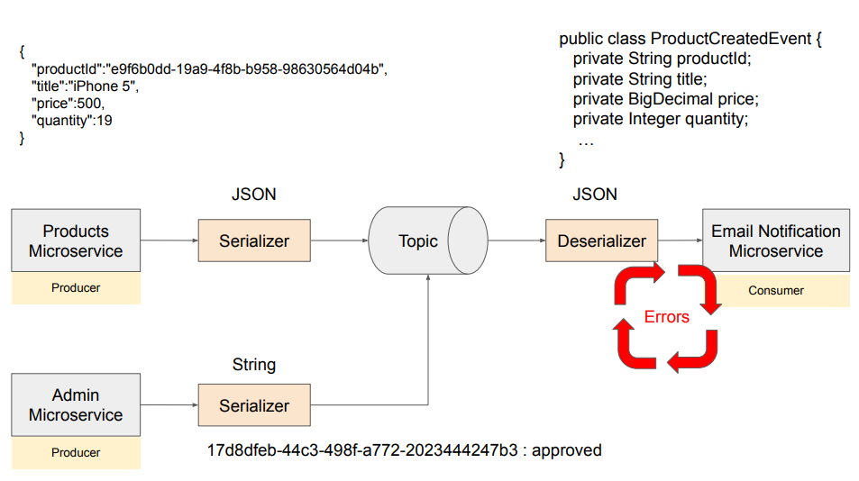

* json serializer will not be able to convert this new message into a product created event java object because it has a different message format
* because error took place the message is not considered successfully consumed so the next time the microservice consumes a message it will again get this faulty message in an error loop and keep throwing exception

---
### Causing the deserialization problem
Make sure your kafka servers are running

Run `EmailNotificationMicroservice` as Spring Boot application

Go to a terminal window and send a message
```
./bin/kafka-console-producer.sh --bootstrap-server localhost:9092 --topic product-created-events-topic --property "parse.key=true" --property "key.separator=:"
```
Then send a message with invalid format
```
>1:{safadsfadag}
```
Go to your console and you will see it is in an endless loop of throwing exception

---
### Kafka Consumer - ErrorHandlingDeserializer
Open `KafkaConsumerConfiguration.java`

Add
```
import org.springframework.kafka.support.serializer.ErrorHandlingDeserializer;
```
change 
```
@Bean
    public ConsumerFactory<String, Object> consumerFactory() {
        Map<String, Object> config = new HashMap<>();
        config.put(ConsumerConfig.BOOTSTRAP_SERVERS_CONFIG, environment.getProperty("spring.kafka.consumer.bootstrap-servers"));
        config.put(ConsumerConfig.KEY_DESERIALIZER_CLASS_CONFIG, StringDeserializer.class);
        config.put(ConsumerConfig.VALUE_DESERIALIZER_CLASS_CONFIG, JsonDeserializer.class);
        config.put(JsonDeserializer.TRUSTED_PACKAGES, environment.getProperty("spring.kafka.consumer.properties.spring.json.trusted"));
        config.put(ConsumerConfig.GROUP_ID_CONFIG, environment.getProperty("spring.kafka.consumer.group-id"));
    
        return new DefaultKafkaConsumerFactory<>(config);
}
```
to 
```
@Bean
ConsumerFactory<String, Object> consumerFactory() {
    Map<String, Object> config = new HashMap<>();
    config.put(ConsumerConfig.BOOTSTRAP_SERVERS_CONFIG,
               environment.getProperty("spring.kafka.consumer.bootstrap-servers"));
    config.put(ConsumerConfig.KEY_DESERIALIZER_CLASS_CONFIG, StringDeserializer.class);
    config.put(ConsumerConfig.VALUE_DESERIALIZER_CLASS_CONFIG, ErrorHandlingDeserializer.class);
    config.put(ErrorHandlingDeserializer.VALUE_DESERIALIZER_CLASS, JsonDeserializer.class);
    config.put(JsonDeserializer.TRUSTED_PACKAGES,
               environment.getProperty("spring.kafka.consumer.properties.spring.json.trusted.packages"));
    config.put(ConsumerConfig.GROUP_ID_CONFIG, environment.getProperty("spring.kafka.consumer.group-id"));
    
    return new DefaultKafkaConsumerFactory<>(config);
}
```
---
### Trying how ErrorHandlingDeserializer works

Start up `EmailNotificationMicroservice`

You will see an error message in the console but it is not repeated again

Starting `ProductsMicroservice` and send a good message again with Postman by copying the port number

You will see a successful response

Open a terminal and run again
```
./bin/kafka-console-producer.sh --bootstrap-server localhost:9092 --topic product-created-events-topic --property "parse.key=true" --property "key.separator=:"
```
Then send a message with invalid format
```
>2:{safadsfadag}
```
You will see that you received an error one time and is able to recover

Go to Postman change `iPhone 12` to `iPhone13` and send a new message

You should see the new message confirming that it recovers from deserialization errors

---
## Kafka Consumer - Dead Letter Topic(DLT)
### Introduction to Dead Letter Topic(DLT) in Kafka
* a message that fails to be deserialized is sent to a dead letter topic
* so that we can look at these messages later and decide what to do with them
* you can 
  * identify the root cause of their problem
  * take corrective action
  * or even create a separate consumer microservice that will consume messages from DLT and process them differently
* example: `product-created-event-topic.DLT`

---
### Handle errors: The DefaultErrorHandler and DeadLetterPublishingRecoverer classes

Open `KafkaConsumerConfiguration.java`

Add
```
import org.springframework.kafka.listener.DefaultErrorHandler
```
Change this
```
@Bean
    ConcurrentKafkaListenerContainerFactory<String, Object> kafkaListenerContainerFactory(
            ConsumerFactory<String, Object> consumerFactory) {
        
        ConcurrentKafkaListenerContainerFactory<String, Object> factory = new ConcurrentKafkaListenerContainerFactory<>();
        factory.setConsumerFactory(consumerFactory);
        
        return factory;
    }
```
to 
```
@Bean
    ConcurrentKafkaListenerContainerFactory<String, Object> kafkaListenerContainerFactory(
            ConsumerFactory<String, Object> consumerFactory, KafkaTemplate<String Object> kafkaTemplate) {
        
        DefaultErrorHandler errorHandler = new DefaultErrorHandler(new DeadLetterPublishingRecoverer(kafkaTemplate));

        ConcurrentKafkaListenerContainerFactory<String, Object> factory = new ConcurrentKafkaListenerContainerFactory<>();
        factory.setConsumerFactory(consumerFactory);
        factory.setCommonErrorHandler(errorHandler);

        return factory;
    }
```
---
### Create and Configure KafkaTemplate object

Open `KafkaConsumerConfiguration.java`

Add new methods
```
@Bean
KafkaTemplate<String, Object> kafkaTemplate(ProducerFactory<String, Object> producerFactory) {
    return new KafkaTemplate<>(producerFactory);
}

@Bean
ProducerFactory<String, Object> producerFactory() {
    Map<String, Object> config = new HashMap<>();
    config.put(ProducerConfig.BOOTSTRAP_SERVERS_CONFIG, environment.getProperty("spring.kafka.consumer.bootstrap-servers"));
    config.put(ProducerConfig.VALUE_SERIALIZER_CLASS_CONFIG, JsonSerializer.class);
    config.put(ProducerConfig.KEY_SERIALIZER_CLASS_CONFIG, StringSerializer.class);
    
    return new DefaultKafkaProducerFactory<>(config);
}RetryClaude can make mistakes. Please double-check responses.
```
and add
```
import org.springframework.kafka.core.DefaultKafkaProducerFactory;
import org.springframework.kafka.support.serializer.JsonSerializer;
```
---
### Dead Letter Topic in Kafka: Trying how it works
Start up `EmailNotificationMicroservice` and `ProductsMicroservice`

Go to a terminal window and run
```
./bin/kafka-console-producer.sh --bootstrap-server localhost:9092 --topic product-created-events-topic --property parse.key=true --property key.separator=:
```
Copy the port nummber on which `ProductsMicroservice` is running

Go to Postman, update port number and create a new product - you will see a successful response

Open `EmailNotificationMicroservice` console and check that it has been consumed properly

Then send a message with invalid format
```
>1:{safadsfadag}
```
Open `EmailNotificationMicroservice` console and check that the error was handled.

Go to a terminal window and run
```
./bin/kafka-console-consumer.sh --bootstrap-server localhost:9092 --topic product-created-events-topic.DLT --from-beginning --property print.key=true --property print.value=true
```
You will see a message like
```
e3NmYXNkc2RmfQ==
```
Paste it and visit browser `base64decode.org`

Decode it and you will see the orginal value `safadsfadag`

---
### Quiz 7: Dead Letter Topic in Kafka

**Q1: What is the primary purpose of a Dead Letter Topic in Apache Kafka?**  
**A: To handle messages that could not be processed successfully.**  
The primary purpose of a Dead Letter Topic in Kafka is to handle messages that cannot be processed successfully by a consumer. This can include messages that cause exceptions during processing. The Dead Letter Topic provides a way to separate these problematic messages for further analysis or reprocessing without interrupting the normal message flow.

**Q2: When would a message be sent to a Dead Letter Topic in Kafka?**  
**A: If a consumer encounters an error while processing the message and cannot proceed.**  
A message is typically sent to a Dead Letter Topic when a consumer encounters an error during processing and cannot successfully process the message. This allows the problematic message to be isolated and handled separately, ensuring that processing errors do not disrupt the normal flow of messages.

**Q3: What is a common practice after a message is sent to a Dead Letter Topic in Kafka?**  
**A: The message is usually analyzed and potentially reprocessed or corrected.**  
A common practice after a message ends up in a Dead Letter Topic is to analyze the message to understand why it failed and then decide on a course of action, which might include reprocessing or correcting the message.

---
## Kafka Consumer - Exceptions and Retries
### Introduction to Exception handling in Kafka consumer and retries
If Exception is Retryable, then:
* Configure wait time
* Number of times to retry
* will be sent to DLT

---
### Creating retryable and not retryable exceptions in Kafka 
In the root package `com.appsdeveloperblog.ws.emailnotification` and create a new class

* Name - RetryableException
* Package - `com.appsdeveloperblog.ws.emailnotification.error`

Write
```
public class RetryableException extends RuntimeException {
```

Then right click, click `Source` then `Generate Constructors from Superclass`

Select `RuntimeException(String)` and `RuntimeException(Throwable)` and press `Generate`

Inside of `com.appsdeveloperblog.ws.emailnotification.error` create a new class

* Name - NotRetryableException

Write
```
public class NotRetryableException extends RuntimeException {
```
Then right click, click `Source` then `Generate Constructors from Superclass`

Select `RuntimeException(String)` and `RuntimeException(Throwable)` and press `Generate`

---
### Configure DefaultErrorHandler with a list of not retryable exceptions

In `EmailNotificationMicroservice` open `KafkaConsumerConfiguration.java`

change 
```
@Bean
    ConcurrentKafkaListenerContainerFactory<String, Object> kafkaListenerContainerFactory(
            ConsumerFactory<String, Object> consumerFactory, KafkaTemplate<String Object> kafkaTemplate) {
        
        DefaultErrorHandler errorHandler = new DefaultErrorHandler(new DeadLetterPublishingRecoverer(kafkaTemplate));

        ConcurrentKafkaListenerContainerFactory<String, Object> factory = new ConcurrentKafkaListenerContainerFactory<>();
        factory.setConsumerFactory(consumerFactory);
        factory.setCommonErrorHandler(errorHandler);

        return factory;
    }
```
to
```
@Bean
    ConcurrentKafkaListenerContainerFactory<String, Object> kafkaListenerContainerFactory(
            ConsumerFactory<String, Object> consumerFactory, KafkaTemplate<String Object> kafkaTemplate) {
        
        DefaultErrorHandler errorHandler = new DefaultErrorHandler(new DeadLetterPublishingRecoverer(kafkaTemplate));
        errorHandler.addNotRetryableExceptions(NotRetryableException.class);

        ConcurrentKafkaListenerContainerFactory<String, Object> factory = new ConcurrentKafkaListenerContainerFactory<>();
        factory.setConsumerFactory(consumerFactory);
        factory.setCommonErrorHandler(errorHandler);

        return factory;
    }
```
---
### Trying how not retryable exception works

In `EmailNotificationMicroservice` open `ProductCreatedEventHandler.java`

Write
```
package com.appsdeveloperblog.ws.emailnotification.handler;

import org.slf4j.Logger;

@Component
@KafkaListener(topics="product-created-events-topic")
public class ProductCreatedEventHandler {

    private final Logger LOGGER = LoggerFactory.getLogger(this.getClass());
    
    @KafkaHandler
    public void handle(ProductCreatedEvent productCreatedEvent) {
        if(true) throw new NotRetryableException("An error took place. No need to consume this message again.");
        LOGGER.info("Received a new event: " + productCreatedEvent.getTitle());
    }
}
```
Start up `ProductsMicroservice`

Next right click `EmailNotificationMicroservice` then click `Debug As` then `Spring Boot App`

Open a terminal and run
```
./bin/kafka-console-producer.sh --bootstrap-server localhost:9092 --topic product-created-events-topic.DLT --from-beginning --property print.key=true --property print.value=true
```

Go to Postman, update port number and send the request a new product - you will see a successful response

Press Resume button on `ProductCreatedEventHandler.java`

Check DLT by checking the terminal and seeing the raw JSON 

---
### Register RetryableException and define wait time interval

In `EmailNotificationMicroservice` open `KafkaConsumerConfiguration.java`

Replace
```
        DefaultErrorHandler errorHandler = new DefaultErrorHandler(new DeadLetterPublishingRecoverer(kafkaTemplate));
        errorHandler.addNotRetryableExceptions(NotRetryableException.class);
```
with
```
        DefaultErrorHandler errorHandler = new DefaultErrorHandler(new DeadLetterPublishingRecoverer(kafkaTemplate);
                new FixedBackOff(5000,3));
        errorHandler.addNotRetryableExceptions(NotRetryableException.class);
        errorHandler.addRetryableExceptions(RetryableException.class);
```

---
### Throwing a RetryableException

Add
```
@Bean
RestTemplate getRestTemplate() {
    return new RestTemplate();
}
```
Replace all of `ProductCreatedEventHandler.java` with
```
package com.appsdeveloperblog.ws.emailnotification.handler;

import org.slf4j.Logger;
import org.slf4j.LoggerFactory;
import org.springframework.http.HttpMethod;
import org.springframework.http.HttpStatus;
import org.springframework.http.ResponseEntity;
import org.springframework.kafka.annotation.KafkaHandler;
import org.springframework.kafka.annotation.KafkaListener;
import org.springframework.stereotype.Component;
import org.springframework.web.client.ResourceAccessException;
import org.springframework.web.client.RestTemplate;

import com.appsdeveloperblog.ws.core.ProductCreatedEvent;
import com.appsdeveloperblog.ws.emailnotification.error.NotRetryableException;
import com.appsdeveloperblog.ws.emailnotification.error.RetryableException;

@Component
@KafkaListener(topics = "product-created-events-topic")
public class ProductCreatedEventHandler {

    private final Logger LOGGER = LoggerFactory.getLogger(this.getClass());
    private RestTemplate restTemplate;

    public ProductCreatedEventHandler(RestTemplate restTemplate) {
        this.restTemplate = restTemplate;
    }

    @KafkaHandler
    public void handle(ProductCreatedEvent productCreatedEvent) {
        LOGGER.info("Received a new event: " + productCreatedEvent.getTitle());

        String requestUrl = "http://localhost:8082";

        try {
            ResponseEntity<String> response = restTemplate.exchange(requestUrl, HttpMethod.GET, null, String.class);

            if (response.getStatusCode().value() == HttpStatus.OK.value()) {
                LOGGER.info("Received response from a remote service: " + response.getBody());
            }
        } catch (ResourceAccessException ex) {
            LOGGER.error(ex.getMessage());
            throw new RetryableException(ex);
        } catch (HttpServerErrorException ex) {
            LOGGER.error(ex.getMessage());
            throw new NotRetryableException(ex);
        } catch (Exception ex) {
            LOGGER.error(ex.getMessage());
            throw new NotRetryableException(ex);
        }
    }
}
```
---
### Overview of a destination Microservice
Download `mockservice`

Right click `mockservice` and Run As Spring Boot

Open a new tab in Postman

send an HHTP GET request to `http://localhost:8082/response/200` and you should see HTTP status code 200

---
### Trying how retry works

Open `ProductCreatedEventHandler.java` and change the request url to
```
String requestUrl = "http://localhost:8082/response/200";
```

Next right click `EmailNotificationMicroservice` then click `Debug As` then `Spring Boot App`

Right click `mockservice` and Run As Spring Boot

Start up `ProductsMicroservice` by Running As Spring Boot

open terminal window and run
```
./bin/kafka-console-consumer.sh --bootstrap-server localhost:9092 --topic product-created-events-topic.DLT --property print.key=true --property print.value=true
```

copy the port number from the `ProductsMicroservice` console  

Send a POST HTTP Request with JSON package
```
{
    "title":"iPad Pro",
    "price":1200,
    "quantity":19
}
```
---
## Kafka Consumer - Multiple Consumers in a Consumer Group
### Introduction to Kafka Consumer Groups

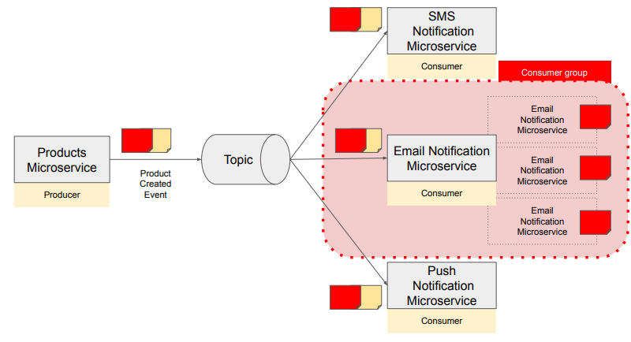
* to help us scale up consumer microservice, kafka allows us to run multiple consumers in a group - this is called Consumer Group
---
### Rebalancing and Partition Assignment in Apache Kafka

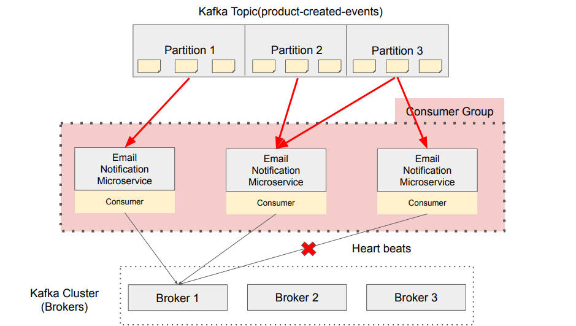

* when we have only one consumer microservice then this consumer will read messages from all 3 partitions in a topic
* when we have two, kafka will reassign partitions amongst these 2 consumer applications
* this process of automatic partition reassignment is called rebalancing
* if we have more consumers than partitions, one consumer will stay idle as 2 consumers from the same consumer group cannot read messages from the same partition
* you cannot start more consumers than the number of partitions in the topic
* while your kafka consumer microservices are running, each of them will be sending heartbeat signals to Kafka broker, letting it know that it can consume new messages
* Heartbeats are sent at regulat intervals (default = 3 seconds)
* when kafka broker notices that there are no heartbeats coming from consumer it will remove this consumer

---
### Assigning Microservice to a consumer group in Kafka

In `EmailNotificationMicroservice` open `application.properties`

Change
```
spring.kafka.consumer.group-id=product-created-events
```
to
```
consumer.group-id=product-created-events
```

In `EmailNotificationMicroservice` open `KafkaConsumerConfiguration.java`

Change 
```
config.put(ConsumerConfig.GROUP_ID_CONFIG, environment.getProperty("spring.kafka.consumer.group-id"));
```
to
```
config.put(ConsumerConfig.GROUP_ID_CONFIG, environment.getProperty("consumer.group-id"));
```

---
### Starting up more Microservices

In `EmailNotificationMicroservice` open `application.properties` 

Make sure 
```
server.port=0
```
this will make a microservice application start on a random port number that will not conflict with other microservices

Open terminal window

`cd` to home folder of `EmailNotificationMicroservice`

Run
```
mvn spring-boot:run
```

Open a new terminal window

`cd` to home folder of `EmailNotificationMicroservice`

Run again
```
mvn spring-boot:run
```

You will now have two instances of `EmailNotificationMicroservice` running

Repeat to get 3 instances running

---
### Trying how partitions assignment works in Kafka

Press `CTRL + C` on all 3 windows to stop all 3 instances

Start them one by one again by running
```
mvn spring-boot:run
```
Once you start the second consumer in the same consumer group you will see log messages that indicate rebalancing took place and partitions were reassigned among these two consumers

---
### Multiple consumers consuming messages from Kafka topic

Press `CTRL + C` on all 3 windows to stop all 3 instances

In `EmailNotificationMicroservice` open `ProductCreatedEventHandler.java`

Change
```
@KafkaHandler
public void handle(ProductCreatedEvent productCreatedEvent) {
    LOGGER.info("Received a new event: " + productCreatedEvent.getTitle());
```
to
```
@KafkaHandler
public void handle(ProductCreatedEvent productCreatedEvent) {
    LOGGER.info("Received a new event: " + productCreatedEvent.getTitle() + " with productId: " 
            + productCreatedEvent.getProductId());
```

Start one instance
```
mvn spring-boot:run
```
Start 2 more instances

Start up `ProductsMicroservice` and `mockservice`

Go to Postman and send an HTTP request with the new port number

In the terminals you should see that only one terminal window shows the message not the other 2

---
### Quiz 8: Apache Kafka Consumer Groups

**Q1: What is the primary function of Consumer Groups in Apache Kafka?**  
**A: To enable parallel processing of messages from a topic by multiple consumers.**  
Consumer groups in Kafka allow multiple consumers to form a group and collaboratively process messages from a topic, enabling parallel processing. Each consumer in the group reads messages from one or more partitions of the topic, enhancing throughput and scalability.

**Q2: What happens when a new consumer joins a consumer group in Kafka?**  
**A: Kafka rebalances the topic partitions among all consumers in the group.**  
When a new consumer joins a consumer group, Kafka triggers a rebalance of the topic partitions among all consumers in the group. This rebalancing ensures that the message load is distributed evenly across the consumers, optimizing parallel processing and resource utilization.

**Q3: How does Kafka manage message distribution to consumers within a consumer group?**  
**A: By sending each message to only one consumer in the group.**  
Kafka ensures message delivery to consumers in a group by assigning each message to only one consumer within that group. This prevents duplicate processing of the same message by multiple consumers, ensuring efficient and coordinated message handling.

**Q4: How does Apache Kafka assign partitions to consumers within a consumer group?**  
**A: Each consumer in a group is assigned a unique set of partitions from multiple topics.**  
Kafka assigns each consumer in a consumer group a unique set of partitions from the topics they subscribe to. This partition assignment ensures that each partition is processed by only one consumer in the group, enabling efficient parallel processing and balanced workload distribution.

**Q5: What determines the number of partitions a consumer in a group can process in Kafka?**  
**A: The number of partitions in the topic and the number of consumers in the consumer group.**  
The number of partitions that a consumer can process is determined by the total number of partitions in the topic and the number of consumers in the consumer group. Kafka balances the partition assignments across consumers to ensure even distribution and efficient message processing.

**Q6: What happens if the number of consumers in a Kafka Consumer Group exceeds the number of partitions in a topic?**  
**A: Some consumers will sit idle and will not be assigned any partitions.**  
If the number of consumers in a consumer group exceeds the number of partitions in the topic, some consumers will remain idle without any assigned partitions. This occurs because Kafka ensures that each partition is consumed by only one consumer within the group.

**Q7: What happens when a consumer in a Kafka Consumer Group shuts down?**  
**A: Kafka rebalances the partitions, reassigning them among the remaining consumers.**  
When a consumer in a consumer group shuts down, Kafka triggers a rebalance of the partitions. The partitions previously assigned to the shutdown consumer are reassigned to the remaining active consumers in the group, ensuring uninterrupted message processing and system reliability.

---
## Idempotent Consumer in Kafka
### Idempotent Consumer - Introduction

* an idempotent Apache Kafka consumer is a consumer that can process the same message multiple times without causing any side effects or data inconsistencies
* avoiding duplicate messages
  * idempotent consumer
  * idempotent producer
  * transactions

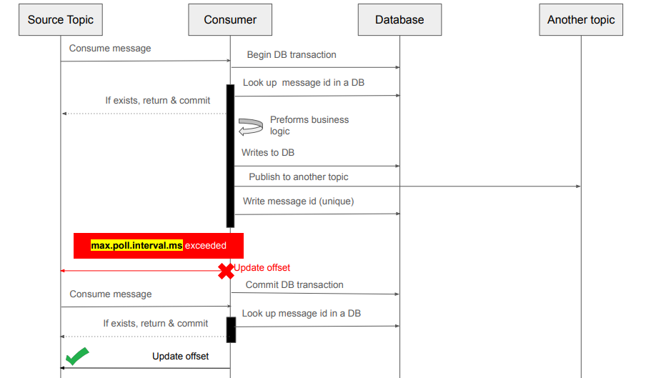

---
### Include a unique id into message header

Open `ProductServiceImpl.java`

Change 
```
LOGGER.info("Before publishing a ProductCreatedEvent");

        SendResult<String, ProductCreatedEvent> result =
                kafkaTemplate.send("product-created-events-topic", productId, productCreatedEvent

        LOGGER.info("Partition: " + result.getRecordMetadata().partition());
        LOGGER.info("Topic: " + result.getRecordMetadata().topic());
        LOGGER.info("Offset: " + result.getRecordMetadata().offset());
```
to
```
LOGGER.info("Before publishing a ProductCreatedEvent");

    ProducerRecord<String, ProductCreatedEvent> record = new ProducerRecord<>(
            "product-created-events-topic",
            productId,
            productCreatedEvent);
    record.headers().add("messageId", UUID.randomUUID().toString().getBytes());

    SendResult<String, ProductCreatedEvent> result =
            kafkaTemplate.send(record).get();

    LOGGER.info("Partition: " + result.getRecordMetadata().partition());
    LOGGER.info("Topic: " + result.getRecordMetadata().topic());
    LOGGER.info("Offset: " + result.getRecordMetadata().offset());
```

---
### Reading a unique id from message header

Open `ProductCreatedEventHandler.java`

Change `@KafkaHandler` to this
```
@KafkaHandler
    public void handle(@Payload ProductCreatedEvent productCreatedEvent,
                      @Header("messageId") String messageId,
                      @Header(KafkaHeaders.RECEIVED_KEY) String messageKey) {
        LOGGER.info("Received a new event: " + productCreatedEvent.getTitle() + " with productId: "
                   + productCreatedEvent.getProductId());

        String requestUrl = "http://localhost:8082/response/200";
```

---
### Adding database-related dependencies

Open a browser and visit `mvnrepository.com`

Search for H2 and install the latest version of `H2 Database Engine`

Search for `Spring Boot Starter Data JPA` and install the latest version

Open `pom.xml` in `EmailNotificationMicroservice` and add depenedencies
```
<!-- https://mvnrepository.com/artifact/com.h2database/h2 -->
<dependency>
    <groupId>com.h2database</groupId>
    <artifactId>h2</artifactId>
</dependency>
<!--
https://mvnrepository.com/artifact/org.springframework.boot/spring-boot-starter-data-jpa -->
<dependency>
    <groupId>org.springframework.boot</groupId>
    <artifactId>spring-boot-starter-data-jpa</artifactId>
</dependency>-->


</dependencies>
```

---
### Configure database connection details

In `EmailNotificationMicroservice` open `application.properties` 

Add
```
spring.datasource.username=sergey
spring.datasource.password=sergey
spring.datasource.url=jdbc:h2:mem:testdb
spring.datasource.driverClassName=org.h2.Driver
spring.jpa.database-platform=org.hibernate.dialect.H2Dialect
spring.h2.console.enabled=true
```

---
### Creating JPA Entity

select root package `com.appsdeveloperblog.ws.emailnotification` and create a new class
* Name - `ProcessedEventEntity`
* Package - `com.appsdeveloperblog.ws.emailnotification.io`
* click `Add...` and choose `Serializable - java.io`

Hover over `ProcessedEventEntity` and click `Add generated serial version ID`

Write so it looks like this
```
package com.appsdeveloperblog.ws.emailnotification.io;

import java.io.Serializable;

import jakarta.persistence.Column;
import jakarta.persistence.Entity;
import jakarta.persistence.GeneratedValue;
import jakarta.persistence.Id;
import jakarta.persistence.Table;

@Entity
@Table(name="processed-events")
public class ProcessedEventEntity implements Serializable {

    private static final long serialVersionUID = 3687553269742697084L;
    
    @Id
    @GeneratedValue
    private long id;
    
    @Column(nullable=false, unique=true)
    private String messageId;
    
    @Column(nullable=false)
    private String productId;
    
}
```
Press generate getters and setters and only check `id`, `messageId` and `productId`

Then after 
```
@Column(nullable=false, unique=true)
private String messageId;
```
press generate constructor using fields and only check `messageId` and `productId`

Then generate a second constructor but uncheck everything

---
### Create JPA Repository

select root package `com.appsdeveloperblog.ws.emailnotification` and create a new interface
* Name - `ProcessedEventRepository`

Write
```
package com.appsdeveloperblog.ws.emailnotification.io;

import org.springframework.data.jpa.repository.JpaRepository;
import org.springframework.stereotype.Repository;

@Repository
public interface ProcessedEventRepository extends JpaRepository<ProcessedEventEntity, Long> {

}
```

---
### Storing a unique message id in a database table

Open `ProductCreatedEventHandler.java`

Change it to this
```
package com.appsdeveloperblog.ws.emailnotification.handler;

import org.slf4j.Logger;

@Component
@KafkaListener(topics = "product-created-events-topic")
public class ProductCreatedEventHandler {

    private final Logger LOGGER = LoggerFactory.getLogger(this.getClass());
    private RestTemplate restTemplate;
    private ProcessedEventRepository processedEventRepository;

    public ProductCreatedEventHandler(RestTemplate restTemplate, ProcessedEventRepository processedEventRepository) {
        this.restTemplate = restTemplate;
        this.processedEventRepository = processedEventRepository;
    }

    @Transactional
    @KafkaHandler
    public void handle(@Payload ProductCreatedEvent productCreatedEvent, @Header("messageId") String messageId,
                      @Header(KafkaHeaders.RECEIVED_KEY) String messageKey) {
        LOGGER.info("Received a new event: " + productCreatedEvent.getTitle() + " with productId: "
                + productCreatedEvent.getProductId());

        String requestUrl = "http://localhost:8082/response/200";

        try {
            ResponseEntity<String> response = restTemplate.exchange(requestUrl, HttpMethod.GET, null, String.class);

            if (response.getStatusCode().value() == HttpStatus.OK.value()) {
                LOGGER.info("Received response from a remote service: " + response.getBody());
            }
        } catch (ResourceAccessException ex) {
            LOGGER.error(ex.getMessage());
            throw new RetryableException(ex);
        } catch (HttpServerErrorException ex) {
            LOGGER.error(ex.getMessage());
            throw new NotRetryableException(ex);
        } catch (Exception ex) {
            LOGGER.error(ex.getMessage());
            throw new NotRetryableException(ex);
        }

        // Save a unique message id in a database table
        try {
            processedEventRepository.save(new ProcessedEventEntity(messageId, productCreatedEvent.getProductId()));
        } catch (DataIntegrityViolationException ex) {
            throw new NotRetryableException(ex);
        }
    }

}
```

---
### Check if Kafka message was processed earlier

Open `ProcessedEventRepository.java` and write
```
package com.appsdeveloperblog.ws.emailnotification.io;

import org.springframework.data.jpa.repository.JpaRepository;

@Repository
public interface ProcessedEventRepository extends JpaRepository<ProcessedEventEntity, Long> {
    ProcessedEventEntity findByMessageId(String messageId);
}
```

In `ProductCreatedEventHandler.java` change to
```
@Transactional
    @KafkaHandler
    public void handle(@Payload ProductCreatedEvent productCreatedEvent, @Header("messageId") String messageId,
                      @Header(KafkaHeaders.RECEIVED_KEY) String messageKey) {
        LOGGER.info("Received a new event: " + productCreatedEvent.getTitle() + " with productId: "
                + productCreatedEvent.getProductId());

        // Check if this message was already processed before
        ProcessedEventEntity existingRecord = processedEventRepository.findByMessageId(messageId);
        
        if(existingRecord!=null) {
            LOGGER.info("Found a duplicate message id: {}", existingRecord.getMessageId());
            return;
        }

        String requestUrl = "http://localhost:8082/response/200";
```

---
### Trying how it works

Open Boot Dashboard and debug `EmailNotificationMicroservice`

Start `mockservice` and `ProductsMicroservice`

Open `ProductServiceImpl` and replace
```
record.headers().add("messageId", UUID.randomUUID().toString().getBytes());
```
with
```
record.headers().add("messageId", "123".getBytes());
```
Stop `ProductsMicroservice` and run it again

Go to Postman, update the port number and send HTTP request 

Find the port number from `EmailNotificationMicroservice` and open a browser and go to `localhost:<PORT-NUMBER>/h2-console`

change `JDBC URL` to
```
jdbc:h2:mem:testdb
```
and username and password to
```
sergey
```
press connect

click on processed-events and click run. You should see the Message Id we hardcoded `123`

Go to Postman and repeat the HTTP request 

Run processed-events again and you should not see any duplicates

Open `ProductServiceImpl` and replace
```
record.headers().add("messageId", "123".getBytes());

```
with
```
record.headers().add("messageId", UUID.randomUUID().toString().getBytes());
```
Copy the new port number, go to Postman and repeat the HTTP request

You will see more message IDs

---
## Apache Kafka Transactions
### Introduction to Transactions in Apache Kafka

Why use transaction in Apache Kafka?
* All or nothing
* Exactly one
  * Idempotent Producer
  * Transactions
* transactions help us to write to multiple topics atomically

once the transaction is completed successfully messages are uncommitted and consumers only read committed messages

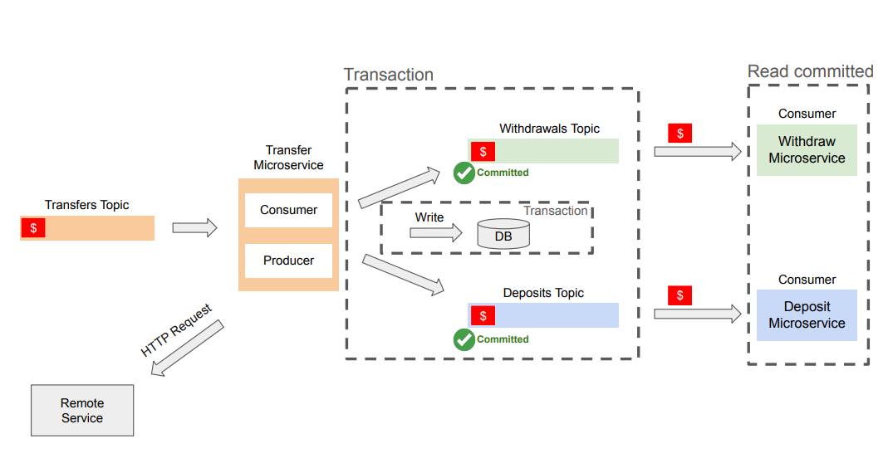

---
### Enable Kafka Transactions in application.properties

Download the source code from this course

In `TransferService` open `application.properties`

Add
```
spring.kafka.producer.transaction-id-prefix=transfer-service-${random.value}-

logging.level.org.springframework.kafka.transaction=TRACE
logging.level.org.springframework.transaction=TRACE
```

---
### Enable Kafka Transactions in the @Bean method

In `TransferService` open `KafkaConfig.java`

Add
```
@Value("${spring.kafka.producer.transaction-id-prefix}")
private String transactionalIdPrefix;
```
Add
```
props.put(ProducerConfig.TRANSACTIONAL_ID_CONFIG, transactionalIdPrefix);
```
Add
```
@Bean
KafkaTransactionManager<String, Object> kafkaTransactionManager(ProducerFactory<String, Object> producerFactory) {
    return new KafkaTransactionManager<>(producerFactory);
}
```

---
### Apache Kafka and @Transactional annotation

In `TransferService` open `TransferServiceImpl.java`

Above `@Override` add
```
@Transactional(value="kafkaTransactionManager")
@Override
```

---
### Rollback transaction for specific exception

In `TransferService` open `TransferServiceImpl.java`

Change `@Transactional`
```
@Transactional(value="kafkaTransactionManager", 
        rollbackFor= { TransferServiceException.class, ConnectException.class}, 
        noRollbackFor= {SpecificException.class})
```

---
### Reading committed messages in Kafka Consumer

In `WithdrawService` open `application.properties`

Add
```
spring.kafka.consumer.isolation-level=READ_COMMITTED
```
Open `KafkaConsumerConfiguration.java` and add
```
config.put(ConsumerConfig.ISOLATION_LEVEL_CONFIG, environment.getProperty("spring.kafka.consumer.isolation-level", "READ_COMMITTED").toLowerCase());
```

---
### Trying how Kafka Transactions work

Start `TransferService` as Spring Boot App in Debug mode

Start `mockservice` as Spring Boot App

Start `DepositService` as Spring Boot App

Start `WithdrawalService` as Spring Boot App

You will be able to see all of their port numbers on the Boot Dashboard

Open a new Postman tab and use url but replace with the port number
```
http://localhost:<TransferServicePortNumber>/transfers
```
Select `POST`

Select `Body`, `raw` and `JSON` and write
```
{
    "senderId":"123",
    "recepientId":"124",
    "amount":123
}
```
Send the HTTP Request and check the logs for success

---
### Apache Kafka local transactions with KafkaTemplate

```
boolean returnValue = kafkaTemplate.executeInTransaction(t -> {
```
can throw exception

`@Transactional` means if exception occurs anywhere in this message then kafka transaction will be rolled back

---
## Apache Kafka and Database transactions
### Kafka & Database transactions - Introduction

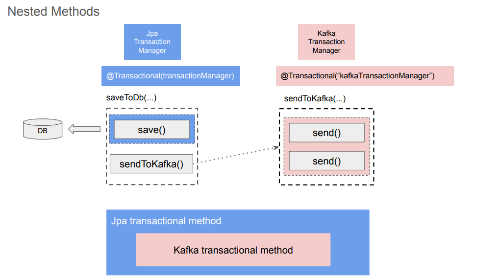

---
### Creating Jpa Transaction Manager

Download new source code

Open `KafkaConfig.java` and replace with
```
@Bean("kafkaTransactionManager")
KafkaTransactionManager<String, Object> kafkaTransactionManager(ProducerFactory<String, Object> producerFactory) {
    return new KafkaTransactionManager<>(producerFactory);
}
```
Open `TransferServiceImpl.java` and replace with
```
@Transactional("kafkaTransactionManager")
```
Open `KafkaConfig.java` and add
```
@Bean("transactionManager")
JpaTransactionManager jpaTransactionManager(EntityManagerFactory entityManagerFactory) {
    return new JpaTransactionManager(entityManagerFactory);
}
```

---
### Synchronized Transaction: Saving to database

Open `TransferServiceImpl.java` and replace with
```
public TransferServiceImpl(KafkaTemplate<String, Object> kafkaTemplate, Environment environment,
                          RestTemplate restTemplate, TransferRepository transferRepository) {
    this.kafkaTemplate = kafkaTemplate;
    this.environment = environment;
    this.restTemplate = restTemplate;
    this.transferRepository = transferRepository;
}

@Transactional("TransactionManager")
@Override
public boolean transfer(TransferRestModel transferRestModel) {
    WithdrawalRequestedEvent withdrawalEvent = new WithdrawalRequestedEvent((transferRestModel.getSenderId(),
            transferRestModel.getRecepientId(), transferRestModel.getAmount());
    DepositRequestedEvent depositEvent = new DepositRequestedEvent(transferRestModel.getSenderId(),
            transferRestModel.getRecepientId(), transferRestModel.getAmount());
    
    TransferEntity transferEntity = new TransferEntity();
    BeanUtils.copyProperties(transferRestModel, transferEntity);
    transferEntity.setTransferId(Uuid.randomUuid().toString());
    
    try {
        
        // Save record to a database table
        transferRepository.save(transferEntity);
```

---
### Enable logging for Kafka and Jpa Transaction Managers

In `TransferService` in `application.properties` add
```
logging.level.org.springframework.orgm.jpa.JpaTransactionManager=DEBUG
```
and set all `logging.level` to `=DEBUG`

then change to
```
logging.level.org.springframework.kafka.transaction.KafkaTransactionManager=DEBUG
```
then add
```
logging.level.org.apache.kafka.clients.producer.internals.TransactionManager=DEBUG
```
---
### Trying how synchronized transactions work

Start all 3 kafka service

Start `TransferService` as Spring Boot App

Start `mockservice` as Spring Boot App

Start `DepositService` as Spring Boot App

Start `WithdrawalService` as Spring Boot App

Open Postman and send HTTP Request with new port number of `TransferService`

```
http://localhost:<TransferServicePortNumber>/transfers
```

Open a browser and go to 
```
localhost:<TRANSFERSERVICE-PORT-NUMBER>/h2-console
```
Enter password to login
```
sergey
```
press connect

Select `TRANSFERS` in the sidebar and press `Run Selected`

You will see the JSON values

Stop `mockservice`

Open Postman and send HTTP Request with new port number of `TransferService` but change `amount` to 10 instead of 0

You will see an error

In the browser Select `TRANSFERS` in the sidebar and press `Run Selected`

You will not see any changes

---
## Integration Testing - Kafka Producer
### Test class annotations

Create a new class in `com.appsdeveloperblog.ws.products` with Name `ProductsServiceIntegrationTest`

Annotate it like this
```
package com.appsdeveloperblog.ws.products;

import org.junit.jupiter.api.TestInstance;
import org.springframework.boot.test.context.SpringBootTest;
import org.springframework.kafka.test.context.EmbeddedKafka;
import org.springframework.test.annotation.DirtiesContext;
import org.springframework.test.context.ActiveProfiles;

@DirtiesContext
@TestInstance(TestInstance.Lifecycle.PER_CLASS)
@ActiveProfiles("test") // application-test.properties
@EmbeddedKafka(partitions=3, count=3, controlledShutdown=true)
@SpringBootTest(properties="spring.kafka.producer.bootstrap-servers=${spring.embedded.kafka.brokers}")
public class ProductsServiceIntegrationTest {

}
```

---
### Creating an empty test method

Add so `ProductsServiceIntegrationTest` looks like this
```
package com.appsdeveloperblog.ws.products;

import org.junit.jupiter.api.TestInstance;
import org.springframework.boot.test.context.SpringBootTest;
import org.springframework.kafka.test.context.EmbeddedKafka;
import org.springframework.test.annotation.DirtiesContext;
import org.springframework.test.context.ActiveProfiles;

@DirtiesContext
@TestInstance(TestInstance.Lifecycle.PER_CLASS)
@ActiveProfiles("test") // application-test.properties
@EmbeddedKafka(partitions=3, count=3, controlledShutdown=true)
@SpringBootTest(properties="spring.kafka.producer.bootstrap-servers=${spring.embedded.kafka.brokers}")
public class ProductsServiceIntegrationTest {

    @Test
    void testCreateProduct_whenGivenValidProductDetails_successfulSendsKafkaMessage() {

    }

}
```
---
### Different ways to execute test methods

You will see the test method in the sidebar under `ProductsServiceIntegrationTest`

Right mouse click `ProductsServiceIntegrationTest` and Run As JUnit Test

Right mouse click `ProductsMicroservice [boot]` and select show in terminal

run
```
./mvnw test
```

run
```
./mvnw test -Dtest=ProductsServiceIntegrationTest
```

run
```
./mvnw test -Dtest=ProductsServiceIntegrationTest#testCreateProduct_whenGivenValidProductDetails_successfulSendsKafkaMessage
```

---
### Test method structure. Arrange, Act and Assert.

Add so `ProductsServiceIntegrationTest` looks like this
```
package com.appsdeveloperblog.ws.products;

import org.junit.jupiter.api.TestInstance;
import org.springframework.boot.test.context.SpringBootTest;
import org.springframework.kafka.test.context.EmbeddedKafka;
import org.springframework.test.annotation.DirtiesContext;
import org.springframework.test.context.ActiveProfiles;

@DirtiesContext
@TestInstance(TestInstance.Lifecycle.PER_CLASS)
@ActiveProfiles("test") // application-test.properties
@EmbeddedKafka(partitions=3, count=3, controlledShutdown=true)
@SpringBootTest(properties="spring.kafka.producer.bootstrap-servers=${spring.embedded.kafka.brokers}")
public class ProductsServiceIntegrationTest {

    @Test
    void testCreateProduct_whenGivenValidProductDetails_successfulSendsKafkaMessage() {

        // Arrange

        // Act

        // Assert

    }

}
```
---
### Implementing the Arrange and Act sections

Add so `ProductsServiceIntegrationTest` looks like this
```
package com.appsdeveloperblog.ws.products;

import java.math.BigDecimal;

@DirtiesContext
@TestInstance(TestInstance.Lifecycle.PER_CLASS)
@ActiveProfiles("test") // application-test.properties
@EmbeddedKafka(partitions=3, count=3, controlledShutdown=true)
@SpringBootTest(properties="spring.kafka.producer.bootstrap-servers=${spring.embedded.kafka.brokers}")
public class ProductsServiceIntegrationTest {

    @Autowired
    private ProductService productService;

    @Test
    void testCreateProduct_whenGivenValidProductDetails_successfullySendsKafkaMessage() throws Exception {
    
        // Arrange
        
        String title="iPhone 11";
        BigDecimal price = new BigDecimal(600);
        Integer quantity = 1;
        
        CreateProductRestModel createProductRestModel = new CreateProductRestModel();
        createProductRestModel.setPrice(price);
        createProductRestModel.setQuantity(quantity);
        createProductRestModel.setTitle(title);
        
        // Act
        
        productService.createProduct(createProductRestModel);
        
        // Assert
        
    }

}
```
---
### Kafka Consumer Configuration in a Test Class

Under `// Assert` write

```
// Assert
    
    
private Map<String, Object> getConsumerProperties() {
        return Map.of(ConsumerConfig.BOOTSTRAP_SERVERS_CONFIG, embeddedKafkaBroker.getBrokersAsString(),
            ConsumerConfig.KEY_DESERIALIZER_CLASS_CONFIG, StringDeserializer.class,
            ConsumerConfig.VALUE_DESERIALIZER_CLASS_CONFIG, ErrorHandlingDeserializer.class,
            ErrorHandlingDeserializer.VALUE_DESERIALIZER_CLASS, JsonDeserializer.class,
            ConsumerConfig.GROUP_ID_CONFIG, environment.getProperty("spring.kafka.consumer.group-id"),
            JsonDeserializer.TRUSTED_PACKAGES, environment.getProperty("spring.kafka.consumer.properties.spring.json.trusted.packages"),
            ConsumerConfig.AUTO_OFFSET_RESET_CONFIG, environment.getProperty("spring.kafka.consumer.auto-offset-reset")
        );
    }
    
}
```

Below `@Autowired` write another

```
@Autowired
private ProductService productService;

@Autowired
private EmbeddedKafkaBroker embeddedKafkaBroker;

@Autowired
Environment environment;
```

In `ProductsMicroservice [boot]` right mouse click `src/test/java` select New Folder

Name it `resources`

Right mouse click `src/test/resources` select New Folder

Name it `application-test.properties`

Write in it
```
spring.kafka.consumer.group-id=product-created-events
spring.kafka.consumer.properties.spring.json.trusted.packages=com.appsdeveloperblog.ws.core
spring.kafka.consumer.auto-offset-reset=earliest
products-created-events-topic-name=product-created-events-topic
```
---
### The setUp() and tearDown() methods

Add to `ProductsServiceIntegrationTest`

```
    @Autowired
    Environment environment;
    
    private KafkaMessageListenerContainer<String, ProductCreatedEvent> container;
    private BlockingQueue<ConsumerRecord<String, ProductCreatedEvent>> records;
    
    @BeforeAll
    void setup() {
        DefaultKafkaConsumerFactory<String, Object> consumerFactory = new DefaultKafkaConsumerFactory<>(getConsumerProperties());
        
        ContainerProperties containerProperties = new ContainerProperties(environment.getProperty("product-created-events-topic-name"));
        container = new KafkaMessageListenerContainer<>(consumerFactory, containerProperties);
        records = new LinkedBlockingQueue<>();
        container.setupMessageListener((MessageListener<String, ProductCreatedEvent>) records::add);
        container.start();
        ContainerTestUtils.waitForAssignment(container, embeddedKafkaBroker.getPartitionsPerTopic());
    }
```

and at the end
```
@AfterAll
void tearDown() {
    container.stop();
}
```
---
### The Assert section

Under `// Assert` write

```
// Assert
ConsumerRecord<String, ProductCreatedEvent> message = records.poll(3000, TimeUnit.MILLISECONDS);
assertNotNull(message);
assertNotNull(message.key());
ProductCreatedEvent productCreatedEvent = message.value();
assertEquals(createProductRestModel.getQuantity(), productCreatedEvent.getQuantity());
assertEquals(createProductRestModel.getTitle(), productCreatedEvent.getTitle());
assertEquals(createProductRestModel.getPrice(), productCreatedEvent.getPrice());
}

private Map<String, Object> getConsumerProperties() {
```
Right mouse click text editor and click Run As JUnit Test

---
### Verify Kafka Producer Configuration Properties - Introduction

As developers, we often focus on writing and testing the business logic of our applications, but I think it is equally important to ensure that our Kafka producers are correctly configured.

The configuration of a Kafka producer can significantly impact how our application works. Therefore, I think it is a good practice to write tests that verify producer configuration properties as well.

In the following two lessons, we are going to focus on a specific part of the producer configuration which is making our producer idempotent.

In Apache Kafka, an idempotent producer is a type of producer that guarantees that messages are delivered exactly once, even in the event of retries or failures. This means that if a producer sends the same message multiple times, the message will only be written to the Kafka topic once, preventing duplicates.

When working with distributed systems like Kafka, it's essential to handle scenarios where messages might be sent multiple times due to network issues, broker failures, or other types of errors. Without idempotence, these retries could lead to duplicate messages being written to the topic, which can cause data inconsistencies and other issues in downstream consumers.

The good news is that idempotency has been enabled in the Apache Kafka producer by default since version 3.0. This is achieved with the following configuration property:
```
spring.kafka.producer.properties.enable.idempotence=true
```
However, there are other configuration properties that, if set to incorrect values, can make your Kafka producer non-idempotent.

To make you Kafka producer idempotent, you typically make sure the following properties are set with correct values:
```
spring.kafka.producer.properties.enable.idempotence=true
spring.kafka.producer.acks=all
spring.kafka.producer.properties.max.in.flight.requests.per.connection=5
spring.kafka.producer.properties.retries=2147483647
```

In the production app, I configured the idempotent producer using the @Bean method.
```
@Configuration
public class KafkaConfig {
 
@Value("${spring.kafka.producer.bootstrap-servers}")
private String bootstrapServers;
 
@Value("${spring.kafka.producer.key-serializer}")
private String keySerializer;
 
@Value("${spring.kafka.producer.value-serializer}")
private String valueSerializer;
 
@Value("${spring.kafka.producer.acks}")
private String acks;
 
@Value("${spring.kafka.producer.properties.enable.idempotence}")
private boolean idempotence;
 
@Value("${spring.kafka.producer.properties.max.in.flight.requests.per.connection}")
private int inflightRequests;
 
public Map<String, Object> producerConfigs() {
Map<String, Object> props = new HashMap<>();
props.put(ProducerConfig.BOOTSTRAP_SERVERS_CONFIG, bootstrapServers);
props.put(ProducerConfig.KEY_SERIALIZER_CLASS_CONFIG, keySerializer);
props.put(ProducerConfig.VALUE_SERIALIZER_CLASS_CONFIG, valueSerializer);

// Idempotent Producer
props.put(ProducerConfig.ENABLE_IDEMPOTENCE_CONFIG, idempotence);
props.put(ProducerConfig.ACKS_CONFIG, acks);
props.put(ProducerConfig.MAX_IN_FLIGHT_REQUESTS_PER_CONNECTION, inflightRequests);
 
 
return props;
}
}
```

And in the application.properties file, I have:
```
spring.kafka.producer.properties.enable.idempotence=true
spring.kafka.producer.acks=all
spring.kafka.producer.properties.max.in.flight.requests.per.connection=5
```
These configuration properties are then used in the same KafkaConfig class to create KafkaProducerFactory and KafkaTempalate objects.
```
@Bean
ProducerFactory<String, ProductCreatedEvent> producerFactory() {
return new DefaultKafkaProducerFactory<>(producerConfigs());
}
 
@Bean
KafkaTemplate<String, ProductCreatedEvent> kafkaTemplate() {
return new KafkaTemplate<String, ProductCreatedEvent>(producerFactory());
}
```

Take note that the KafkaTemplate object is created using the configuration defined in the ProducerFactory. This KafkaTemplate object is what we use to send messages to Kafka.

To verify if my Kafka producer is configured to be idempotent, I will inject this KafkaTemplate object into my test class. This allows me to access the producer configuration properties directly from the KafkaTemplate object.

By doing this, I can confirm that the KafkaTemplate object is indeed configured with the correct properties.

---
### Test Method for Idempotent Kafka Producer
To test that Kafka producer is configured to be idempotent, I will create a separate Java class.
```
@SpringBootTest
public class IdempotentProducerIntegrationTest {
 
}
```
The test method in this class is going to be very simple, so annotating it with @SpringBootTest annotation is enough.

Test Method for Idempotent Producer
Next, I will create a new test method.
```
@SpringBootTest
public class IdempotentProducerIntegrationTest {
 
  @Test
  void testProducerConfig_whenIdempotenceEnabled_assertsIdempotentProperties() {
  
  }
 
}
```

As name of this test method suggests, I am going to test Producer configuration to make sure that it does have configuration properties that enable producer idempotence.

Let’s start with the Arrange section.
```
@SpringBootTest
public class IdempotentProducerIntegrationTest {
 
@Autowired
KafkaTemplate<String, ProductCreatedEvent> kafkaTemplate;
 
@Test
void testProducerConfig_whenIdempotenceEnabled_assertsIdempotentProperties() {
  
// Arrange
  ProducerFactory<String, ProductCreatedEvent> producerFactory = kafkaTemplate.getProducerFactory();
 
  }
 
}
```

To get configuration properties that Kafka producer was configured with, I can inject into my test class KafkaTemplate object and use it to get ProducerFactory.

I can now use ProducerFactory object to get configuration properties that it uses to create Kafka producer. I can do it in the Act section of my test method.
```
@Test
void testProducerConfig_whenIdempotenceEnabled_assertsIdempotentProperties() {
 
// Arrange
ProducerFactory<String, ProductCreatedEvent> producerFactory = kafkaTemplate.getProducerFactory();
 
// Act
Map<String, Object> config = producerFactory.getConfigurationProperties();
 
}
```
Now that I have access to configuration properties, I can verify those that make producer idempotent. I will do it in the Assert section of my test method.
```
@Test
void testProducerConfig_whenIdempotenceEnabled_assertsIdempotentProperties() {
 
// Arrange
ProducerFactory<String, ProductCreatedEvent> producerFactory = kafkaTemplate.getProducerFactory();
 
// Act
Map<String, Object> config = producerFactory.getConfigurationProperties();
 
// Assert
Assertions.assertTrue((Boolean) config.get(ProducerConfig.ENABLE_IDEMPOTENCE_CONFIG));
Assertions.assertTrue("all".equalsIgnoreCase((String) config.get(ProducerConfig.ACKS_CONFIG)));
 
if (config.containsKey(ProducerConfig.RETRIES_CONFIG)) {
Assertions.assertTrue(
Integer.parseInt(config.get(ProducerConfig.RETRIES_CONFIG).toString()) > 0
);
}
 
}
```
The test class is nearly complete. One final change I’ll make to it is to mock the KafkaAdmin bean. Please add the following two lines above the test method name:
```
@MockBean    
KafkaAdmin kafkaAdmin;
```
The KafkaAdmin class in Spring Kafka simplifies administrative tasks related to Kafka topics, including creating, deleting, and inspecting topics within a Kafka cluster.

When the Products Microservice Spring Boot application starts, it creates a new topic. Since this particular test method does not work with topics, I can mock the KafkaAdmin bean so that it does not communicate with the Kafka cluster. This approach will make my test method run faster.

If you run this test method, it should successfully pass.

---
## Integration Testing - Kafka Consumer
### Creating a new test class

Create a new class in the root package `com.appsdeveloperblog.ws.emailnotification` and name it `ProductCreatedEventHandlerIntegrationTest`

Annotate it like this
```
package com.appsdeveloperblog.ws.emailnotification;

import org.springframework.boot.test.context.SpringBootTest;
import org.springframework.kafka.test.context.EmbeddedKafka;

@EmbeddedKafka
@SpringBootTest(properties="spring.kafka.consumer.bootstrap-servers=${spring.embedded.kafka.brokers}")
public class ProductCreatedEventHandlerIntegrationTest {

}
```

---
### The 'Arrange' section

Add so it looks like this
```
package com.appsdeveloperblog.ws.emailnotification;

import java.math.BigDecimal;
import java.util.UUID;

import org.apache.kafka.clients.producer.ProducerRecord;
import org.springframework.boot.test.context.SpringBootTest;
import org.springframework.kafka.support.KafkaHeaders;
import org.springframework.kafka.test.context.EmbeddedKafka;

import com.appsdeveloperblog.ws.core.ProductCreatedEvent;

@EmbeddedKafka
@SpringBootTest(properties="spring.kafka.consumer.bootstrap-servers=${spring.embedded.kafka.brokers}")
public class ProductCreatedEventHandlerIntegrationTest {

    @Test
    public void testProductCreatedEventHandler_OnProductCreated_HandlesEvent() {
    
        // Arrange
        ProductCreatedEvent productCreatedEvent = new ProductCreatedEvent();
        productCreatedEvent.setPrice(new BigDecimal(10));
        productCreatedEvent.setProductId(UUID.randomUUID().toString());
        productCreatedEvent.setQuantity(1);
        productCreatedEvent.setTitle("Test product");
        
        String messageId = UUID.randomUUID().toString();
        String messageKey = productCreatedEvent.getProductId();
        
        ProducerRecord<String, Object> record = new ProducerRecord<>(
            "product-created-events-topic",
            messageKey,
            productCreatedEvent);
        
        record.headers().add("messageId", messageId.getBytes());
        record.headers().add(KafkaHeaders.RECEIVED_KEY, messageKey.getBytes());
        
        // Act

        // Assert

    }
}
```
---
### Mocking objects

Above `@Test` write
```
@MockBean
ProcessedEventRepository processedEventRepository;

@MockBean
RestTemplate restTemplate
```
After `record.headers` write
```
record.headers().add("messageId", messageId.getBytes());
record.headers().add(KafkaHeaders.RECEIVED_KEY, messageKey.getBytes());

ProcessedEventEntity processedEventEntity = new ProcessedEventEntity();
when(processedEventRepository.findByMessageId(anyString())).thenReturn(processedEventEntity);
when(processedEventRepository.save(any(ProcessedEventEntity.class))).thenReturn(null);

String responseBody = "{\"key\":\"value\"}";
HttpHeaders headers = new HttpHeaders();
headers.setContentType(MediaType.APPLICATION_JSON);
ResponseEntity<String> responseEntity = new ResponseEntity<>(responseBody, headers, HttpStatus.OK);

when(restTemplate.exchange(
    any(String.class),
    any(HttpMethod.class),
    isNull(), eq(String.class)
))
.thenReturn(responseEntity);

// Act

// Assert

}

}
```
---
### The 'Act' and 'Assert' sections

After `@MockBean` write
```
@MockBean
RestTemplate restTemplate

@Autowired
kafkaTemplate<String, Object> kafkaTemplate;
```
Add to `@Test`
```
@Test
public void testProductCreatedEventHandler_OnProductCreated_HandlesEvent() throws Exception{
```
Under `@Autowired` write
```
@Autowired
kafkaTemplate<String, Object> kafkaTemplate;

@SpyBean
ProductCreatedEventHandler productCreatedEventHandler;
```
Now add to `// Act` and `// Assert`
```
// Act
kafkaTemplate.send(record).get();

// Assert
ArgumentCaptor<String> messageIdCaptor = ArgumentCaptor.forClass(String.class);
ArgumentCaptor<String> messageKeyCaptor = ArgumentCaptor.forClass(String.class);
ArgumentCaptor<ProductCreatedEvent> eventCaptor = ArgumentCaptor.forClass(ProductCreatedEvent.class);

verify(productCreatedEventHandler, timeout(5000).times(1)).handle(eventCaptor.capture(),
    messageIdCaptor.capture(),
    messageKeyCaptor.capture());

assertEquals(messageId, messageIdCaptor.getValue());
assertEquals(messageKey, messageKeyCaptor.getValue());
assertEquals(productCreatedEvent.getProductId(), eventCaptor.getValue().getProductId());

    }

}
```
---
### Testing Kafka Consumer - Trying how it works

In `KafkaConsumerConfiguration.java` add 
```
config.put(ConsumerConfig.AUTO_OFFSET_RESET_CONFIG, environment.getProperty("spring.kafka.consumer.auto-offset-reset"));
```
Go to `applications.properties` and add
```
spring.kafka.consumer.auto-offset-reset=earliest
```
Right mouse click text editor and click Run As JUnit Test

Expand JUnit panel and see a successfull green bar

---
## Saga design pattern with Apache Kafka
### Coreography-Based Saga 

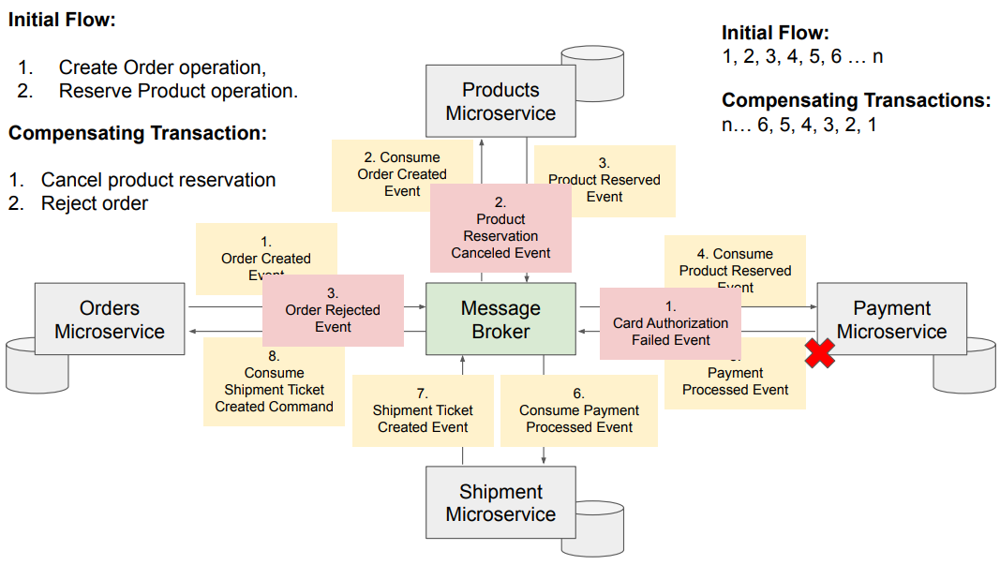

---
### Orchestration-Based Saga

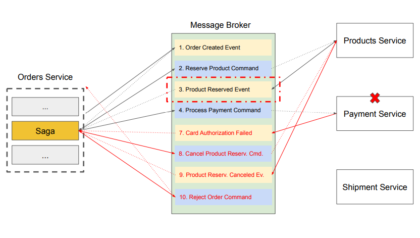

---
### Quiz 9: Saga design pattern

**Q1: In the context of microservices, what is a Saga?**  
**A: A sequence of local transactions.**  
A Saga is a sequence of local transactions where each transaction updates data within a single service. The Saga pattern helps maintain data consistency across multiple services in a microservices architecture, ensuring that even if one transaction fails, compensating actions can be taken to preserve system integrity.

**Q2: In the Orchestration Saga pattern, who is responsible for coordinating the steps of a distributed transaction?**  
**A: A central orchestrator.**  
In the Orchestration Saga pattern, a central orchestrator is responsible for managing and coordinating all steps of the distributed transaction. The orchestrator ensures that each local transaction is executed in the correct sequence and triggers compensating actions if a failure occurs.

**Q3: What is the primary difference between Orchestration and Choreography in a microservices architecture?**  
**A: Orchestration involves a central controller/orchestrator while Choreography does not.**  
In an Orchestration design pattern, a central controller (orchestrator) manages and coordinates how different microservices interact to complete a process. In contrast, Choreography relies on each microservice to communicate through events without a central controller, enabling more decentralized and autonomous coordination.

**Q4: In which Saga pattern is each local transaction publishing an event that triggers the next local transaction in the saga?**  
**A: Choreography Saga.**  
In a Choreography Saga, each local transaction publishes an event that may trigger the next local transaction in the saga. This pattern does not rely on a central coordinator; instead, microservices communicate through events to manage the workflow autonomously.

**Q5: Which Saga pattern would be more suitable for complex business transactions that require centralized control and decision making?**  
**A: Orchestration Saga.**  
The Orchestration Saga pattern is more suitable for complex business transactions that require centralized control and decision-making. In this pattern, a central orchestrator coordinates and guides the process, overseeing the execution of each local transaction and making decisions based on their outcomes.

---
### Reserve Product in Stock - Introduction