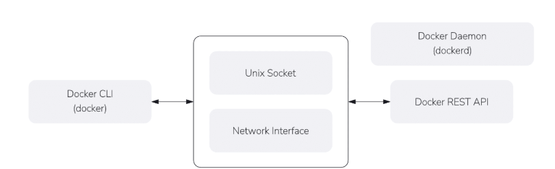
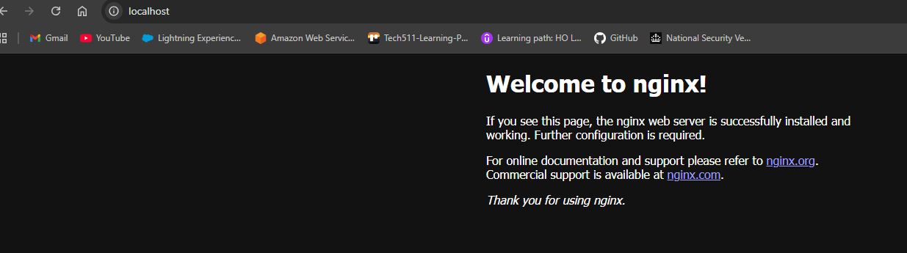
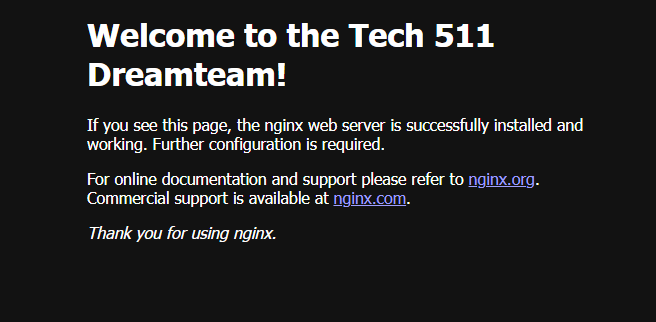
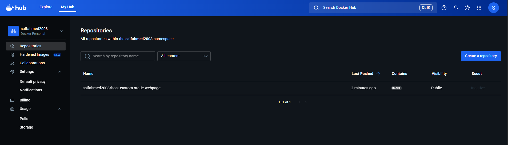
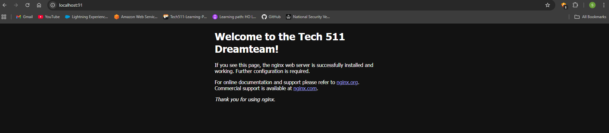
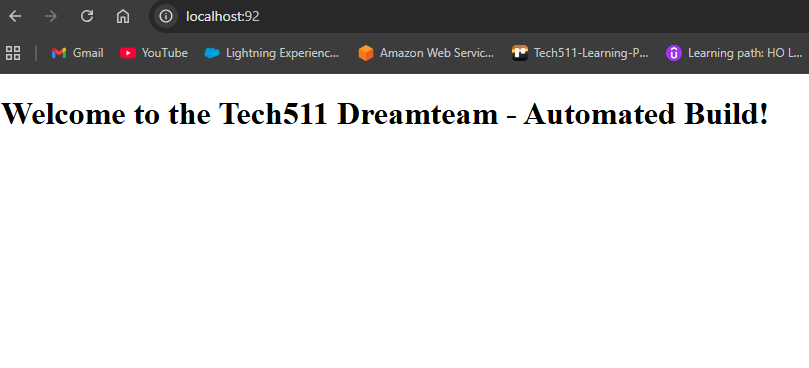
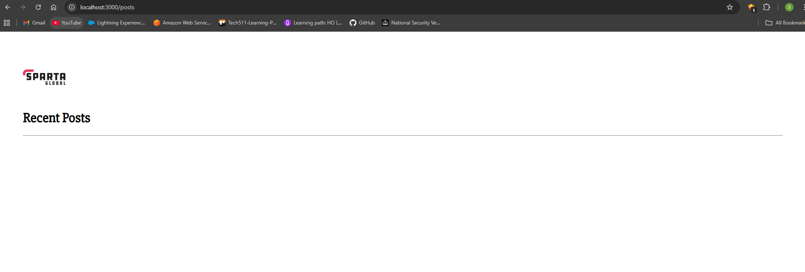

# Use Docker for App Deployment

**Overview**

This goal of this project is to containerise the deployment of the Sparta test app (which uses Node JS v20) and database using Docker and AWS.

---

- [Use Docker for App Deployment](#use-docker-for-app-deployment)
  - [1. Install Docker Desktop](#1-install-docker-desktop)
  - [2. Task: Research microservices, containers and Docker](#2-task-research-microservices-containers-and-docker)
    - [Differences between virtualisation and containerisation](#differences-between-virtualisation-and-containerisation)
      - [What is usually included in a container vs virtual machine?](#what-is-usually-included-in-a-container-vs-virtual-machine)
      - [Benefits of each, especially a virtual machine over the traditional architecture](#benefits-of-each-especially-a-virtual-machine-over-the-traditional-architecture)
    - [Microservices](#microservices)
      - [What are they?](#what-are-they)
      - [How are they made possible?](#how-are-they-made-possible)
      - [Benefits](#benefits)
    - [Docker](#docker)
      - [What is it?](#what-is-it)
      - [Alternatives](#alternatives)
      - [How it works (Docker architecture/API)](#how-it-works-docker-architectureapi)
      - [Success story using Docker](#success-story-using-docker)
    - [Sources](#sources)
  - [3. Learn to manage Docker containers locally](#3-learn-to-manage-docker-containers-locally)
    - [3a. Task: Run and pull your first image](#3a-task-run-and-pull-your-first-image)
    - [3b. Run nginx web server in a Docker container](#3b-run-nginx-web-server-in-a-docker-container)
    - [3c. Remove a container](#3c-remove-a-container)
    - [3d. Task: Modify our nginx default page in our running container](#3d-task-modify-our-nginx-default-page-in-our-running-container)
    - [3e. Task: Run different container on different port](#3e-task-run-different-container-on-different-port)
  - [4. Use Docker Hub to host custom images](#4-use-docker-hub-to-host-custom-images)
    - [4a. Task: Push host-custom-static-webpage container image to Docker Hub](#4a-task-push-host-custom-static-webpage-container-image-to-docker-hub)
    - [4b. Task: Automate docker image creation using a Dockerfile](#4b-task-automate-docker-image-creation-using-a-dockerfile)
  - [5. Run Sparta test app in a container](#5-run-sparta-test-app-in-a-container)
  - [6. Task: Research Docker Compose](#6-task-research-docker-compose)
    - [Why use it?](#why-use-it)
    - [How to use it](#how-to-use-it)
      - [What do you need to install for it to work?](#what-do-you-need-to-install-for-it-to-work)
      - [How to store your docker compose file?](#how-to-store-your-docker-compose-file)
      - [Docker Compose commands:](#docker-compose-commands)
    - [Sources](#sources-1)
  - [7. Task: Use Docker Compose to run app and database containers](#7-task-use-docker-compose-to-run-app-and-database-containers)
    - [Extension: Run the containers on an EC2 instance](#extension-run-the-containers-on-an-ec2-instance)

---
## 1. Install Docker Desktop

Open in a browser: `https://www.docker.com/products/docker-desktop/`

Download Docker Desktop for Windows and install it (`AMD64`)

Restart your computer after installation.

Verify Install:

After Docker Desktop starts, in Git Bash:
```
docker --version
```
---
## 2. Task: Research microservices, containers and Docker

### Differences between virtualisation and containerisation

* Containers and virtual machines are technologies that make your applications independent from your IT infrastructure resources
* A container is a software code package containing an application’s code, its libraries, and other dependencies
* Containerization makes your applications portable so that the same code can run on any device. 
* A virtual machine is a digital copy of a physical machine
* You can have multiple virtual machines with their own individual operating systems running on the same host operating system
* In addition you can create a virtual machine that contains everything required to run your application.

---
#### What is usually included in a container vs virtual machine?

* The key differentiator between containers and virtual machines is that virtual machines virtualize an entire machine down to the hardware layers and containers only virtualize software layers above the operating system level

| **Characteristics** | **Container** | **Virtual Machine** |
|----------------------|---------------|----------------------|
| **Definition** | Software code package containing an application’s code, its libraries, and other dependencies that make up the application running environment. | Digital replica of a physical machine. Partitions the physical hardware into multiple environments. |
| **Virtualization** | Virtualizes the operating system. | Virtualizes the underlying physical infrastructure. |
| **Encapsulation** | Software layer above the operating system required for running the application or application component. | Operating system, all software layers above it, multiple applications. |
| **Technology** | Container engine coordinates with the underlying operating system for resources. | Hypervisor coordinates with underlying operating system or hardware. |
| **Size** | Lighter weight (think in terms of MB). | Much larger (think in terms of GB). |
| **Control** | Less control of the environment outside the container. | More control over the entire environment. |
| **Flexibility** | More flexible. You can quickly migrate between on-premises and cloud-centered environments. | Less flexible. Migration has challenges. |
| **Scalability** | Highly scalable. Granular scalability possible with microservices. | Scaling can be costly. Requires switching from on-premises to cloud instances for cost-effective scale. |

---
#### Benefits of each, especially a virtual machine over the traditional architecture

Containers
* Iteration speed
  * Because containers are lightweight and only include high level software, they are very fast to modify and iterate on
* Robust ecosystem
  * Most container runtime systems offer a hosted public repository of pre-made containers
  * These container repositories contain many popular software applications like databases or messaging systems and can be instantly downloaded and executed, saving time for development teams

Virtual Machines
* Full isolation security
  * Virtual machines run in isolation as  a fully standalone system
  * This means that virtual machines are immune to any exploits or interference from other virtual machines on a shared host
  * An individual virtual machine can still be hijacked by an exploit but the exploited virtual machine will be isolated and unable to contaminate any other neighboring virtual machines
* Interactive development
  * Containers are usually static definitions of the expected dependencies and configuration needed to run the container
  * Virtual machines are more dynamic and can be interactively developed
  * Once the basic hardware definition is specified for a virtual machine the virtual machine can then be treated as a bare bones computer
  * Software can manually be installed to the virtual machine and the virtual machine can be snapshotted to capture the current configuration state
  * The virtual machine snapshots can be used to restore the virtual machine to that point in time or spin up additional virtual machines with that configuration

---
### Microservices

#### What are they?

* Microservices represent a shift away from traditional monolithic application development
* Instead of building one large application, developers create specialized, cloud-hosted sub-applications, each with a specific business function
* Microservices distribute application load balancing and can help ensure stability with replicable, scalable services interacting

---
#### How are they made possible?

* With a microservices architecture, an application is built as independent components that run each application process as a service
* These services communicate via a well-defined interface using lightweight APIs
* Services are built for business capabilities and each service performs a single function
* Because they are independently run, each service can be updated, deployed, and scaled to meet demand for specific functions of an application

---
#### Benefits

* Agility
  * foster an organization of small, independent teams that take ownership of their services
  * Teams act within a small and well understood context and empowered to work more independently and quickly
  * shortens development cycle times
* Flexible Scaling
  * allow each service to be independently scaled to meet demand for the application feature it supports
  * enables teams to right-size infrastructure needs, accurately measure the cost of a feature, and maintain availability if a service experiences a spike in demand
* Easy Deployment
  * enable continuous integration and continuous delivery, making it easy to try out new ideas and to roll back if something doesn’t work
  * The low cost of failure enables experimentation, makes it easier to update code, and accelerates time-to-market for new features
* Technological Freedom
  * architectures don’t follow a “one size fits all” approach
  * Teams have the freedom to choose the best tool to solve their specific problems. 
  * teams building microservices can choose the best tool for each job.
* Reusable Code
  * Dividing software into small, well-defined modules enables teams to use functions for multiple purposes
  * A service written for a certain function can be used as a building block for another feature
  * This allows an application to bootstrap off itself, as developers can create new capabilities without writing code from scratch.
* Resilience
  * Service independence increases an application’s resistance to failure 
  * In a monolithic architecture, if a single component fails, it can cause the entire application to fail
  * With microservices, applications handle total service failure by degrading functionality and not crashing the entire application.

---
### Docker

#### What is it?
* Docker is an open platform for developing, shipping, and running applications. 
* Docker enables you to separate your applications from your infrastructure so you can deliver software quickly.
* With Docker, you can manage your infrastructure in the same ways you manage your applications.
* By taking advantage of Docker's methodologies for shipping, testing, and deploying code, you can significantly reduce the delay between writing code and running it in production.

---
#### Alternatives
* Podman
* containerd and nerdctl
* LXC
* runc
* Rancher Desktop
* Kubernetes
* Red Hat OpenShift
* Hyper-V Containers
* Buildah
* OrbStack
* Virtual Machines
* Platform-as-a-Service (PaaS) Solutions

---
#### How it works (Docker architecture/API)
* Docker uses a client-server driven architecture, where the client (usually the CLI) sends requests to a separate process that’s responsible for carrying out the required actions.
* Docker runs a daemon (dockerd) that exposes a REST API as a Unix socket or network interface.
* The CLI processes your commands, converts them to API requests, and waits for the response from the Docker daemon. 
* It’s the daemon that’s responsible for actually starting containers, building images, and handling the other Docker operations you invoke with the CLI.



---
#### Success story using Docker

* Ataccama
  * Problem: Need for consistent and efficient AI model deployment across multiple platforms.
  * Solution: Adoption of Docker Business for seamless AI model and code deployment.
* The Warehouse Group
  * Problem: Long setup times, inconsistent environments, and slow deployment cycles.
  * Solution: Adoption of Docker Business for seamless AI model and code deployment.
* ZEISS
  * Problem: Need for consistent and efficient AI model deployment across multiple platforms.
  * Solution: Update monolithic infrastructure to containerized approach with Docker Business.

---
### Sources

https://www.sumologic.com/blog/microservices-architecture-docker-containers

https://www.docker.com/resources/what-container/

https://docs.docker.com/get-started/docker-overview/#:~:text=Docker%20is%20an%20open%20platform,you%20can%20deliver%20software%20quickly.

https://spacelift.io/blog/docker-alternatives

https://www.docker.com/customer-stories/#ataccama

https://aws.amazon.com/microservices/

https://aws.amazon.com/compare/the-difference-between-containers-and-virtual-machines/

https://www.atlassian.com/microservices/cloud-computing/containers-vs-vms#:~:text=The%20key%20differentiator%20between%20containers,above%20the%20operating%20system%20level.

---
## 3. Learn to manage Docker containers locally

### 3a. Task: Run and pull your first image

Open a GitBash window and run this command which lists all Docker commands and usage options:
```
docker help
```

You can list local images with:
```
docker images
```

Running:
```
docker run hello-world
```

  * Pulls the image the first time (downloads it from Docker Hub).
  * Uses the local copy on subsequent runs without re-downloading.

Docker automatically differentiates between local and remote images. The hello-world container is a simple way to test that Docker is set up and working.

---
### 3b. Run nginx web server in a Docker container

Open a Git Bash window and download the latest nginx Docker image by running the following command:

```
docker pull nginx:latest
```

**Explanation:**
* `docker pull` fetches an image from Docker Hub.
* `nginx:latest` specifies the Nginx image (the `latest` tag means the most recent version).

You should see Docker downloading multiple layers of the image. After it completes, check that it’s available locally:

```
docker images
```
You should see something like:
```
REPOSITORY   TAG       IMAGE ID       CREATED       SIZE
nginx        latest    <image_id>     <date>        <size>
```
Run the Nginx container and expose port 80 by running this command:

```
docker run --name my-nginx -p 80:80 -d nginx
```

**Explanation:**
* `--name my-nginx` gives the container a custom name (`my-nginx`).
* `-p 80:80` maps **port 80 on your local machine** to **port 80 inside the container**, which is where Nginx listens by default.
* `-d` runs the container in the background (detached mode).
* `nginx` is the name of the image to run.

After running this command, Docker will start the container and return an alphanumeric container ID.

Check if the container is running with:

```
docker ps
```

You should see an entry like:
```
CONTAINER ID   IMAGE    COMMAND                  STATUS          PORTS                NAMES
<id>           nginx    "/docker-entrypoint.…"   Up xx seconds   0.0.0.0:80->80/tcp   my-nginx
```

If you don’t see it running, check all containers (including stopped ones) with:

```
docker ps -a
```

Test that Nginx is working
Open your web browser and visit:
```
http://localhost
```
or
```
http://127.0.0.1
```

You should see the **Nginx welcome page** (a simple HTML page confirming it’s working).



Stop the running container by running:

```
docker stop my-nginx
```

**Explanation:**
- This stops the container gracefully.  

---

### 3c. Remove a container

Open a Git Bash window and Re-start the nginx container you were previously running:

```
docker start my-nginx
```

Confirm it’s running:
```
docker ps
```
You should see:
```
CONTAINER ID   IMAGE    COMMAND                  STATUS          PORTS                NAMES
<id>           nginx    "/docker-entrypoint.…"   Up xx seconds   0.0.0.0:80->80/tcp   my-nginx
```
Try to remove the container while it’s running with:

```
docker rm my-nginx
```

**What happens:**

Docker will respond with an error:
```
Error response from daemon: cannot remove container "my-nginx": container is running: stop the container before removing or force remove
```

This message tells you that Docker does **not allow removal of running containers** unless you use a special flag.

Find the option to forcibly remove a running container by running:

```
docker rm --help
```

You’ll see the list of available options so look for:

```
-f, --force    Force the removal of a running container (uses SIGKILL)
```

This tells you that you can use `--force` (or `-f`) to remove a container even if it’s running.

Remove the running container forcefully by running:

```
docker rm -f my-nginx
```

**What happens:**
* Docker will **kill (stop) the container** and then remove it immediately.
* You won’t need to stop it manually first.

Now check that it’s gone:

```
docker ps -a
```

If the container was successfully removed, you should **not** see `my-nginx` listed anymore.

**Takeaway**
* Normally, Docker won’t let you remove a container that’s still running.  
* The `--force` (or `-f`) option overrides this rule and forcibly removes it.  
* Using `-f` sends a `SIGKILL` to the container, stopping it immediately before removal.

---
### 3d. Task: Modify our nginx default page in our running container

Start the nginx container:
```
docker run --name my-nginx -p 80:80 -d nginx
```
Verify it’s running:
```
docker ps
```
Attempt to open a bash shell:
```
docker exec -it my-nginx /bin/bash
```
**Did not work.**  
* Git Bash on Windows interprets `/bin/bash` as a Windows path (`C:/Program Files/Git/usr/bin/bash`).  
* Additionally, the official **nginx** image **does not include bash** – it only has **sh**.

Fix for the TTY and missing bash problem:
```
winpty docker exec -it my-nginx sh
```
**Worked.**  
* `winpty` fixes the TTY compatibility issue between Git Bash and Docker.  
* `sh` is available in the nginx image, so this successfully opens a shell inside the container.

Update and upgrade packages:
```
apt update && apt upgrade -y
```
Try to use sudo:
```
sudo ls
```
**Did not work.**  
- `sudo` not found: minimal images don’t include it.  

**Fix:**
```
apt install sudo -y
```
Now `sudo` is installed — though not required since container users are root by default.

Move to nginx web directory:
```
cd /usr/share/nginx/html
```

Try to edit the HTML:
```
nano index.html
```
**Did not work.**  
- `nano` isn’t installed in the image.

**Fix: Install nano**
```
apt install nano -y
```

Then reopen:
```
nano index.html
```

Modify and save the default page

Inside `nano`, change:
```
<h1>Welcome to nginx!</h1>
```
to:
```
<h1>Welcome to the Tech 511 Dreamteam!</h1>
```
Then save with **Ctrl + S**, **Enter**, and exit with **Ctrl + X**.  

Open or refresh:
```
http://localhost
```



Shows the updated message — verifying your container is serving the new HTML page.

---
### 3e. Task: Run different container on different port

Confirm your existing nginx container is still running:
```
docker ps
```

Output example:
```
CONTAINER ID   IMAGE     COMMAND                  STATUS          PORTS                                 NAMES
dd7299fd4706   nginx     "/docker-entrypoint.…"   Up 5 minutes    0.0.0.0:80->80/tcp, [::]:80->80/tcp   my-nginx
```

If not, run:
```
docker start my-nginx
```

Try to run a new container on port 80:
```
docker run --name my-nginx-dreamteam -p 80:80 -d daraymonsta/nginx-257:dreamteam
```
**Did NOT work.**  

You’ll see an error like:
```
docker: Error response from daemon: failed to set up container networking: driver failed programming external connectivity on endpoint my-nginx-dreamteam (cd7387ca7842cf2b637079bfe2c4b9da4c5c00d19a54f029fa2dd72af9ea17c6): Bind for 0.0.0.0:80 failed: port is already allocated
```

**Why this happens:**

* Port 80 on your **local machine** is already being used by your currently running `my-nginx` container.
* Docker can’t map two different containers to the same external port on the same host.

Fix — remove the failed container

Even though the container didn’t start properly, Docker created a **reference for it**.  

Check all containers (running and stopped):
```
docker ps -a
```

You’ll see something like:
```
CONTAINER ID   IMAGE                              STATUS    PORTS  NAMES
e123ab45c678   daraymonsta/nginx-257:dreamteam    Created           my-nginx-dreamteam
```

Remove the failed one:
```
docker rm my-nginx-dreamteam
```

Run the container again, but expose it on a different port:
```
docker run --name my-nginx-dreamteam -p 90:80 -d daraymonsta/nginx-257:dreamteam
```
**Worked.**  

**Why this works:**
* You mapped **port 90 on your local machine** → **port 80 inside the container**.
* Since port 90 wasn’t already taken, Docker successfully started the container.

Check that it’s running:
```
docker ps
```

Example output:
```
CONTAINER ID   IMAGE                              STATUS          PORTS                   NAMES
dd7299fd4706   nginx                              Up 8 minutes    0.0.0.0:80->80/tcp      my-nginx
e123ab45c678   daraymonsta/nginx-257:dreamteam    Up 30 seconds   0.0.0.0:90->80/tcp      my-nginx-dreamteam
```

Verify in your web browser by going to:
```
http://localhost:90
```

You’ll see the default page served by the new Docker image `daraymonsta/nginx-257:dreamteam`, separate from your first container running on port 80.


You can now visit:
- `http://localhost` → your **first nginx container**
- `http://localhost:90` → your **new custom nginx container**

**Key Takeaways**
* Only one container can listen on the same host port at a time.  
* Use a different external port (left side of `-p <host>:<container>`) to run multiple containers simultaneously.  
* If a container fails to start due to a **port conflict**, remove it using `docker rm <name>` before retrying.  

---
## 4. Use Docker Hub to host custom images
### 4a. Task: Push host-custom-static-webpage container image to Docker Hub

Create an image from your running container

Your container with the modified `index.html` is called `my-nginx`.  

Save it as an image:
```
docker commit my-nginx host-custom-static-webpage
```

This captures the current state of your running container (including your custom HTML file) as a new image named `host-custom-static-webpage`.

Confirm it was created:
```
docker images
```
Example output:
```
REPOSITORY                  TAG       IMAGE ID       CREATED              SIZE
host-custom-static-webpage   latest    a1b2c3d4e5f6   10 seconds ago       133MB
```

Log in to Docker Hub

You must authenticate before pushing an image.

```
docker login
```

Enter your **Docker Hub username and password**

If successful:
```
Login Succeeded
```

Tag the image for your Docker Hub repository with your username:
```
docker tag host-custom-static-webpage saifahmed2003/host-custom-static-webpage:latest
```

Now your image has two names:
```
docker images
```
Output:
```
REPOSITORY                                TAG       IMAGE ID       CREATED         SIZE
saifahmed2003/host-custom-static-webpage  latest    a1b2c3d4e5f6   1 minute ago    133MB
host-custom-static-webpage                latest    a1b2c3d4e5f6   1 minute ago    133MB
```

Push the correctly tagged image
```
docker push saifahmed2003/host-custom-static-webpage:latest
```

You’ll see your image layers upload:
```
The push refers to repository [docker.io/saifahmed2003/host-custom-static-webpage]
abcd1234: Pushed
efgh5678: Pushed
latest: digest: sha256:xxxxxxxx size: 1572
```

This uploads all layers of your image to your Docker Hub repository:
[https://hub.docker.com/repositories/saifahmed2003](https://hub.docker.com/repositories/saifahmed2003)



Run a container from your **Docker Hub image**

Now test your uploaded image by pulling it back from Docker Hub and running it on a new port.

```
docker run --name my-hub-webpage -p 91:80 -d saifahmed2003/host-custom-static-webpage:latest
```

Explanation:
* `--name my-hub-webpage` gives this new container a unique name.
* `-p 91:80` maps local port 91 to port 80 inside the container (avoiding conflicts with your other nginx containers).
* `-d` runs it detached in the background.

Check it’s running:
```
docker ps
```
You should see:
```
CONTAINER ID   IMAGE                                           STATUS          PORTS                  NAMES
abcd1234efgh   saifahmed2003/host-custom-static-webpage:latest  Up 10s     0.0.0.0:91->80/tcp     my-hub-webpage
```

Visit in your browser:
```
http://localhost:91
```

You’ll see your custom nginx welcome message served from your **Docker Hub image**.




**Key Takeaways**
* `docker commit` saves a running container’s state into a local image.  
* Docker Hub requires your **username prefix** for repository names (`username/repository`).  
* Use `docker tag` to rename local images before pushing to Docker Hub.  
* Once pushed, the image becomes cloud‑hosted:  
  ```
  docker pull saifahmed2003/host-custom-static-webpage:latest
  ```
* You can test by running that same image locally again from your Docker Hub repository.

---
### 4b. Task: Automate docker image creation using a Dockerfile

Make a new folder for your Dockerfile project (outside of any repo you plan to publish):

```
mkdir tech511-mod-nginx-dockerfile
```

Move into that folder:
```
cd tech511-mod-nginx-dockerfile
```

Create a custom `index.html`

Open or create the file:
```
nano index.html
```

Paste this content:
```
<!DOCTYPE html>
<html>
  <head>
    <title>Tech511 Auto Docker</title>
  </head>
  <body>
    <h1>Welcome to the Tech511 Dreamteam - Automated Build!</h1>
  </body>
</html>
```

Save (**Ctrl + S**, then **Enter**) and exit (**Ctrl + X**).

Create a Dockerfile

Open a new file called `Dockerfile`:
```
nano Dockerfile
```

Paste the following lines:
```
# Use the official nginx base image
FROM nginx:latest

# Copy custom index.html into nginx’s default web directory
COPY index.html /usr/share/nginx/html/index.html
```

Save and exit (**Ctrl + S**, **Enter**, **Ctrl + X**).

**Explanation:**  
This Dockerfile tells Docker to start with the official `nginx` image and automatically replace the default homepage with your custom one.

Build your custom Docker image by running:
```
docker build -t tech511-nginx-auto:v1 .
```
**Explanation:**  
* `-t tech511-nginx-auto:v1` gives your image a name and version tag.  
* The `.` indicates the current directory contains your Dockerfile and `index.html`.

Check it:
```
docker images
```
Example output:
```
REPOSITORY             TAG     IMAGE ID       CREATED          SIZE
tech511-nginx-auto     v1      abcd1234       30 seconds ago   133MB
```

Run the container to test it locally
Use an available port (e.g. 92):
```
docker run --name tech511-auto -p 92:80 -d tech511-nginx-auto:v1
```

Verify it’s running:
```
docker ps
```

Output example:
```
CONTAINER ID   IMAGE                 STATUS          PORTS                  NAMES
abcd1234efgh   tech511-nginx-auto:v1 Up 10s          0.0.0.0:92->80/tcp     tech511-auto
```

Now in your browser, check:
```
http://localhost:92
```
You should see your Tech511 custom webpage.



Tag the built image with your Docker Hub username:

```
docker tag tech511-nginx-auto:v1 saifahmed2003/tech511-nginx-auto:v1
```

Check again:
```
docker images
```
Output:
```
REPOSITORY                          TAG     IMAGE ID       CREATED         SIZE
saifahmed2003/tech511-nginx-auto    v1      abcd1234       3 minutes ago   133MB
tech511-nginx-auto                  v1      abcd1234       3 minutes ago   133MB
```

If you’re not already logged in:

```
docker login
```

You should see:
```
Login Succeeded
```

Now upload your tagged image:

```
docker push saifahmed2003/tech511-nginx-auto:v1
```

Docker uploads image layers — output looks like:
```
The push refers to repository [docker.io/saifahmed2003/tech511-nginx-auto]
abcd1234: Pushed
efgh5678: Pushed
v1: digest: sha256:xxxxxxxx size: 1572
```

Check online:
[https://hub.docker.com/repositories/saifahmed2003](https://hub.docker.com/repositories/saifahmed2003)

Stop the running container that was using your image:
```
docker stop tech511-auto
```

Force‑remove the image from your local system:
```
docker rmi -f saifahmed2003/tech511-nginx-auto:v1
```

The message:
```
Untagged: saifahmed2003/tech511-nginx-auto:v1
```
means Docker successfully removed the tag (and, if that was the last tag, deleted the image locally).

Check if any matching images remain:
```
docker images
```
You should **not** see `tech511-nginx-auto` or `saifahmed2003/tech511-nginx-auto`.

If it’s gone — everything is clean and you’re ready for the **final step** of the task.

Now test pulling the image from your Docker Hub repository by running it fresh from the registry:

```
docker run --name tech511-auto-pulled -p 93:80 -d saifahmed2003/tech511-nginx-auto:v1
```

**What will happen:**
* Docker checks locally for that image, sees it’s missing.  
* It automatically **pulls it down from Docker Hub**.  
* Then it runs your container on port 93.

You’ll see output like:
```
Unable to find image 'saifahmed2003/tech511-nginx-auto:v1' locally
v1: Pulling from saifahmed2003/tech511-nginx-auto
Digest: sha256:xxxxxxxx
Status: Downloaded newer image for saifahmed2003/tech511-nginx-auto:v1
container_id
```

Verify in browser
1. Make sure container is running:
   ```
   docker ps
   ```
   Look for something like:
   ```
   CONTAINER ID   IMAGE                               STATUS          PORTS         NAMES
   e12345abcd     saifahmed2003/tech511-nginx-auto:v1  Up 5s      0.0.0.0:93->80/tcp  tech511-auto-pulled
   ```

2. Go to your browser and open:
   ```
   http://localhost:93
   ```

You should see your **Tech511 Dreamteam – Automated Build** page served **from the image pulled from Docker Hub**.

**Key Takeaways**
* You’ve automated nginx customization with a **Dockerfile** instead of manual edits.  
* `FROM nginx` + `COPY index.html` = instant custom web page baked into the image.  
* Proper Docker Hub tagging uses the format `<username>/<repository>:<tag>`.  
* Removing the local copy and re‑running forces Docker to pull from Docker Hub, verifying the push was successful.

---
## 5. Run Sparta test app in a container

**Goal**
Run a **Node JS v20 Sparta Test App** (frontpage only) inside a Docker container and host it on **port 3000** — then push the image to Docker Hub and verify it by pulling it fresh.

Create a new project folder because every Dockerfile project needs its own directory:
```
mkdir tech511-sparta-test-app
cd tech511-sparta-test-app
```

Place the entire `app` folder (your Sparta test app code) inside this new directory.

Create a Dockerfile:
```
nano Dockerfile
```

Paste the following content:

```
# 1. Use official Node.js v20 image as base
FROM node:20

# 2. Add a descriptive label
LABEL maintainer="saifahmed2003 <saifahmed2003@dockerhub>"

# 3. Set working directory inside container
WORKDIR /usr/src/app

# 4. Copy application code into the container
COPY app /usr/src/app

# 5. Copy package.json and package-lock.json if present
COPY app/package*.json ./

# 6. Install dependencies
RUN npm install

# 7. Expose port 3000
EXPOSE 3000

# 8. Default command to run the app
CMD [ "node", "app.js" ]
```

Save (**Ctrl + S**, **Enter**) and exit (**Ctrl + X**).  

**Explanation**
* Starts from official Node v20 base image (so the runtime matches your app).
* Copies in your files and installs dependencies with `npm install`.
* Exposes port 3000 — the default for most Node apps.
* Runs the app with Node.

Your should now have this structure:
```
tech511-sparta-test-app/
├── Dockerfile
└── app/
    ├── app.js
    ├── package.json
    ├── ...
```
---

Build the Docker image by running:
```
docker build -t tech511-sparta-app:v1 .
```

**Explanation:**
* `-t` gives your image a name and version tag (`v1`).
* `.` tells Docker to look for the Dockerfile in the current directory.

Check all images:
```
docker images
```

You’ll see something like:
```
REPOSITORY                                 TAG         IMAGE ID       CREATED          SIZE
tech511-sparta-app                         v1          8bd50d7816aa   34 seconds ago   1.66GB
```

Run the container (port 3000) by launching your app via Docker:
```
docker run --name tech511-sparta-container -p 3000:3000 -d tech511-sparta-app:v1
```

**Explanation:**
* Maps port 3000 on your local machine to port 3000 in the container (`-p 3000:3000`).
* `-d` runs detached so the container runs in the background.

Check it:
```
docker ps
```

Output:
```
CONTAINER ID   IMAGE                                 COMMAND                  CREATED          STATUS          PORTS                                         NAMES
bedf0a548675   tech511-sparta-app:v1                 "docker-entrypoint.s…"   13 seconds ago   Up 12 seconds   0.0.0.0:3000->3000/tcp, [::]:3000->3000/tcp   tec
```

Now go to your browser:

[http://localhost:3000](http://localhost:3000)

You should see the **Sparta test app** front page.


Before pushing, tag it with your username for DockerHub:

```
docker tag tech511-sparta-app:v1 saifahmed2003/tech511-sparta-app:v1
```

Confirm:
```
docker images
```
Output:
```
REPOSITORY                                 TAG         IMAGE ID       CREATED         SIZE
tech511-sparta-app                         v1          8bd50d7816aa   3 minutes ago   1.66GB
saifahmed2003/tech511-sparta-app           v1          8bd50d7816aa   3 minutes ago   1.66GB
```

Log in to Docker Hub
```
docker login
```

You’ll see: `Login Succeeded`.

Push your Sparta app image:
```
docker push saifahmed2003/tech511-sparta-app:v1
```

Your layers upload:
```
The push refers to repository [docker.io/saifahmed2003/tech511-sparta-app]
cc416d1dd0a3: Pushed
4f4fb700ef54: Pushed
50bdbb13b0be: Pushed
cd01849e3cbd: Pushed
d8e38445f377: Pushed
f279d33abc52: Pushed
fa7b58dc9b39: Pushed
8501d359779d: Pushed
6bf25397979a: Pushed
ad1ecab4b183: Pushed
5daa5a418829: Pushed
3e82fb856c34: Pushed
da3556d62e9b: Pushed
v1: digest: sha256:8bd50d7816aa5e92bc228ccde78e949aeff3a37d0a2c4a0d6a682d5a9ff4d08a size: 856
```

You can confirm online at:  
[https://hub.docker.com/repositories/saifahmed2003](https://hub.docker.com/repositories/saifahmed2003)


Remove your local image:

Stop and remove the container first (otherwise the image will be “in use”):
```
docker stop tech511-sparta-container
docker rm tech511-sparta-container
```

Then remove both local tags:
```
docker rmi tech511-sparta-app:v1 saifahmed2003/tech511-sparta-app:v1
```

Docker reports untagged/deleted image and ID.

Check:
```
docker images
```
You should **not** see those images anymore.

Re‑run your app, forcing Docker to pull it from Docker Hub:
```
docker run --name tech511-sparta-pulled -p 3000:3000 -d saifahmed2003/tech511-sparta-app:v1
```

Output:
```
Unable to find image 'saifahmed2003/tech511-sparta-app:v1' locally
v1: Pulling from saifahmed2003/tech511-sparta-app
d8e38445f377: Pull complete
4f4fb700ef54: Pull complete
cc416d1dd0a3: Pull complete
6bf25397979a: Pull complete
Digest: sha256:8bd50d7816aa5e92bc228ccde78e949aeff3a37d0a2c4a0d6a682d5a9ff4d08a
Status: Downloaded newer image for saifahmed2003/tech511-sparta-app:v1
fcaa395940b09614b804ddbad18f50fe701096b8304e132a9fff6e420737398d
```

Check:
```
docker ps
```

Visit again:
[http://localhost:3000](http://localhost:3000)

You’re now running the **Sparta test Node.js app** from your Docker Hub image.

**Key Takeaways**
* **Dockerfile automation** eliminates manual setup — the Node runtime, dependencies, and start command are all in code.  
* **Build → Run → Tag → Push → Pull → Re‑Run** is the full image lifecycle.  
* The Sparta App now runs anywhere instantly from your Docker Hub repo:
  ```
  docker pull saifahmed2003/tech511-sparta-app:v1
  docker run -p 3000:3000 saifahmed2003/tech511-sparta-app:v1
  ```

If you want to stop everything that’s running:
```
docker stop $(docker ps -q)
```

**Explanation:**

* docker ps -q lists only container IDs of all running containers.
* Docker passes that list to docker stop, stopping them all.

---
## 6. Task: Research Docker Compose

### Why use it?
* Simplified control
  * define and manage multi-container apps in one YAML file, streamlining orchestration and replication
* Efficient collaboration
  * shareable YAML files support smooth collaboration between developers and operations, improving workflows and issue resolution leading to increased overall efficiency
* Rapid application development
  * Compose catches the configuration used to create a container
  * when you restart a service that has not changed, Compose re-uses the existing containers
  * Re-using containers means that you can make changes to your environment very quickly
* Portability across environments
  * Compose supports variables in the Compose file
  * You can use these variables to customize your composition for different environments, or different users

---
### How to use it

#### What do you need to install for it to work?

Windows
* The easiest and recommended way to get Docker Compose is to install Docker Desktop.
* Docker Desktop includes Docker Compose along with Docker Engine and Docker CLI which are Compose prerequisites.

#### How to store your docker compose file?

* With Docker Compose you use a YAML configuration file, known as the Compose file or `compose.yaml` file, to configure your application’s services, and then you create and start all the services from your configuration with the Compose CLI
* The default path for a Compose file is `compose.yaml` (preferred) or `compose.yml` that is placed in the working directory

---
#### Docker Compose commands:

All management commands start with:
```
docker compose <command>
```
Start the application (without detached mode)
```
docker compose up
```

Start the application (in detached mode)
```
docker compose up -d
```

**The difference between running your application with or without detached mode** is that `docker compose up` (non-detached) logs stream to your terminal; **Ctrl+C** stops everything whereas `docker compose up -d` (detached) is where containers run in background and the terminal is free to use; view logs later with `docker compose logs`.

Stop the application
```
docker compose down
```

Run your application in detached mode
```
docker compose up -d
```

Check services running with docker compose
```
docker compose ps
```

View logs in real-time
```
docker compose logs -f
```

View docker compose images
```
docker compose images
```

---
### Sources

https://docs.docker.com/compose/intro/features-uses/

https://docs.docker.com/compose/install/#:~:text=The%20easiest%20and%20recommended%20way,CLI%20which%20are%20Compose%20prerequisites.

https://docs.docker.com/compose/intro/compose-application-model/

---

## 7. Task: Use Docker Compose to run app and database containers

You already have your Node.js microservice image on Docker Hub (`saifahmed2003/tech511-sparta-app`) and only need to pair it with a MongoDB container using Docker Compose.

Create a directory for your Docker setup:
```
mkdir sparta-app-compose
cd sparta-app-compose
```

Create a file named `docker-compose.yaml` inside that folder:
```
nano docker-compose.yaml
```

Paste this inside:
```
services:
  mongo:
    image: mongo:6.0                # stable MongoDB image version
    container_name: mongo
    restart: always
    ports:
      - "27017:27017"               # expose MongoDB port
    volumes:
      - mongo_data:/data/db         # persist MongoDB data even if container stops

  app:
    image: saifahmed2003/tech511-sparta-app:v1   # use your Docker Hub image with tag v1
    container_name: app
    restart: always
    ports:
      - "3000:3000"                 # map container port 3000 to your localhost
    depends_on:
      - mongo                       # ensure Mongo starts first
    environment:
      - DB_HOST=mongodb://mongo:27017/posts  # environment variable to link to MongoDB

volumes:
  mongo_data:                       # declared volume for Mongo persistence
```

**Explanation:**
* The `mongo` service uses the official MongoDB image.
* The `app` service pulls your Node app from Docker Hub.
* `depends_on` ensures Mongo starts before the app.
* `DB_HOST` is passed as an environment variable to your Node service.

Pull your images:
```
docker pull mongo:6.0
docker pull saifahmed2003/tech511-sparta-app:v1
```

Start your containers:
```
docker-compose up -d
```

You should see:
```
[+] Running 9/9
 ✔ mongo Pulled                                                           89.5s
   ✔ 1ad79419bb76 Pull complete                                           30.1s
   ✔ afdef96060ff Pull complete                                           30.4s
   ✔ cde22982277a Pull complete                                            0.6s
   ✔ af6eca94c810 Pull complete                                           30.0s
   ✔ dc9abaf2c8ff Pull complete                                           30.5s
   ✔ a2be9b1fc57a Pull complete                                           30.6s
   ✔ 9d81a4e85c6a Pull complete                                            0.9s
   ✔ 9d6e74542339 Pull complete                                           86.5s
[+] Running 4/4
 ✔ Network sparta-app-compose_default    Created                           0.2s
 ✔ Volume sparta-app-compose_mongo_data  Created                           0.0s
 ✔ Container mongo                       Started                           2.1s
 ✔ Container app                         Started                           2.1s
```

Check containers are running:
```
docker ps
```

Test in your browser:

Visit http://localhost:3000/posts

You should see your app running with a blank posts page as the database is empty.



You can manually run your seed script inside the running app container.

Open a shell into the running app container:
```
docker exec -it app bash
```

You should now see a prompt like:
```
root@<container-id>:/usr/src/app#
```

Run your seed file inside the container:
```
node seeds/seed.js
```

You should see console messages confirming documents being inserted:
```
Connected to database
Database cleared
Database seeded with 100 records
Database connection closed
```

Exit the container:
```
exit
```

Reload your page

Go back to http://localhost:3000/posts — you should now see your seeded posts listed.


---
### Extension: Run the containers on an EC2 instance

Launch your EC2 instance

Go to the AWS Management Console → EC2 → Launch Instance

Choose:
* Amazon Machine Image (AMI): Ubuntu 22.04 LTS
* Instance type: t3.micro (free tier eligible)
* Key pair: Choose existing
* Security group: 
  * Allow SSH (port 22) from your IP
  * Allow HTTP (port 80) from anywhere (0.0.0.0/0)
  * Allow Custom TCP (port 3000) from anywhere
* Launch the instance.

Connect to your EC2 instance:
```
ssh -i /path/to/your-key.pem ubuntu@<your-ec2-public-dns>
```

Run these commands one by one and install Docker:
```
sudo apt update
sudo apt upgrade
sudo apt install -y docker.io
sudo systemctl start docker
sudo systemctl enable docker
docker --version
```

Install Docker Compose (standalone binary):
```
sudo curl -L "https://github.com/docker/compose/releases/latest/download/docker-compose-$(uname -s)-$(uname -m)" \
  -o /usr/local/bin/docker-compose
sudo chmod +x /usr/local/bin/docker-compose
```

Check that it has been installed:
```
docker-compose --version
```

Create your project directory and move into it
```
mkdir sparta-app-compose
cd sparta-app-compose
```

Create the `docker-compose.yaml` file:
```
nano docker-compose.yaml
```

Paste this in:
```
services:
  mongo:
    image: mongo:6.0
    container_name: mongo
    restart: always
    ports:
      - "27017:27017"
    volumes:
      - mongo_data:/data/db

  app:
    image: saifahmed2003/tech511-sparta-app:v1
    container_name: app
    restart: always
    ports:
      - "3000:3000"
    depends_on:
      - mongo
    environment:
      - DB_HOST=mongodb://mongo:27017/posts

volumes:
  mongo_data:
```

Save and exit (`Ctrl + S`, `Enter`, `Ctrl + X`).

Pull the images:
```
sudo docker pull mongo:6.0
sudo docker pull saifahmed2003/tech511-sparta-app:v1
```

Run the containers:
```
sudo docker-compose up -d
sudo docker ps
```

You should see both `mongo` and `app` containers running.

Seed your database:
```
sudo docker exec -it app bash
node seeds/seed.js
exit
```

Then go to your app in the browser:
```
http://<your-ec2-public-dns>:3000/posts
```

You’ll now see a working posts page with your seeded posts.


