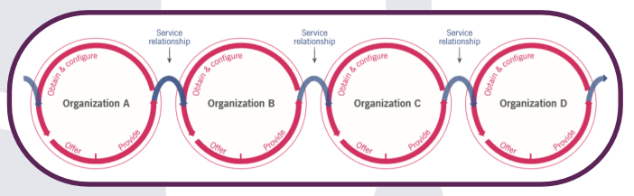
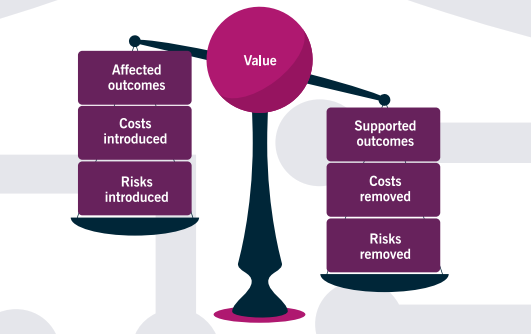
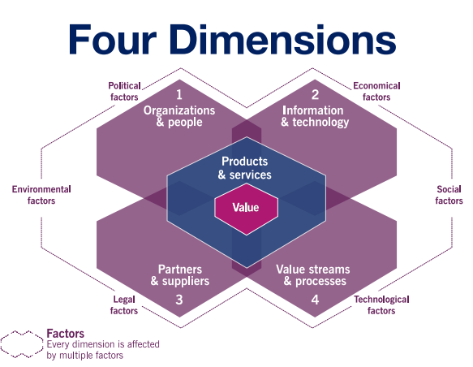
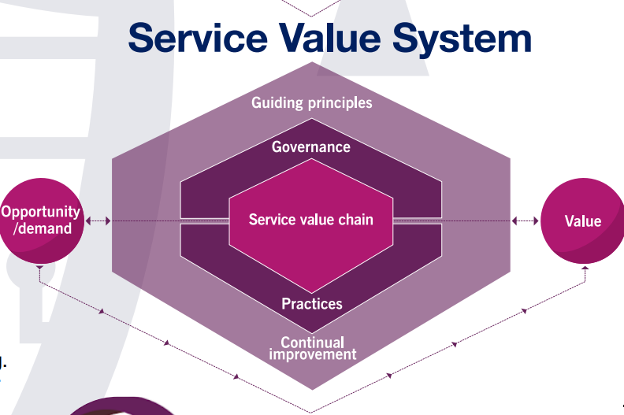
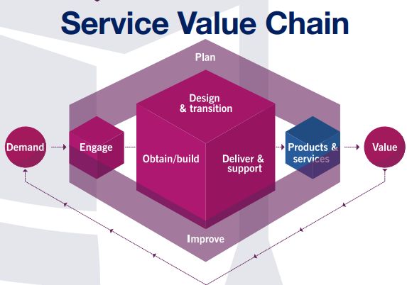
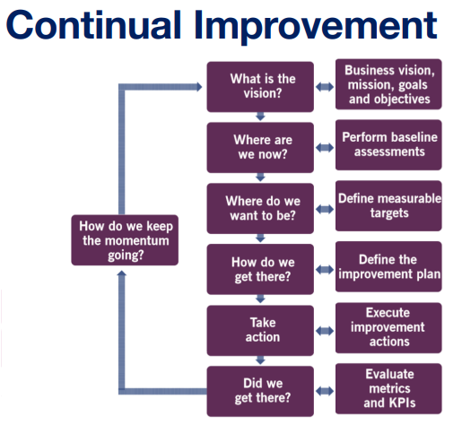

# ITIL Service Management 

**Overview**

Learn about service management, four dimensions, guiding principles, service value system, and ITSM best practices.

---

- [ITIL Service Management](#itil-service-management)
  - [Introduction](#introduction)
    - [Welcome](#welcome)
    - [Industrial Revolution](#industrial-revolution)
    - [Service Organisations](#service-organisations)
  - [Service Management](#service-management)
    - [Service Management](#service-management-1)
    - [Value](#value)
    - [Organisations and People](#organisations-and-people)
    - [Services and Products](#services-and-products)
    - [Service Offerings](#service-offerings)
    - [Service Relationships](#service-relationships)
    - [Outcomes](#outcomes)
    - [Costs](#costs)
    - [Risks](#risks)
    - [Utility and Warranty](#utility-and-warranty)
  - [The Basics of ITL 4](#the-basics-of-itl-4)
    - [4 Dimensions of Service Management](#4-dimensions-of-service-management)
    - [Service Value System](#service-value-system)
    - [Guiding Principles](#guiding-principles)
    - [Service Value Chain](#service-value-chain)
    - [Continual Improvement](#continual-improvement)
    - [The 34 Practices](#the-34-practices)

---
## Introduction
### Welcome
* Will be learning about:
  * Four Dimensions
  * Service Value System
  * Guiding Principles
  * Service Value Chain
  * Continual Improvement
  * The 34 Practices
* Can take ITIL4 Certification Exam
* **Service Management** - A set of specialised organisational capabilities for enabling value to customers in the form of services
* ITIL is the most popular information technology service management framework in the world
---
### Industrial Revolution
* 1st revolution
  * 18th and 19th centuries across Europe and America
  * humanity moved from an agrarian-based rural society of farmers into an urbanised industrial area that later developed into large cities
  * brought about by the development of mechanisation in the form of iron and textile industries, aswell as the steam engine for transportation
* 2nd revolution
  * end of the 19th century to WWI
  * industries expanded to include steel, oil, electricity and electrically powered equipment to aid in the mass production of goods
  * cars were developed with internal combustion engines improving transportation
  * the light bulb began to replace candlelight allowing us to work longer into the night
  * telephones improved communication over long distances
* 3rd revolution
  * around 1980 the digital revolution occured
  * advancement of analog and digital electronics meant humans using life changing technologies on a daily basis
  * personal computer, internet and entire spectrum of information and communication technologies
  * **ITIL** first created during this time
    *  Information Technology Infrastructure Library 
    *  was a series of best practices on how to run an information technology organisation
    * a way to create processes and procedures to better run their IT systems
* 4th revolution
  * right now
  * creation of cyber physical systems
  * blurred the lines between physical and digital realms
  * robotics, nanotechnology, artificial intelligence, internet of things, autonomous cars 
  * ITIL 4 is for the 4th industrial revolution
  * ITIL is no longer considered an acronym - its a brand name
---
### Service Organisations
* in the digital world, every organisation in the world has become a service organisation
* done to co-create value with your customers enabled by information technology
* e.g. Walmart 
  * created a robust distribution amd logistics system to deliver their products more cost effectively and efficiently than others
  * allows them to rely on complex inventory tracking and logistic systems all run by various IT components and services
* **Service Management** - A set of specialised organisational capabilities for enabling value to customers in the form of services
  * fast service and quality service 
* **Governance** - the means by which an organisation is directed or controlled
---
## Service Management
### Service Management
* **Service Management** - A set of specialised organisational capabilities for enabling value to customers in the form of services
* **Organisational capability** referes to having both the capacity and the ability to perform the functions required
* Organize your people to best support the actvities, practices and processes
* none of this is done in isolation - have to consider the service relationships that are built throught the process
---
### Value
* The perceived benefits, usefulness and importance of something
* the amount of value something has is always subjective by the percipient of the value
---
### Organisations and People
* **Organisation** - a person or a group of people that has its own functions, responsibilities and relationships to achieve its objectives
* 2 basics roles an organisation can fulfill in ITIL4:
  * **Service Provider** - a role performed by an organisation in a service relationship to provide services to consumers
  * **Consumer** - a role performed by an organisation in a relationship that uses those services
* Organisations vary in size, complexity and legal structure
* People are organised around common goals within a larger business organisation to achieve common objectives in a coordinated method
* value is co-created by the service provider and the consumer
* you can be both a supplier and a consumer simultaneously
* people can fulfill 3 other types of roles:
  * **User** - a person who uses a service
  * **Customer** - a person who defines the requirements for a service and takes responsibility for the outcomes of service consumption
  * **Sponsor** - a person who authorises the budget fot service consumption
* you can multiple roles simultaneously 
* a disconnect between requirements, budget and usability may occur
---
### Services and Products
* **Service** - means of enabling value co-creation by facilitating outcomes that customers want to achieve, without the customer having to manage specific costs and risks
* a service provider cannot achieve outcomes for you
* services may be based on products
* **Product** - Configuration of resources created by the organisation that will be potenially valuable for its customers
* resources can be owned or managed by the organisation
* a product combines and simplifies the various services
---
### Service Offerings
* **Service Offerings** - a description of one or more services designed to address the needs of a target consumer group
* Service offerings can include goods, access to resources and service actions
* **Goods** - things that are transferred from the service provider to the consumer and then the consumer is responsible for their future use
* **Access to Resources** - granted or licensed to a consumer under agreed terms and conditions
* **Service Action** - actions performed to address a consumer's needs
---
### Service Relationships
* **Service Relationships** - a cooperation between a service provider and service consumer including service provision, service consumption and service relationship management
* **Service Provision** - the activities performed by an organisation to provide the services
* **Service Consumption** - the activities performed by an organisation to consume the services
* **Service Relationship Management** - the actvities that the service provider and the service consumer do together to enable value co-creation to occur based upon the service offerings
* **Service Relationship Model** - an organisation might be both a service provider and service consumer at the same time

---
### Outcomes
* **Outcome** - a result for a stakeholder. enabled by one or more outputs

* when the value proposition is good, a business agreement can be made
* value propositions change when the factors change
---
### Costs
* **Costs** - the amount of money spent on a specific activity or resource
* may be measured in man-hours or FTEs
* One FTE = 2000 hours of work per year
* a service provider aims to reduce or remove costs for you when providing a service
---
### Risks
* **Risk** - a possible event that could cause harm, loss or make it more difficult to achieve objectives
* a service provider's goal should be to reduce risk to the consumer
* risk is potentially imposed on consumers by the service
* consumers should contribute to the reduction of risk
* Consumers must:
  1. define the requirements of the service and clarify the rrquired outcomes
  2. clearly communicate any constraint and the critical success factors 
  3. ensure providers have access to the necessary resources
* providers can:
  * Avoid risk - removing risks from the service
  * Accept risk - used when the risk or cost is considered low
  * Transfer risk - used when you insure against a risk
  * Mitigate risk - used when you implement technology or processes to reduce the risk
---
### Utility and Warranty
* **Utility** - functionality offered by a product or service to meet a particular need
  * "what a product does"
  * fit for purpose
  * requires that a service support the performance or remove constraints from the consumer
* **Warranty** - assurance that a product or service will meet agreed requirements
  * "how the service performs"
  * fit for use
  * requires that a service has defined and agrred-upon conditions that are met
* a service should have both utility and warranty
---
## The Basics of ITL 4
### 4 Dimensions of Service Management
* 4 different perspectives:
  1. Organisations and people
  2. Information and technology
  3. Partners and suppliers
  4. Value streams and processes

---
### Service Value System
* **Service Value System (SVS)** - describes how all the components and activities of the organisation work together as a system to enable value co-creation
* require integration and coordination of activities, practices, teams, authorities and responsibilities
* ensures that the organisation continually co-creates value with all stakeholders through the use and management of products and services

---
### Guiding Principles
* **Guiding Principles** - a recommendation that guides an organisation in all circumstances
* allows organisations to integrate them into an overall approach to service management
* guiding principles are applied universally to any initiative
* encourage and support organisations in continual improvement
* consider which of the guiding principles are relevant to your situation
* 7 principles:  
  * focus on value
  * start where you are
  * progress iteratively with feedback
  * collaborate and promote visibility
  * think and work holistically
  * keep it simple and practical
  * optimise anf automate

---
### Service Value Chain

* service value chain uses interactions between practices
* each activity contributes to the service value chain by transforming specific inputs into outputs
* service value chain activities use different combinations of the 34 ITIL practices
* all incoming and outgoing interactions are performed trhough the engage activity
* all new resources are obtained through the obtain/build activity
* planning at all levels is performed via plan activity
* improvements at all levels are initiated and managed through the improve activity
* integration and coordination between design and transition, obtain/build and delivery and support
---
### Continual Improvement
* **Continual Improvement** - aligns the organisation's practices and services with changing business needs through the ongoing identification and improvement of services, service components, practices or any element involved in the efficient and effective management of products and services

---
### The 34 Practices
* **Practice** - a set of organised resources designed for performing work or accomplishing an objective
* 34 practices divided into:
  
  * General Management
    * 14 practices
    * have been adapted from the wider business domain
  1. Architecture management
  2. Continual improvement
  3. Information security management 
  4. Knowledge management
  5. Measurement and reporting
  6. Organisational change management
  7. Portfolio management
  8. Project management
  9. Relationship management
  10.  Risk management
  11. Service financial management
  12. Strategy management
  13. Supplier management
  14. Workforce talent management
  
  * Service Management
    * 17 practices
    * have been created/adapted from within the service management industry
  1.  Availability management
  2.  Business analysis
  3.  Capacity and performance management
  4.  Change enablement
  5.  Incident management
  6.  IT asset management (now included in ITIL 4)
  7.  Monitoring and event management
  8.  Problem management
  9.  Release management
  10. Service catalog management
  11. Service configuration management
  12. Service continuity management
  13. Service design
  14. Service desk (now an ITIL 4 practice)
  15. Service level management
  16. Service request management (including the service portal)
  17. Service validation and testing
  
  * Technical Management
    * 3 practices
    * technical functions which have been elevated to the level of service
  1. Deployment management
  2. Infrastructure and platform management
  3. Software development and management

