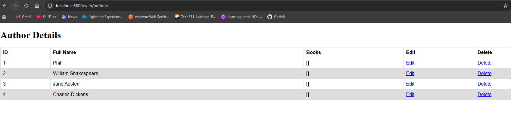
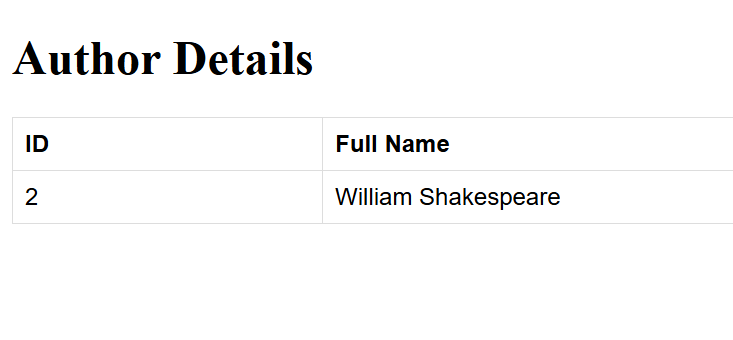

# 2-Tier Deployment of ‘Library’ Java Spring Boot App

**Overview**

This goal of this project is to implement the 2-tier deployment of a Java Spring Boot app using various methods, including virtualisation and containerisation.

---

- [2-Tier Deployment of ‘Library’ Java Spring Boot App](#2-tier-deployment-of-library-java-spring-boot-app)
  - [Stage 0: Pre-requisites](#stage-0-pre-requisites)
    - [1. Install Java 17 (OpenJDK):](#1-install-java-17-openjdk)
    - [2. Install Maven and set environment variables for both Maven and Java:](#2-install-maven-and-set-environment-variables-for-both-maven-and-java)
    - [3. Install and Configure AWS CLI](#3-install-and-configure-aws-cli)
    - [4. Final Verification Summary (Run all)](#4-final-verification-summary-run-all)
  - [Stage 1: Create a private GitHub repository to store the Java app and SQL script to seed the database](#stage-1-create-a-private-github-repository-to-store-the-java-app-and-sql-script-to-seed-the-database)
    - [1. Create Repo](#1-create-repo)
    - [2. Upload code to repo](#2-upload-code-to-repo)
  - [(Option 1) Stage 2: Deploy the app and database on your local machine](#option-1-stage-2-deploy-the-app-and-database-on-your-local-machine)
    - [1. Install \& Configure MySQL](#1-install--configure-mysql)
    - [2. Start the MySQL Service](#2-start-the-mysql-service)
    - [3. Create and Prepare the Database](#3-create-and-prepare-the-database)
    - [4. Seed the Database](#4-seed-the-database)
    - [5. Set Environment Variables in Git Bash](#5-set-environment-variables-in-gitbash)
    - [6. Build \& Run the Spring Boot App](#6-build--run-the-springboot-app)
    - [7. Test in Browser](#7-test-in-browser)
    - [8. Stop \& Restart Later](#8-stop--restart-later)
  - [(Option 2) Stage 2: Deploy the app and database on your local machine using Docker](#option-2-stage-2-deploy-the-app-and-database-on-your-local-machine-using-docker)
    - [1. Install Docker Desktop](#1-install-docker-desktop)
    - [2. Start the MySQL Database Container](#2-start-the-mysql-database-container)
    - [3. Copy and Seed the Database](#3-copy-and-seed-the-database)
    - [4. Verify Data Inside MySQL](#4-verify-data-inside-mysql)
    - [5. Set Environment Variables](#5-set-environment-variables)
    - [6. Build and Run Spring Boot App](#6-build-and-run-springboot-app)
    - [7. Test in Browser](#7-test-in-browser-1)
    - [Fixing the Unit Tests Error](#fixing-the-unit-tests-error)
  - [Stage 3: Deploy the App and Database on AWS EC2 with Bash Automation](#stage3-deploy-the-app-and-database-on-awsec2-with-bash-automation)
    - [1. Set Up the Database VM](#1-setupthedatabasevm)
    - [2. Set Up the Application VM](#2-setuptheapplicationvm)
    - [3. Verify Deployment](#3-verifydeployment)
    - [4. Test Auto‑Startup](#4-testautostartup)
    - [5. Result](#5-result)
  - [Stage 4: Deploy the app and database on AWS using Docker Compose + Automation (User Data)](#stage-4-deploy-the-app-and-database-on-aws-using-dockercompose--automation-user-data)
    - [1. Fix your local code so it builds cleanly](#1-fix-your-local-code-so-it-builds-cleanly)
    - [2. Commit \& push to GitHub](#2-commit--push-to-github)
    - [3. Provision the EC2 instance](#3-provision-the-ec2-instance)
    - [4. Paste this User Data script](#4-paste-this-userdata-script)
    - [5. Verify Deployment](#5-verify-deployment)
    - [6. Test the Application](#6-test-the-application)
    - [7. Auto‑Startup Check](#7-autostartup-check)
  - [Stage 5: Deploy App and DB on AWS using Kubernetes (Minikube)](#stage5deploy-app-and-db-on-aws-usingkubernetesminikube)
    - [1. Create a new k8s folder inside your repo](#1-create-a-new-k8s-folder-inside-your-repo)
    - [2. Commit and push to GitHub](#2-commit-and-push-togithub)
    - [3. Create AWS EC2 instance](#3-create-awsec2-instance)
    - [4. Verify](#4-verify)

---
## Stage 0: Pre-requisites

**If you already have all these installed then skip this step.**

### 1. Install Java 17 (OpenJDK):

Run this in Git Bash or PowerShell:
```
winget install --id Microsoft.OpenJDK.17 -e
```
Once complete, re-open Git Bash and verify:
```
java -version
```
You should see output like:
```
openjdk version "17.0.x"
OpenJDK Runtime Environment Microsoft-17.0.x
OpenJDK 64-Bit Server VM
```
Make sure JDK is installed, and `JAVA_HOME` environment variable is configured.

---
### 2. Install Maven and set environment variables for both Maven and Java:

Go to `https://maven.apache.org/download.cgi` and download the Binary zip archive (e.g., `apache-maven-3.x.x-bin.zip`)

Extract it (for example, to `C:\Program Files\Apache\maven`)

In `Environment variables` dialog, System variables, Clicks on the `New...` button and add a `MAVEN_HOME` variable and point it to `C:\Program Files\Apache\maven\apache-maven-3.6.0`

In `Environment variables` dialog, System variables, Clicks on the `New...` button and add a `JAVA_HOME` variable and point it to `C:\Program Files\Microsoft\jdk-17.0.16.8-hotspot`

In system variables, find `PATH`, click on the `Edit...` button. In `Edit environment variable` dialog, click on the `New` button and add this `%MAVEN_HOME%\bin`

In system variables, find `PATH`, click on the `Edit...` button. In `Edit environment variable` dialog, click on the `New` button and add this `%JAVA_HOME%\bin`

Verify Install:

Reopen Git Bash, run:
```
mvn -version
```
---
### 3. Install and Configure AWS CLI

Install AWS CLI using winget
```
winget install --id Amazon.AWSCLI -e
```

Verify Install in GitBash:
```
aws --version
```
Expected output:
```
aws-cli/2.x.x Python/3.x.x Windows/10 botocore/2.x.x
```

After installation:
```
aws configure
```
Enter:
```
AWS Access Key ID: <your-key>
AWS Secret Access Key: <your-secret>
Default region name: eu-west-1
Default output format: json
```
---
### 4. Final Verification Summary (Run all)
```
java -version
mvn -version
aws --version
```
All four should print valid version numbers.

---
## Stage 1: Create a private GitHub repository to store the Java app and SQL script to seed the database

### 1. Create Repo

On GitHub, click New Repository → Private → name it `library-java17-mysql-app`.

Clone it locally:
```
git clone https://github.com/<your-username>/library-java17-mysql-app.git
```
Navigate to the repo:
```
cd library-java17-mysql-app
```

### 2. Upload code to repo

Get the app code `library-java17-mysql-app.zip` and extract it here.

Review the README.md and app structure.

Add and commit your files:
```
git add .
git commit -m "Initial commit of Java app and SQL script"
git push origin main
```
You should now see the code on your repo on GitHub.

---
## (Option 1) Stage 2: Deploy the app and database on your local machine

### 1. Install & Configure MySQL

1. Download **MySQL Community Server** (Installer > `mysql-installer-community‑9.5.x.msi`) from:  
   🔗 [https://dev.mysql.com/downloads/installer/](https://dev.mysql.com/downloads/installer/)

2. Run the installer:
   - Choose **Developer Default**.
   - Set root password → `root`.
   - Leave default port → `3306`.
   - Select **Start MySQL at system startup**.
   - Complete installation.

3. When the **MySQL Configurator** launches, use all default paths.  
   When you reach **Accounts and Roles**, set:
   ```
   Root Account Password: root
   ```
4. Go to System Variables and add this to your PATH:
   ```
   C:\Program Files\MySQL\MySQL Server 9.5\bin
   ```
5. Verify installation in Command Prompt:
   ```cmd
   mysql --version
   ```
   Expected:
   ```
   mysql  Ver 9.5.0 for Win64 on x86_64 (MySQL Community Server - GPL)
   ```

### 2. Start the MySQL Service

Open **Command Prompt as Administrator** and run:
```cmd
net start MySQL95
```
If it says “already started,” it’s fine.

Then open the MySQL shell:
```cmd
mysql -u root -p
```
Password: `root`

### 3. Create and Prepare the Database

At the MySQL prompt:
```sql
CREATE DATABASE `library`;
SHOW DATABASES;
```
You should see `library` listed.

Exit:
```sql
EXIT;
```

### 4. Seed the Database

The SQL seed file is at:

```
C:\Users\sohai\GitHub\library-java17-mysql-app\library.sql
```

Run this command:

```cmd
mysql -u root -p < "C:\Users\sohai\GitHub\library-java17-mysql-app\library.sql"
```

The file includes:
```sql
DROP DATABASE IF EXISTS library;
CREATE DATABASE library;
USE library;
...
```

Verify:
```cmd
mysql -u root -p
```
then:
```sql
USE library;
SHOW TABLES;
SELECT * FROM authors;
```
You should see four authors.

Exit:
```sql
EXIT;
```

### 5. Set Environment Variables in Git Bash

Open **Git Bash** and set your database environment variables:

```bash
export DB_HOST=jdbc:mysql://localhost:3306/library
export DB_USER=root
export DB_PASS=root
```

Check they’re set:
```bash
echo $DB_HOST
echo $DB_USER
echo $DB_PASS
```

Expected:
```
jdbc:mysql://localhost:3306/library
root
root
```

### 6. Build & Run the Spring Boot App

1. Navigate into the Spring Boot project directory:
   ```bash
   cd ~/GitHub/library-java17-mysql-app/LibraryProject2
   ```

2. Build the app (ignore failed tests):
   ```bash
   mvn clean package -DskipTests
   ```

3. Start the app:
   ```bash
   mvn spring-boot:run
   ```

When you see:
```
Tomcat initialized with port(s): 5000 (http)
Started LibraryProject2Application in ...
```
Your app is running on **port 5000**.

### 7. Test in Browser

Open a web browser:
```
http://localhost:5000/web/authors
```

Expected:

The web app lists four authors as shown in the image:



Edit link for each author works, however, Delete function does not.

To view specific author by id (e.g. 2), go to `<public-ip-of-app>:5000/web/author/<id-of-author>`

You should see just the author with id = 2:



### 8. Stop & Restart Later

- To stop the app: **Ctrl +C** in Git Bash.  
- To stop MySQL:
  ```cmd
  net stop MySQL95
  ```
- To restart next time:
  ```cmd
  net start MySQL95
  cd ~/GitHub/library-java17-mysql-app/LibraryProject2
  export DB_HOST=jdbc:mysql://localhost:3306/library
  export DB_USER=root
  export DB_PASS=root
  mvn spring-boot:run
  ```

---
## (Option 2) Stage 2: Deploy the app and database on your local machine using Docker

### 1. Install Docker Desktop

Open in a browser: `https://www.docker.com/products/docker-desktop/`

Download Docker Desktop for Windows and install it (`AMD64`)

Restart your computer after installation.

Verify Install:

After Docker Desktop starts, in Git Bash:
```
docker --version
``` 

### 2. Start the MySQL Database Container

Make sure Docker Desktop is running, then execute:

```
docker run --name library-mysql -e MYSQL_ROOT_PASSWORD=root -e MYSQL_DATABASE=library -p 3306:3306 -d mysql:8
```

Verify it’s running:
```
docker ps
```

Expected output shows library-mysql running on port 3306.

### 3. Copy and Seed the Database

Move into your project folder where library.sql is located:

```
cd ~/GitHub/library-java17-mysql-app
```

Copy the SQL file into the container:
```
docker cp library.sql library-mysql:/library.sql
```

Import the SQL script into the database:
```
docker exec -i library-mysql mysql -uroot -proot library < library.sql
```

If there are no error messages, the data is loaded.

### 4. Verify Data Inside MySQL

Access the MySQL shell inside the container:
```
docker exec -it library-mysql mysql -uroot -proot
```

Run these commands one at a time:

```
SHOW DATABASES;
```
```
USE library;
```
```
SHOW TABLES;
```
```
SELECT * FROM authors;
```

Exit MySQL:
```
exit;
```
### 5. Set Environment Variables

In Git Bash, set the environment variables that the app uses to connect to the DB:

```
export DB_HOST=jdbc:mysql://localhost:3306/library
```
```
export DB_USER=root
```
```
export DB_PASS=root
```

Confirm one variable:
```
echo $DB_HOST
```

Expected output:
```
jdbc:mysql://localhost:3306/library
```

### 6. Build and Run Spring Boot App

Navigate into the application folder:
```
cd ~/GitHub/library-java17-mysql-app/LibraryProject2
```
Build the project while skipping tests (since one test fails):
```
mvn clean package -DskipTests
```

Wait for output:
```
[INFO] BUILD SUCCESS
```

Start the Spring Boot app:
```
mvn spring-boot:run
```
When you see this in the logs, it’s running:
```
Tomcat started on port(s): 5000 (http)
```

The app is now live on your local machine.

### 7. Test in Browser

Open a web browser:
```
http://localhost:5000/web/authors
```

Expected:

The web app lists four authors as shown in the image:


Edit link for each author works, however, Delete function does not.

To view specific author by id (e.g. 2), go to `<public-ip-of-app>:5000/web/author/<id-of-author>`

You should see just the author with id = 2:


To Stop the Application in Git Bash, press:
```
CTRL + C
```

This stops the Spring Boot server.

When you run
```
docker stop library-mysql
```
Docker sends a clean shutdown signal to MySQL — it’s just like stopping a server.

Starting it again later:

```
docker start library-mysql
cd ~/GitHub/library-java17-mysql-app/LibraryProject2
export DB_HOST=jdbc:mysql://localhost:3306/library
export DB_USER=root
export DB_PASS=root
mvn spring-boot:run
```

### Fixing the Unit Tests Error

When running `mvn test`, one test class (`MVCTests.java`) failed with:  
```
No qualifying bean of type 'com.sparta.mg.libraryproject2.model.repositories.AuthorRepository' available
```
The other two (`RepositoryTests.java`, `RestTests.java`) passed.  
The failure happened because Spring’s **`@WebMvcTest`** loads only the *web layer* (controllers, filters, etc.) and **does not automatically load repository beans**.

1. Located the file
```
src/test/java/com/sparta/mg/libraryproject2/MVCTests.java
```

2. Added dependency mocks  
We inserted two `@MockBean` annotations for the repository dependencies that the `AuthorWebController` requires:

```
@MockBean
private AuthorRepository authorRepository;

@MockBean
private BookRepository bookRepository;
```

**Why:**  
When `@WebMvcTest` instantiates `AuthorWebController`, it needs these beans for constructor injection.  
Mocking them allows Spring to create the controller without booting the database or JPA layer.

3. Mocked repository behavior
Inside the test method, we added a few lines before performing the request:

```
Author author = new Author();
author.setId(1);
author.setFullName("Manish");
Mockito.when(authorRepository.findAll()).thenReturn(List.of(author));
```

**Why:**  
This ensures the controller has predictable data when it calls `authorRepository.findAll()` during rendering of `/web/authors`.

4. Added an assertion for HTTP status code
We expanded the request chain to check the response code:

```
mockMvc.perform(MockMvcRequestBuilders.get("/web/authors"))
        .andExpect(MockMvcResultMatchers.status().isOk())
        .andDo(MockMvcResultHandlers.print());
```

**Why:**  
This confirms the controller successfully returns a 200 OK for that endpoint, verifying routing and template rendering.

5. Re‑ran full test suite
Command executed:
```
mvn test
```

Result:
```
Tests run: 5, Failures: 0, Errors: 0, Skipped: 0
BUILD SUCCESS
```

6. Commit Example

If you want to log the change properly:

```
git add src/test/java/com/sparta/mg/libraryproject2/MVCTests.java
git commit -m "Fix MVCTests: mock repository dependencies in @WebMvcTest and verify 200 OK response"
git push
```

Now all unit tests (`MVCTests`, `RepositoryTests`, `RestTests`) pass consistently.

---
## Stage 3: Deploy the App and Database on AWS EC2 with Bash Automation

**Goal:**  
Run a 2‑tier setup on AWS EC2 using automation scripts, so the database and application start automatically whenever the VMs boot.

### 1. Set Up the Database VM

1. Go to the **AWS Management Console → EC2 → Launch Instance**.  
2. Name the instance: `tech511‑saif‑library‑database`.  
3. Select **Ubuntu Server 22.04 LTS** as the AMI.  
4. Choose instance type `t3.micro`.  
5. Create or select an SSH key pair.  
6. Configure the security group:  
   - Inbound rules:  
     - **SSH (22)** from 0.0.0.0/0  
     - **MySQL (3306)** from 0.0.0.0/0  
   - Outbound: Allow all traffic.  
7. Under **Advanced Details → User data**, paste this:

   ```
   #!/bin/bash
   apt update -y
   apt install -y mysql-server git
   systemctl enable mysql
   systemctl start mysql
   sed -i "s/^bind-address.*/bind-address = 0.0.0.0/" /etc/mysql/mysql.conf.d/mysqld.cnf
   sed -i "s/^mysqlx-bind-address.*/mysqlx-bind-address = 0.0.0.0/" /etc/mysql/mysql.conf.d/mysqld.cnf
   systemctl restart mysql
   mysql -e "ALTER USER 'root'@'localhost' IDENTIFIED WITH mysql_native_password BY 'root';
   CREATE USER IF NOT EXISTS 'root'@'%' IDENTIFIED WITH mysql_native_password BY 'root';
   GRANT ALL PRIVILEGES ON *.* TO 'root'@'%' WITH GRANT OPTION;
   FLUSH PRIVILEGES;"
   cd /home/ubuntu
   git clone https://github.com/saifahmed2003/library-java17-mysql-app.git
   mysql -uroot -proot -e "CREATE DATABASE IF NOT EXISTS library;"
   mysql -uroot -proot library < /home/ubuntu/library-java17-mysql-app/library.sql
   ```

   **Database VM User Data Explanation**

   ```bash
   #!/bin/bash
   ```
   Starts the Bash shell — this tells EC2 how to interpret all subsequent commands.

   ```
   apt update -y
   apt install -y mysql-server git
   ```
   Updates Ubuntu’s package list and installs **MySQL Server** and **Git**.  
   MySQL hosts the database tier, and Git is used to clone your app repository.

   ```
   systemctl enable mysql
   systemctl start mysql
   ```
   Ensures the MySQL service starts now and automatically starts on every future boot.

   ```
   # Allow external connections
   sed -i "s/^bind-address.*/bind-address = 0.0.0.0/" /etc/mysql/mysql.conf.d/mysqld.cnf
   sed -i "s/^mysqlx-bind-address.*/mysqlx-bind-address = 0.0.0.0/" /etc/mysql/mysql.conf.d/mysqld.cnf
   systemctl restart mysql
   ```
   By default, MySQL listens only on `127.0.0.1` (localhost).  
   These lines edit its configuration so it listens on all network interfaces (`0.0.0.0`), allowing other instances (like the app VM) inside the same VPC to connect.  
   Then MySQL is restarted to apply the edits.

   ```
   # Configure root user and permissions
   mysql -e "ALTER USER 'root'@'localhost' IDENTIFIED WITH mysql_native_password BY 'root';
   CREATE USER IF NOT EXISTS 'root'@'%' IDENTIFIED WITH mysql_native_password BY 'root';
   GRANT ALL PRIVILEGES ON *.* TO 'root'@'%' WITH GRANT OPTION;
   FLUSH PRIVILEGES;"
   ```
   Creates a **password‑based root account** that can connect both locally and remotely.  
   Using `'%'` as the host wildcard lets the app VM authenticate over the network.  
   `FLUSH PRIVILEGES` applies the new settings immediately.

   ```
   cd /home/ubuntu
   git clone https://github.com/saifahmed2003/library-java17-mysql-app.git
   ```
   Clones your GitHub repo so the SQL seed file (`library.sql`) is available on the VM.

   ```
   mysql -uroot -proot -e "CREATE DATABASE IF NOT EXISTS library;"
   mysql -uroot -proot library < /home/ubuntu/library-java17-mysql-app/library.sql
   ```
   Creates the `library` database and populates it with tables + sample data from `library.sql`.

   **End Result**  
   When the VM starts:
   * MySQL is installed and enabled.  
   * Remote connections are allowed.  
   * Database `library` exists with seeded data.  
   * No manual SSH required.

8. Launch the instance.  
9. Once running, note the **Private IPv4 address** (you’ll need it for the app VM).

### 2. Set Up the Application VM

1. Launch another EC2 instance from the console.  
2. Name: `tech511‑saif‑library‑app`.  
3. Same AMI and instance type: Ubuntu 22.04 LTS, `t3.micro`.  
4. Use the same SSH key pair.  
5. Configure the security group:  
   * Inbound rules:  
     * **SSH (22)** from 0.0.0.0/0  
     * **Custom TCP 5000** from 0.0.0.0/0  
   * Outbound: Allow all traffic.  
6. Under **Advanced Details → User data**, paste this (but replace `<DB_PRIVATE_IP>` with your database VM’s private address):

   ```
   #!/bin/bash
   apt update -y
   apt install -y git openjdk-17-jdk maven
   cd /home/ubuntu
   git clone https://github.com/saifahmed2003/library-java17-mysql-app.git
   cd library-java17-mysql-app/LibraryProject2
   mvn clean package -DskipTests

   cat >/etc/systemd/system/libraryapp.service <<EOF
   [Unit]
   Description=Library Spring Boot App
   After=network.target

   [Service]
   User=ubuntu
   WorkingDirectory=/home/ubuntu/library-java17-mysql-app/LibraryProject2
   Environment=DB_HOST=jdbc:mysql://<DB_PRIVATE_IP>:3306/library
   Environment=DB_USER=root
   Environment=DB_PASS=root
   ExecStart=/usr/bin/java -jar /home/ubuntu/library-java17-mysql-app/LibraryProject2/target/LibraryProject2-0.0.1-SNAPSHOT.jar
   Restart=always
   RestartSec=5
   SuccessExitStatus=143

   [Install]
   WantedBy=multi-user.target
   EOF

   systemctl daemon-reload
   systemctl enable libraryapp
   systemctl start libraryapp
   ```

   **Application VM User Data Explanation**

   ```
   #!/bin/bash
   ```
   Starts the Bash shell for the initialization commands.

   ```
   apt update -y
   apt install -y git openjdk-17-jdk maven ufw
   ```
   Installs all dependencies needed to build and run the Java Spring Boot application:  
   - **Git** → clone the repo.  
   - **OpenJDK 17** → Java runtime environment.  
   - **Maven** → build and package the app.  
   - **UFW** → optional firewall configuration.

   ```
   cd /home/ubuntu
   git clone https://github.com/saifahmed2003/library-java17-mysql-app.git
   cd library-java17-mysql-app/LibraryProject2
   ```
   Clones your GitHub repository and moves into the application folder that contains the Maven project.

   ```
   mvn clean package -DskipTests
   ```
   Builds the Spring Boot application into a runnable JAR file (`target/LibraryProject2‑0.0.1‑SNAPSHOT.jar`) without running unit tests.  
   This ensures the JAR is ready each time the instance boots.

   ```
   cat >/etc/systemd/system/libraryapp.service <<EOF
   ...
   EOF
   ```
   Creates a **systemd service file** which defines how your Spring Boot application runs automatically as a Linux service.  
   Within the file:

   * **User=ubuntu** → runs the app under the non‑root user.  
   * **WorkingDirectory** → where app files live.  
   * **Environment=DB_HOST…** → supply the database connection details (host, username, password).  
   * **ExecStart** → command that runs the packaged JAR.  
   * **Restart=always** → auto‑restart if the app crashes.  
   * **WantedBy=multi-user.target** → ensures it starts on boot.

   ```
   systemctl daemon-reload
   systemctl enable libraryapp
   systemctl start libraryapp
   ```
   * **daemon‑reload** → refreshes systemd so it recognizes the new service.  
   * **enable libraryapp** → registers the service to start automatically at boot.  
   * **start libraryapp** → starts the app immediately.

   **End Result**  
   When the app VM boots:
   - Java + Maven installed automatically.  
   - App repo cloned and built.  
   - Spring Boot JAR runs automatically via systemd.  
   - Application is reachable at  
   `http://<public‑IP‑of‑app‑VM>:5000/web/authors`.

7. Launch the instance.  
8. Wait a few minutes for setup to finish.

### 3. Verify Deployment

1. Open the browser on your local machine:  
   ```
   http://<public‑IP‑of‑tech511‑saif‑library‑app>:5000/web/authors
   ```
   You should see the authors list from the database.  

### 4. Test Auto‑Startup

1. In AWS Console, reboot both instances:
   - Select each → **Instance State → Reboot Instance**  
2. After reboot, wait ~2 minutes.    
3. Refresh:
   ```
   http://<app‑VM‑public‑IP>:5000/web/authors
   ```
   The page should still load.

### 5. Result

* Both VMs self‑configure from user‑data scripts.  
* The database service starts automatically with the library schema and data.  
* The Spring Boot application starts via systemd on port 5000.  
* Verified it continues to work after multiple reboots with no manual intervention.
---

## Stage 4: Deploy the app and database on AWS using Docker Compose + Automation (User Data)

### 1. Fix your local code so it builds cleanly

On your local machine:
```
cd ~/GitHub/library-java17-mysql-app
```

Fix `LibraryProject2/Dockerfile`

Replace its contents with the following:
```
# ==== Build stage ====
FROM maven:3.9-eclipse-temurin-17 AS build

WORKDIR /app

# Copy project files
COPY pom.xml .
COPY src ./src

# Build the JAR (skip tests for faster builds)
RUN mvn clean package -DskipTests

# ==== Run stage ====
FROM eclipse-temurin:17-jdk

WORKDIR /app
COPY --from=build /app/target/LibraryProject2-0.0.1-SNAPSHOT.jar app.jar

EXPOSE 5000
ENTRYPOINT ["java", "-jar", "/app/app.jar"]
```

**Why:**  
* Uses `maven:3.9-eclipse-temurin-17` so Maven is already installed.  
* Eliminates the `./mvnw` error.  
* Produces a reliable two‑stage build.

Fix `docker-compose.yml`:

Replace its contents with:
```
version: "3.8"

services:
  mysql:
    image: mysql:8
    container_name: library-mysql
    environment:
      MYSQL_ROOT_PASSWORD: root
      MYSQL_DATABASE: library
    ports:
      - "3306:3306"
    volumes:
      - db_data:/var/lib/mysql
      - ./library.sql:/docker-entrypoint-initdb.d/library.sql:ro
    healthcheck:
      test: ["CMD", "mysqladmin", "ping", "-h", "localhost", "-proot"]
      interval: 10s
      timeout: 5s
      retries: 5

  app:
    build: ./LibraryProject2
    container_name: library-java-app
    depends_on:
      mysql:
        condition: service_healthy
    environment:
      SPRING_DATASOURCE_URL: jdbc:mysql://mysql:3306/library
      SPRING_DATASOURCE_USERNAME: root
      SPRING_DATASOURCE_PASSWORD: root
      SPRING_JPA_DATABASE_PLATFORM: org.hibernate.dialect.MySQLDialect
      SPRING_JPA_HIBERNATE_DDL_AUTO: none
    ports:
      - "5000:5000"

volumes:
  db_data:
```

**Why:**  
* Correct Spring property (`SPRING_JPA_DATABASE_PLATFORM`).  
* Adds MySQL health‑check so the app waits.  
* Keeps configuration consistent across launches.

### 2. Commit & push to GitHub
```
git add .
git commit -m "Fix Dockerfile and docker-compose for AWS deployment"
git push
```

Your cloud‑init (user data) will now pull this updated repo during startup.

### 3. Provision the EC2 instance

**In AWS Console:**

- Service → **EC2** → **Launch instance**  
- **AMI:** Ubuntu 22.04 LTS  
- **Instance type:** `t3.small` (2 GB RAM recommended)  
- **Key pair:** your SSH key  
- **Security group:**  
  - TCP 22 (SSH)  
  - TCP 5000 (Web app)  
  - *Optional:* TCP 3306 (MySQL)

### 4. Paste this User Data script

In **Advanced details → User data**, paste:
```
#!/bin/bash
# === Automated Docker Compose deployment (fixed version) ===

set -e

# --- Install dependencies ---
apt update -y
apt install -y docker.io docker-compose git openjdk-17-jdk maven curl

systemctl enable docker
systemctl start docker
usermod -aG docker ubuntu

# --- Log progress for debugging ---
exec > >(tee /var/log/deploy.log|logger -t user-data -s 2>/dev/console) 2>&1

# --- Clone updated GitHub repo ---
cd /home/ubuntu
git clone https://github.com/saifahmed2003/library-java17-mysql-app.git
cd library-java17-mysql-app

# --- Build and start containers ---
docker-compose up -d --build

# --- Auto-start on reboot ---
(crontab -l 2>/dev/null; echo "@reboot cd /home/ubuntu/library-java17-mysql-app && /usr/bin/docker-compose up -d") | crontab -
```

Then click **Launch Instance**.  
Wait ≈ 3–5 minutes for provisioning to finish.

### 5. Verify Deployment

SSH into the instance:
```
ssh -i <key>.pem ubuntu@<public-ip>
```

Check:
```
docker ps
```
You should see both containers **Up**  
(`library-java-app` and `library-mysql`).


### 6. Test the Application

**Inside the VM:**
```
curl -I http://localhost:5000/web/authors
```
→ Expect `HTTP/1.1 200 OK`

**From your browser:**
```
http://<public-ip>:5000/web/authors
```

App should display authors from the seeded MySQL DB.


### 7. Auto‑Startup Check

Reboot the VM:
```
sudo reboot
```

After 1–2 min:
```
ssh -i <key>.pem ubuntu@<public-ip>
docker ps
```
Containers should appear **Up** again automatically.

---
## Stage 5: Deploy App and DB on AWS using Kubernetes (Minikube)

### 1. Create a new k8s folder inside your repo

Use `nano` to create the following 5 yaml files:
```
library-java17-mysql-app/
│
├── LibraryProject2/                   
├── library.sql                        
├── docker-compose.yml                 
├── provision.sh                       
├── k8s/                               
│   ├── app-deployment.yaml
│   ├── app-service.yaml
│   ├── mysql-deployment.yaml
│   ├── mysql-service.yaml
│   └── mysql-configmap.yaml       
└── README.md
```

**Paste the following content in all Kubernetes YAMLs:**

`k8s/app-deployment.yaml`
```
apiVersion: apps/v1
kind: Deployment
metadata:
  name: library-app
spec:
  replicas: 1
  selector:
    matchLabels:
      app: library-app
  template:
    metadata:
      labels:
        app: library-app
    spec:
      containers:
        - name: library-app
          image: saifahmed2003/library-java17-mysql-app:latest
          ports:
            - containerPort: 5000                    # matches Spring Boot port
          env:
            - name: SPRING_DATASOURCE_URL
              value: jdbc:mysql://mysql:3306/librarydb
            - name: SPRING_DATASOURCE_USERNAME
              value: root
            - name: SPRING_DATASOURCE_PASSWORD
              value: rootpassword
```

`k8s/app-service.yaml`
```
apiVersion: v1
kind: Service
metadata:
  name: library-app-service
spec:
  type: ClusterIP
  ports:
    - port: 5000
      targetPort: 5000
  selector:
    app: library-app
```

`k8s/mysql-configmap.yaml`
```
apiVersion: v1
kind: ConfigMap
metadata:
  name: mysql-initdb-script
data:
  library.sql: |
    CREATE TABLE authors (
      author_id int PRIMARY KEY NOT NULL AUTO_INCREMENT,
      full_name VARCHAR(40)
    );
    CREATE TABLE books (
      book_id int PRIMARY KEY NOT NULL AUTO_INCREMENT,
      title VARCHAR(100),
      author_id int,
      FOREIGN KEY (author_id) REFERENCES authors(author_id)
    );
    INSERT INTO authors (full_name) VALUES ('Phil');
    INSERT INTO authors (full_name) VALUES ('William Shakespeare');
    INSERT INTO authors (full_name) VALUES ('Jane Austen');
    INSERT INTO authors (full_name) VALUES ('Charles Dickens');
```

`k8s/mysql-deployment.yaml`
```
apiVersion: apps/v1
kind: Deployment
metadata:
  name: mysql
spec:
  replicas: 1
  selector:
    matchLabels:
      app: mysql
  template:
    metadata:
      labels:
        app: mysql
    spec:
      containers:
        - name: mysql
          image: mysql:8
          env:
            - name: MYSQL_ROOT_PASSWORD
              value: rootpassword
            - name: MYSQL_DATABASE
              value: librarydb
          ports:
            - containerPort: 3306
          volumeMounts:
            - name: mysql-storage
              mountPath: /var/lib/mysql
            - name: mysql-initdb
              mountPath: /docker-entrypoint-initdb.d
      volumes:
        - name: mysql-storage
          emptyDir: {}
        - name: mysql-initdb
          configMap:
            name: mysql-initdb-script
```

`k8s/mysql-service.yaml`
```
apiVersion: v1
kind: Service
metadata:
  name: mysql
spec:
  type: ClusterIP
  ports:
    - port: 3306
  selector:
    app: mysql
```

### 2. Commit and push to GitHub

From inside your local repo root:
```
git add .
git commit -m "Final working K8s manifests for automated AWS deploy"
git push
```

Confirm on GitHub that all five YAMLs show under `k8s/`.

### 3. Create AWS EC2 instance

* **AMI**: Ubuntu 22.04 LTS  
* **Instance Type**: t3.medium (≥ 4 GB RAM)  
* **Security Group**: 
  * SSH from Port 22
  * Port 5000
* **Key Pair**: Your SSH key
* Click **Advanced details** → *User Data* → paste the script below:

`user-data-kubernetes-library.sh`:
```
#!/bin/bash
# ==========================================================
# Auto‑Deploy Library App + MySQL with seeded DB on Minikube
# ==========================================================
set -euxo pipefail

# 1️⃣  Update & install dependencies
apt-get update -y
apt-get install -y apt-transport-https ca-certificates curl git conntrack socat wget gnupg lsb-release docker.io

systemctl enable docker
systemctl start docker
usermod -aG docker ubuntu

# 2️⃣  Install kubectl & Minikube
curl -LO "https://dl.k8s.io/release/$(curl -L -s https://dl.k8s.io/release/stable.txt)/bin/linux/amd64/kubectl"
install -o root -g root -m 0755 kubectl /usr/local/bin/kubectl
curl -LO https://storage.googleapis.com/minikube/releases/latest/minikube_latest_amd64.deb
dpkg -i minikube_latest_amd64.deb

# 3️⃣  Clone your GitHub repo
cd /home/ubuntu
chown -R ubuntu:ubuntu /home/ubuntu
sudo -u ubuntu git clone https://github.com/saifahmed2003/library-java17-mysql-app.git
cd library-java17-mysql-app

# 4️⃣  Start Minikube
sudo -u ubuntu minikube start --driver=docker --force
sleep 60

# 5️⃣  Apply all Kubernetes manifests
cd /home/ubuntu/library-java17-mysql-app/k8s
sudo -u ubuntu kubectl apply -f .
sleep 150   # wait for pods

# 6️⃣  Background port‑forward 0.0.0.0:5000 → Service:5000
nohup sudo -u ubuntu kubectl port-forward service/library-app-service 5000:5000 --address=0.0.0.0 \
    > /home/ubuntu/portforward.log 2>&1 &

PUBLIC_IP=$(curl -s http://169.254.169.254/latest/meta-data/public-ipv4 || echo "0.0.0.0")
echo "✅ Deployment complete!  Visit:  http://${PUBLIC_IP}:5000/web/authors" | tee /home/ubuntu/READY.txt
```

### 4. Verify
1. Boot the instance.  
2. Wait about 5–6 minutes (first‑time image pulls).  
3. Open browser:  
   ```
   http://<EC2_PUBLIC_IP>:5000/web/authors
   ```
   You’ll see:
   * HTML “Author Details” table  
   * Rows: Phil, William Shakespeare, Jane Austen, Charles Dickens.
  
    

4. SSH in to verify cluster
    ```
    ssh -i yourkey.pem ubuntu@<EC2_PUBLIC_IP>
    kubectl get pods -A
    kubectl get svc
    kubectl logs deployment/library-app --tail=20
    ```
You’ll see both pods (`library-app`, `mysql`) running and healthy.
