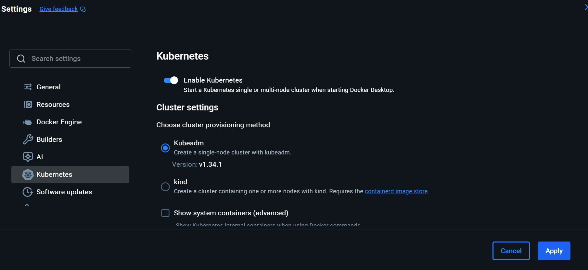
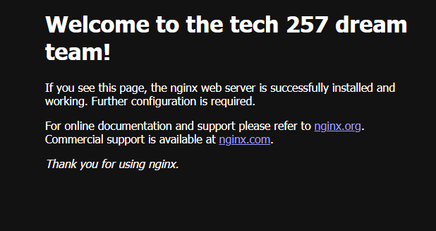
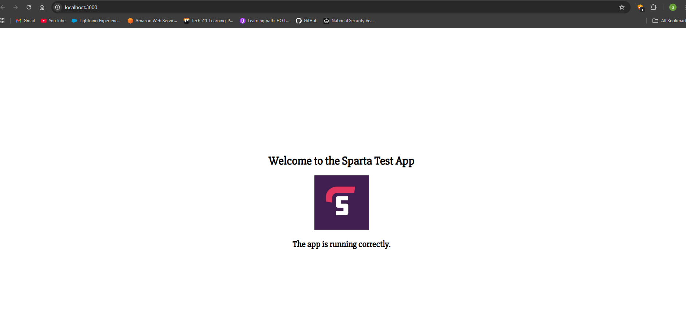
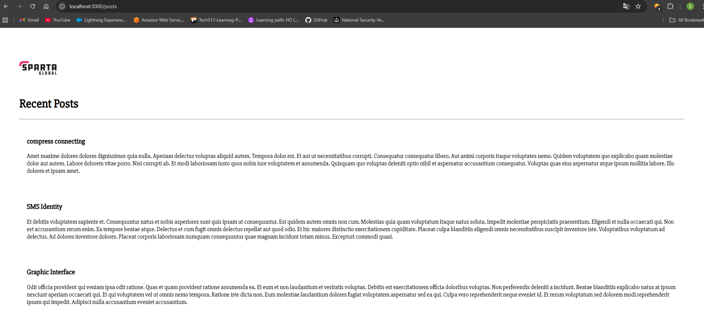
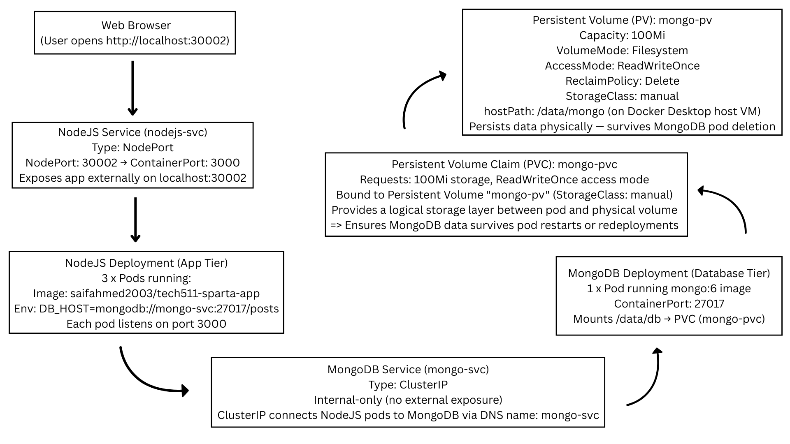
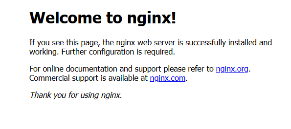
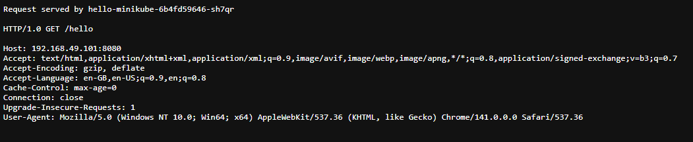

# Use Kubernetes for App Deployment

**Overview:**

This goal of this project is to containerise the deployment of the Sparta test app (which uses Node JS v20) and database using Kubernetes.

---

- [Use Kubernetes for App Deployment](#use-kubernetes-for-app-deployment)
  - [1. Research Kubernetes](#1-research-kubernetes)
    - [Why is Kubernetes needed?](#why-is-kubernetes-needed)
    - [Benefits of Kubernetes](#benefits-of-kubernetes)
    - [Success stories](#success-stories)
    - [Kubernetes architecture](#kubernetes-architecture)
    - [The cluster setup](#the-cluster-setup)
      - [What is a cluster](#what-is-a-cluster)
      - [Master vs worker nodes](#master-vs-worker-nodes)
      - [Pros and cons of using managed service vs launching your own](#pros-and-cons-of-using-managed-service-vs-launching-your-own)
        - [Managed Kubernetes Service](#managed-kubernetes-service)
        - [Self-Managed Kubernetes](#self-managed-kubernetes)
      - [Control plane vs data plane](#control-plane-vs-data-plane)
    - [Kubernetes objects](#kubernetes-objects)
      - [Research the most common ones, e.g. Deployments, ReplicaSets, Pods](#research-the-most-common-ones-eg-deployments-replicasets-pods)
      - [What does it mean a pod is "ephemeral"](#what-does-it-mean-a-pod-is-ephemeral)
    - [How to mitigate security concerns with containers](#how-to-mitigate-security-concerns-with-containers)
    - [Maintained images](#maintained-images)
      - [What are they](#what-are-they)
      - [Pros and cons of using maintained images for your base container images](#pros-and-cons-of-using-maintained-images-for-your-base-container-images)
  - [2. Get Kubernetes running using Docker Desktop](#2-get-kubernetes-running-using-docker-desktop)
  - [3. Nginx deployment with NodePort service](#3-nginx-deployment-with-nodeport-service)
    - [3a. Create Nginx deployment only](#3a-create-nginx-deployment-only)
    - [3b. Get a NodePort service running](#3b-get-a-nodeport-service-running)
    - [3c. See what happens when we delete a pod](#3c-see-what-happens-when-we-delete-a-pod)
    - [3d. Increase replicas with no downtime](#3d-increase-replicas-with-no-downtime)
      - [Method 1: Edit the Deployment in Real Time](#method-1-edit-the-deployment-in-real-time)
      - [Method 2: Apply an Updated YAML File](#method-2-apply-an-updated-yaml-file)
      - [Method 3: Use the kubectl scale Command](#method-3-use-the-kubectl-scale-command)
    - [3e. Delete Kubernetes Deployments and Services](#3e-delete-kubernetes-deployments-and-services)
  - [4. K8s deployment of NodeJS Sparta test app](#4-k8s-deployment-of-nodejs-sparta-test-app)
  - [5. Persisting data for the database deployment](#5-persisting-data-for-the-database-deployment)
    - [5a. Create 2-tier deployment with PV for database](#5a-create-2-tier-deployment-with-pv-for-database)
    - [5b. Research types of autoscaling with K8s](#5b-research-types-of-autoscaling-with-k8s)
  - [6. Autoscaling](#6-autoscaling)
    - [6a. Task: Use Horizontal Pod Autoscaler (HPA) to scale the app](#6a-task-use-horizontal-pod-autoscaler-hpa-to-scale-the-app)
  - [7. Remove PVC and Retain Data in Persistent Volume](#7-remove-pvc-and-retain-data-in-persistent-volume)
  - [8. Deploy the Sparta test app on the cloud](#8-deploy-the-sparta-test-app-on-the-cloud)
    - [8a. Setup minikube on a cloud instance running Ubuntu 22.04 LTS](#8a-setup-minikube-on-a-cloud-instance-running-ubuntu-2204-lts)
    - [8b. Task: Deploy on three apps on one cloud instance running minikube](#8b-task-deploy-on-three-apps-on-one-cloud-instance-running-minikube)
    - [8c. Task: Use Kubernetes to deploy the Sparta test app in the cloud](#8c-task-use-kubernetes-to-deploy-the-sparta-test-app-in-the-cloud)

---

## 1. Research Kubernetes

### Why is Kubernetes needed?
* Kubernetes (sometimes referred to as K8s) is an open-source container orchestration platform that schedules and automates the deployment, management and scaling of containerized applications (microservices)
* Kubernetes helps you run your containerized applications reliably
* It automatically places and balances containerized workloads and scales clusters appropriately to accommodate increasing demand and keep the system live
* If one node in a multi-node cluster fails, the workload is redistributed to others without disrupting availability to users
* It also provides self-healing capabilities and will restart, reschedule or replace a container when it fails or when nodes die
* It allows you to do rolling updates to your software without downtime

### Benefits of Kubernetes
* Container Orchestration Benefits
  * Automated Deployment and Rollbacks - Kubernetes simplifies application deployment with rollouts and rollbacks for minimal downtime.
  * Self-Healing - Kubernetes has an automated system that constantly monitors the containers and restarts them in case of failure, helping deliver enhanced uptime.
  * Service Discovery and Load Balancing - Kubernetes simplifies network configuration by managing internal and external container traffic routing. This means you don’t have to worry about complex network configurations, as Kubernetes takes care of them for you
* Scalability
  * Horizontal Scaling - Easily scale worker nodes and Pods to match changing app load
  * Autoscaling - Automatically adjust resource allocation based on usage metrics (e.g., CPU, memory) to meet dynamic traffic demands
* Portability
  * Cloud-agnostic - A standardized deployment model allows for a smoother application migration across different public clouds (AWS, Azure, Google Cloud) or hybrid setups, preventing vendor lock-in
  * Consistent Environment - Minimizes compatibility issues between development, testing and production environments, maintaining straightforward transitions and reducing errors
* Resource Efficiency
  * Bin Packing - Intelligently placing Pods on nodes optimizes resource allocation, reducing the number of required machines
  * Cost Optimization - Effective cost management through resource right-sizing, scalable capabilities and diverse infrastructure options

### Success stories
* Microservices Architecture
  * many financial services companies use Kubernetes to manage their microservices architectures, which enables them to quickly update parts of their system, such as payment processing and fraud detection, without affecting other services
* Continuous Integration and Continuous Deployment (CI/CD)
  * Tech companies use Kubernetes to streamline their development processes, introduce new features and deploy quick and safe fixes to production environments
* DevSecOps and Agile Development
  * many organizations use Kubernetes to deliver DevSecOps practices and improve their ability to respond quickly to market changes and customer feedback
* Cloud-Native Applications
  * e-commerce platforms can use Kubernetes so that their cloud-native applications can handle variable traffic loads, especially during peak periods
* Supporting Multi-Cloud and Hybrid Cloud Strategies
  * businesses can include Kubernetes in their multi-cloud strategies to easily move workloads and applications to alternate services and take advantage of better pricing from cloud providers and retain regulatory compliance and data sovereignty
* Big Data and Machine Learning
  * Many companies and research institutions use Kubernetes to manage their big data analytics and machine learning operations, which enables them to process large datasets and train models more efficiently
* Internet of Things (IoT) and Edge Computing
  *  frequently used to manage applications at the network Edge closer to IoT devices and end users using modern networking standards such as 5G and Wi-Fi 6
  *  manufacturing and logistics companies are deploying Kubernetes at the Edge to process IoT sensor data in real time to optimize operational decision-making and for predictive maintenance to reduce service disruptions

### Kubernetes architecture


* The architecture of Kubernetes is distributed and modular, which makes it possible to manage containerized applications across distributed groups of machines
* A Kubernetes cluster comprises a minimum of one Master (control plane) node and several worker nodes, each of which plays an important role in managing the lifecycle of the applications

### The cluster setup
#### What is a cluster
* Clusters - The core building blocks of the Kubernetes architecture
* Each cluster has multiple worker nodes that deploy, run and manage containers and one Control Plane node that controls and monitors the worker nodes

#### Master vs worker nodes
* **Master nodes** serve as the control center, orchestrating everything in the cluster. They decide where pods should run, monitor the health of the cluster, and make adjustments when necessary
* **Worker nodes** are responsible for executing the tasks assigned by the master node. They run the pods, providing the resources and networking necessary for the applications

#### Pros and cons of using managed service vs launching your own

##### Managed Kubernetes Service

| **Pros** | **Cons** |
|-----------|-----------|
| **Automated Management:** The provider handles updates, patching, and cluster scaling, reducing operational burden. | **Less Control:** You are limited by the provider's infrastructure options and integrations, leading to vendor lock-in. |
| **Faster Deployment:** Simpler setup and management allow you to focus on applications rather than infrastructure. | **Potential for Higher Costs:** Some providers charge extra for premium support, and costs can increase with high-load production. |
| **High Availability:** The control plane is managed for you, with high availability built-in. | **Complexity:** Understanding the underlying “plumbing” can be challenging if you need advanced configurations or troubleshooting. |
| **Expert Support:** Benefit from the provider's expertise for issues related to the cluster itself. | **Vendor Lock-in:** Moving to another cloud provider or self-managed setup can be more difficult. |

##### Self-Managed Kubernetes

| **Pros** | **Cons** |
|-----------|-----------|
| **Complete Control and Flexibility:** Full control over every aspect of the cluster and its configuration. | **Significant Operational Overhead:** Manual management of the entire cluster lifecycle, including upgrades, scaling, and security patching. |
| **Customization:** Ability to implement highly specific configurations not supported by managed services. | **High Resource Requirements:** Requires substantial time, resources, and specialized technical skills to operate effectively. |
| **No Vendor Lock-in:** Easier to migrate to a different environment or provider if needed. | **No Vendor Support:** You are responsible for all troubleshooting and problem-solving; there is no external support for the infrastructure itself. |
| **Cost-Effective:** Potentially lower costs if you can manage it efficiently, especially for low-load projects. | **Higher Risk for Production:** Managing a self-hosted, critical production cluster is complex and risky, especially with staff turnover. |

#### Control plane vs data plane
A Kubernetes cluster is composed of two separate planes:

* **control plane** - manages Kubernetes clusters and the workloads running on them. Include components like the API Server, Scheduler, and Controller Manager
* **data plane** - machines that can run containerized workloads. Each node is managed by the kubelet, an agent that receives commands from the control plane.

### Kubernetes objects
#### Research the most common ones, e.g. Deployments, ReplicaSets, Pods
Pods
* The container is encapsulated in the Kubernetes object known as Pod
* Docker is the most common container runtime used in a Kubernetes Pod, but Pods support other container runtimes as well
* Each Pod is meant to run a single instance of a given application
* If you want to scale your application horizontally, you should use multiple Pods, one for each instance
* Each pod has it’s own Ip address

ReplicaSets
* A ReplicaSet’s purpose is to maintain a stable set of replica Pods running at any given time
* In the replica sets, we used the selector
* The selector is used to identifying the Pods it can acquire
* a number of replicas indicating how many Pods it should be maintaining
* pod template specifying the data of new Pods it should create to meet the number of replicas criteria, When a ReplicaSet needs to create new Pods, it uses its Pod template
* using replica set you can easily run multiple pods of given instances

Deployments
* A Deployment provides declarative updates for Pods and Replicaset
* Deployments wrap up Pods and ReplicaSets into a nice package that is capable of deploying your applications
* A deployment is an object in Kubernetes that lets you manage a set of identical pods
* Without a deployment, you’d need to create, update, and delete a bunch of pods manually
* With a deployment, you declare a single object in a YAML file. This object is responsible for creating the pods, making sure they stay up to date and ensuring there are enough of them running
* You can also easily autoscale your applications using a Kubernetes deployment
* we also update the image in the pod and after updating the pod if the image is failing then we able to roll out it to the old image, as called as ”Rolling Back a Deployment ”
* using deployment we can undo deployment, pause deployment, resume deployment

#### What does it mean a pod is "ephemeral"
* An "ephemeral" pod means its existence is temporary; it is designed to be disposable and can be created and destroyed without affecting the application's overall state
* This concept applies to both the pod itself and its associated storage, which is lost when the pod is terminated or restarted

### How to mitigate security concerns with containers

**Secure the Container Images**
* **Use Trusted Base Images:** Start from minimal, verified, and up-to-date images from trusted registries (e.g., distroless or Alpine).
* **Regularly Update and Patch:** Ensure base and dependency layers are updated frequently to address CVEs.
* **Scan Images:** Use tools like **Trivy**, **Clair**, or **Anchore** to detect vulnerabilities before deployment.
* **Sign and Verify Images:** Use **cosign** (as part of **Sigstore**) to sign and verify images, ensuring provenance and immutability.

**Implement Runtime Security**
* **Run as Non-root:** Enforce non-root containers to reduce privilege escalation risk.
* **Drop Unnecessary Capabilities:** Use Kubernetes `securityContext.capabilities.drop` to limit Linux capabilities.
* **Use Read-Only Filesystems:** Prevent runtime modifications to containers.
* **Resource Limits:** Define CPU and memory limits to avoid DoS risks.
* **Monitor Behavior:** Use **Falco** or **Sysdig Secure** to detect anomalous runtime behavior.

**Strengthen Kubernetes Configuration**
* **Apply RBAC (Role-Based Access Control):** Grant least privilege to users, service accounts, and workloads.
* **Use Network Policies:** Restrict communication between Pods using `NetworkPolicy`.
* **Adopt Pod Security Standards (PSS):** Use baseline or restricted policies to control pod permissions.
* **Limit API Access:** Configure admission controllers and API access properly.
* **Enable Audit Logging:** Track changes and access to cluster resources.

**Protect Secrets and Sensitive Data**
* **Use Kubernetes Secrets Properly:** Avoid storing sensitive info in ConfigMaps or environment variables.
* **Enable Encryption at Rest:** Use the Kubernetes `EncryptionConfiguration` for etcd Secrets.
* **Integrate with External Secret Managers:** Use **HashiCorp Vault**, **AWS Secrets Manager**, or **GCP Secret Manager**.

**Network and Node Security**
* **Isolate Nodes:** Harden host OS following CIS Benchmarks for Linux.
* **Control Ingress and Egress:** Use ingress controllers with TLS and restrict outbound traffic.
* **Encrypt Communication:** Enable TLS for internal cluster traffic and API server access.

**Continuous Security Practices**
* **Adopt a DevSecOps Model:** Integrate security scanning into CI/CD pipelines.
* **Use Admission Controllers:** Enforce policies with **OPA Gatekeeper** or **Kyverno**.
* **Regular Compliance Audits:** Use tools like **kube-bench** and **kube-hunter** for regular checks.

**Monitoring and Incident Response**
* **Centralized Logging and Monitoring:** Aggregate logs with **ELK**, **Prometheus**, or **Grafana**.
* **Incident Response Plan:** Define steps to isolate and remediate compromised containers or nodes.

### Maintained images
#### What are they
* **Maintained image** refers to container images that are actively managed, updated, and secured over their lifecycle
* These are images that have been built, stored in a registry, and are ready to be deployed as containers, but also require continuous maintenance, including security scanning, versioning, and updates to address vulnerabilities


#### Pros and cons of using maintained images for your base container images

| **Aspect** | **Pros** | **Cons** |
|-------------|-----------|-----------|
| **Security** | - Regular patches and updates reduce vulnerabilities.<br>- Security teams maintain and test for known CVEs. | - May introduce changes that break compatibility.<br>- Dependence on vendor’s patch cycle. |
| **Compliance** | - Easier to meet compliance requirements (e.g., CIS benchmarks, SOC2).<br>- Often include signed and verified components. | - May not align exactly with your organization’s security policies or configurations. |
| **Reliability** | - Tested and stable images reduce unexpected runtime issues.<br>- Lower risk of using deprecated or outdated libraries. | - Updates might lead to new bugs or regressions beyond your control. |
| **Maintenance Effort** | - Reduces internal overhead for patch management and base image hardening.<br>- Simplifies DevOps workflow. | - Limited flexibility to customize or strip down image layers for specific needs. |
| **Performance** | - Optimized vendor-maintained images can improve startup and runtime performance.<br>- Often smaller and more efficient. | - Some maintained images (e.g., general-purpose ones) may be larger than necessary. |
| **Trust & Provenance** | - Verified sources ensure authenticity and prevent tampered images.<br>- Signed by trusted maintainers (e.g., Docker Official, Red Hat UBI, Google Distroless). | - Trust placed in external maintainers—if they’re compromised, users are indirectly affected. |
| **Community & Support** | - Large community and vendor support for patches and usage issues.<br>- Documentation and tooling integrations readily available. | - Vendor deprecations may force migration sooner than expected. |


**Sources:**

https://www.ibm.com/think/insights/kubernetes-benefits#:~:text=Kubernetes%20helps%20you%20run%20your,to%20your%20software%20without%20downtime.

https://kemptechnologies.com/blog/kubernetes-everything-you-need-to-know?utm_source=google&utm_medium=cpc&utm_campaign=kemp-search-nb-ao-en-EMEA&utm_term=&utm_id=&adgroupid=&network=&ad_copy=&utm_content=&gad_source=1&gad_campaignid=19693211673

https://kubernetes.io/docs/concepts/architecture/

https://zesty.co/finops-glossary/kubernetes-nodes/#:~:text=In%20a%20typical%20Kubernetes%20cluster,assigned%20by%20the%20master%20node.

https://spot.io/resources/kubernetes-architecture/11-core-components-explained/#:~:text=A%20Kubernetes%20cluster%20is%20composed,that%20can%20run%20containerized%20workloads.

https://katharharshal1.medium.com/kubernetes-objects-pods-replicasets-and-deployments-44f16b38d9f7

---
## 2. Get Kubernetes running using Docker Desktop

Open a **Git Bash** terminal

Check if Kubernetes is running:
```
kubectl get service
```
If Kubernetes is **not running yet**, you’ll see an error as we have not installed it yet.

Leave this terminal window open. You’ll check again later.

Enable Kubernetes in Docker Desktop
Open **Docker Desktop**.  

Go to **Settings** → **Kubernetes**.  

Check the box that says **Enable Kubernetes** 

Click **Apply**

Docker Desktop will now download the Kubernetes components and configure them. This may take several minutes.



Once Docker Desktop finishes setting up Kubernetes (you’ll see the Kubernetes icon turn green or get a “running” status).

Go back to your terminal window and run the same command again:
```
kubectl get service
```
You should now get output similar to:
```
NAME         TYPE        CLUSTER-IP   EXTERNAL-IP   PORT(S)   AGE
kubernetes   ClusterIP   10.96.0.1    <none>        443/TCP   3m21s

```
This confirms Kubernetes is successfully running.

---
## 3. Nginx deployment with NodePort service
### 3a. Create Nginx deployment only

Open **Git Bash**.  

Change directories to where your Kubernetes YAML files are saved or create one if not already there:  
```
cd ~/GitHub/tech511-learning-path/Kubernetes-App-Deploy/yaml-scripts
```

Inside that folder, create a new yaml file called `nginx-deploy.yaml` with the following content:

```
apiVersion: apps/v1
kind: Deployment
metadata:
  name: nginx-deployment
  labels:
    app: nginx
spec:
  replicas: 3
  selector:
    matchLabels:
      app: nginx
  template:
    metadata:
      labels:
        app: nginx
    spec:
      containers:
        - name: nginx
          image: daraymonsta/nginx-257:dreamteam
          ports:
            - containerPort: 80
```

Apply the deployment by running:
```
kubectl apply -f nginx-deploy.yaml
```
You should see:
```
deployment.apps/nginx-deployment created
```

Verify the deployment, replica sets, and pods:

Check the **deployment**:
```
kubectl get deployment
```
You should see:
```
NAME               READY   UP-TO-DATE   AVAILABLE   AGE
nginx-deployment   0/3     3            0           16s
```

Check the **replica sets**:
```
kubectl get rs
```
You should see:
```
NAME                          DESIRED   CURRENT   READY   AGE
nginx-deployment-67c68f6d64   3         3         0       23s
```

Check the **pods**:
```
kubectl get pods
```
You should see:
```
NAME                                READY   STATUS              RESTARTS   AGE
nginx-deployment-67c68f6d64-6nj8t   0/1     ContainerCreating   0          28s
nginx-deployment-67c68f6d64-lnb7g   0/1     ContainerCreating   0          29s
nginx-deployment-67c68f6d64-s28tt   0/1     ContainerCreating   0          28s
```

To see all three (deployments, replicasets, and pods) at once:
```
kubectl get all
```
You should see:
```
NAME                                    READY   STATUS              RESTARTS   AGE
pod/nginx-deployment-67c68f6d64-6nj8t   0/1     ContainerCreating   0          35s
pod/nginx-deployment-67c68f6d64-lnb7g   0/1     ContainerCreating   0          36s
pod/nginx-deployment-67c68f6d64-s28tt   0/1     ContainerCreating   0          35s

NAME                 TYPE        CLUSTER-IP   EXTERNAL-IP   PORT(S)   AGE
service/kubernetes   ClusterIP   10.96.0.1    <none>        443/TCP   21m

NAME                               READY   UP-TO-DATE   AVAILABLE   AGE
deployment.apps/nginx-deployment   0/3     3            0           36s

NAME                                          DESIRED   CURRENT   READY   AGE
replicaset.apps/nginx-deployment-67c68f6d64   3         3         0       36s
```

This confirms your deployment was successfully created and Kubernetes is starting the containers.

To Access your Nginx deployment locally use port forwarding to access it locally since this is a **ClusterIP deployment** (not exposed outside the cluster).

Run:
```
kubectl port-forward deployment/nginx-deployment 8080:80
```

You should see:
```
Forwarding from 127.0.0.1:8080 -> 80
Forwarding from [::1]:8080 -> 80
Handling connection for 8080
```

While the terminal is still forwarding, open your browser and go to:
  ```
  http://localhost:8080
  ```

You should see the Nginx web page (or if containers are still creating, wait a minute and refresh).



Press **Ctrl + C** in the terminal when you’re done to stop port forwarding.

---
### 3b. Get a NodePort service running

Open **Git Bash**. 

Navigate to your Kubernetes YAML folder:  
```
cd ~/GitHub/tech511-learning-path/Kubernetes-App-Deploy/yaml-scripts
```

Create a new file called **`nginx-service.yaml`**. You can use a text editor or create it in Git Bash with:
```
nano nginx-service.yml
```

Paste the following YAML configuration inside:

```
apiVersion: v1
kind: Service
metadata:
  name: nginx-svc
spec:
  type: NodePort
  selector:
    app: nginx
  ports:
    - port: 80
      targetPort: 80
      nodePort: 30001
```

Save your changes and close the file.

Reapply your previous `nginx-deployment` using:
```
kubectl apply -f nginx-deploy.yaml
```

Create the NodePort service by applying your service YAML file:
```
kubectl apply -f nginx-service.yaml
```

You should see:
```
service/nginx-svc created
```

Verify your Kubernetes services by running:
```
kubectl get services
```

You should see output similar to:
```
NAME         TYPE        CLUSTER-IP      EXTERNAL-IP   PORT(S)        AGE
kubernetes   ClusterIP   10.96.0.1       <none>        443/TCP        35m
nginx-svc    NodePort    10.102.65.178   <none>        80:30001/TCP   7s
```

Here:
* `CLUSTER-IP` is your internal cluster IP.  
* `80:30001/TCP` confirms port 80 inside Kubernetes is exposed externally on `localhost:30001`.

Test the Nginx service in your browser by going to:
```
http://localhost:30001
```

If everything is working, you’ll see your Nginx welcome page.

---
### 3c. See what happens when we delete a pod

Before testing autocreation, confirm your Nginx Deployment and Service still exist by running:  
```
kubectl get deployment
```
You should see:
```
NAME               READY   UP-TO-DATE   AVAILABLE   AGE
nginx-deployment   3/3     3            3           22m
```
Then run:
```
kubectl get svc
```

You should see:
```
NAME         TYPE        CLUSTER-IP      EXTERNAL-IP   PORT(S)        AGE
kubernetes   ClusterIP   10.96.0.1       <none>        443/TCP        43m
nginx-svc    NodePort    10.102.65.178   <none>        80:30001/TCP   8m33s
```

List all your pods:
```
kubectl get pods
```

You’ll see something similar to:
```
NAME                                READY   STATUS    RESTARTS   AGE
nginx-deployment-67c68f6d64-6nj8t   1/1     Running   0          23m
nginx-deployment-67c68f6d64-lnb7g   1/1     Running   0          23m
nginx-deployment-67c68f6d64-s28tt   1/1     Running   0          23m
```

Those are the three pods created by your **nginx-deployment**.

Pick any one of the pod names from your list (e.g., `nginx-deployment-67c68f6d64-6nj8t`) and delete it:
```
kubectl delete pod nginx-deployment-67c68f6d64-6nj8t
```

You should get confirmation:
```
pod "nginx-deployment-67c68f6d64-6nj8t" deleted from default namespace
```

Immediately check your pods again:
```
kubectl get pods
```

Within seconds, Kubernetes will detect the missing pod (because you have a Deployment with 3 replicas) and automatically create a replacement.  

You’ll see something like:
```
NAME                                READY   STATUS    RESTARTS   AGE
nginx-deployment-67c68f6d64-lnb7g   1/1     Running   0          23m
nginx-deployment-67c68f6d64-s28tt   1/1     Running   0          23m
nginx-deployment-67c68f6d64-xw2nh   1/1     Running   0          12s
```

**What happened:**  
Kubernetes automatically replaced the deleted pod so that your Deployment continues to have 3 replicas running.  
This is part of Kubernetes’ built-in **self-healing** feature.

Get detailed information about a specific pod using:
```
kubectl describe pod <pod-name>
```

For example, to examine the newest pod (`nginx-deployment-67c68f6d64-xw2nh`):
```
kubectl describe pod nginx-deployment-67c68f6d64-xw2nh
```

You’ll see a long description including:
* Namespace  
* Node where it’s running  
* Containers (and their status)  
* Events showing how it started (e.g., “Successfully pulled image…”)

---
### 3d. Increase replicas with no downtime

#### Method 1: Edit the Deployment in Real Time

Open the deployment for live editing:
```
kubectl edit deployment nginx-deployment
```

Scroll until you find:
```
spec:
  replicas: 3
```

Change it to:
```
spec:
  replicas: 4
```

Save and close the editor.

You’ll see:
```
deployment.apps/nginx-deployment edited
```

Verify the change:
```
kubectl get deployment
```

You should see:
```
NAME               READY   UP-TO-DATE   AVAILABLE   AGE
nginx-deployment   4/4     4            4           37m
```

Also check pods:
```
kubectl get pods
```

Output:
```
NAME                                READY   STATUS    RESTARTS   AGE
nginx-deployment-67c68f6d64-h9kvf   1/1     Running   0          43s
nginx-deployment-67c68f6d64-lnb7g   1/1     Running   0          37m
nginx-deployment-67c68f6d64-s28tt   1/1     Running   0          37m
nginx-deployment-67c68f6d64-xw2nh   1/1     Running   0          13m
```

Kubernetes automatically created one new pod - with no downtime.

---

#### Method 2: Apply an Updated YAML File

Locate your previous deployment YAML (`nginx-deploy.yaml`) and open it in your text editor.  
Find the `replicas` line and change it from **4** to **5**:

```
spec:
  replicas: 5
```

Save and close the file.

Apply the updated YAML:
```
kubectl apply -f nginx-deploy.yaml
```

You’ll see:
```
deployment.apps/nginx-deployment configured
```

Verify there are now 5 pods:
```
kubectl get deployment
```

Output:
```
NAME               READY   UP-TO-DATE   AVAILABLE   AGE
nginx-deployment   5/5     5            5           42m
```

List the pods:
```
kubectl get pods
```

You’ll now see 5 pods listed:
```
NAME                                READY   STATUS    RESTARTS   AGE
nginx-deployment-67c68f6d64-h9kvf   1/1     Running   0          5m45s
nginx-deployment-67c68f6d64-k9mvn   1/1     Running   0          18s
nginx-deployment-67c68f6d64-lnb7g   1/1     Running   0          42m
nginx-deployment-67c68f6d64-s28tt   1/1     Running   0          42m
nginx-deployment-67c68f6d64-xw2nh   1/1     Running   0          18m
```

Each new pod was added smoothly - without restarting or dropping connections.

---

#### Method 3: Use the kubectl scale Command

Scale directly from the command line by running:
```
kubectl scale deployment/nginx-deployment --replicas=6
```

You’ll get:
```
deployment.apps/nginx-deployment scaled
```

Check the deployment:
```
kubectl get deployment
```
Output:
```
NAME               READY   UP-TO-DATE   AVAILABLE   AGE
nginx-deployment   6/6     6            6           44m
```

Then list the pods:
```
kubectl get pods
```

You should now see 6 running pods:
```
NAME                                READY   STATUS    RESTARTS   AGE
nginx-deployment-67c68f6d64-bs8l2   1/1     Running   0          13s
nginx-deployment-67c68f6d64-h9kvf   1/1     Running   0          8m21s
nginx-deployment-67c68f6d64-k9mvn   1/1     Running   0          2m54s
nginx-deployment-67c68f6d64-lnb7g   1/1     Running   0          44m
nginx-deployment-67c68f6d64-s28tt   1/1     Running   0          44m
nginx-deployment-67c68f6d64-xw2nh   1/1     Running   0          21m
```

Kubernetes has spun them up immediately and distributed traffic evenly using your existing Service.

---

Since scaling doesn’t delete your previous pods — it simply adds new ones — your Nginx application remains available through:
```
http://localhost:30001
```

Test this several times during your scaling steps — the web page should stay up continuously.

---
### 3e. Delete Kubernetes Deployments and Services

Open **Git Bash** (or your terminal).

Go to the folder where your YAML manifests are located:  
```
cd ~/GitHub/tech511-learning-path/Kubernetes-App-Deploy/yaml-scripts
```

Check that both YAML files exist:
```
ls
```
You should see:
```
nginx-deploy.yaml  nginx-service.yaml
```

Delete the Deployment using its YAML file:
```
kubectl delete -f nginx-deploy.yaml
```

You should see confirmation like:
```
deployment.apps "nginx-deployment" deleted from default namespace
```

What this command does:
* It removes the **Deployment** defined in the file.  
* Kubernetes also automatically deletes the **ReplicaSet(s)** and their **Pods** that were controlled by this deployment.

Now delete the NodePort service:
```
kubectl delete -f nginx-service.yaml
```

You should see:
```
service "nginx-svc" deleted from default namespace
```

This removes the Kubernetes **Service** that exposed your Nginx deployment.

Check deployments:
```
kubectl get deployment
```
Expected output:
```
No resources found in default namespace.
```

Check ReplicaSets:
```
kubectl get rs
```
Expected output:
```
No resources found in default namespace.
```

Check pods:
```
kubectl get pods
```
Expected output:
```
No resources found in default namespace.
```

Check services:
```
kubectl get svc
```
Expected output:
```
NAME         TYPE        CLUSTER-IP   EXTERNAL-IP   PORT(S)   AGE
kubernetes   ClusterIP   10.96.0.1    <none>        443/TCP   75m
```

Only the built-in `kubernetes` service should remain — your `nginx-svc` has been removed.

**What You Learned**

* The `kubectl delete -f <file>.yaml` command deletes the Kubernetes object(s) defined in that manifest.  
* Deleting the **Deployment** automatically deletes its associated **ReplicaSets and Pods**.  
* Deleting the **Service** removes its ClusterIP or NodePort endpoint.  
* Always verify deletion to ensure your namespace is clean before deploying something new.

---
## 4. K8s deployment of NodeJS Sparta test app

Before starting:

* Docker Desktop with Kubernetes is running (green “Kubernetes is running” status).
* kubectl CLI is working (verify with `kubectl get all`).
* You have these Docker Hub images accessible **publicly**:
  * **Node app:** `saifahmed2003/tech511-sparta-app:v1`
  * **MongoDB:** official image `mongo:6`
* Your repository path (Windows + Git Bash):
  ```
  ~/GitHub/tech511-learning-path/Kubernetes-App-Deploy
  ```

Create the Deployment Folder. From that directory:
```
cd ~/GitHub/tech511-learning-path/Kubernetes-App-Deploy

mkdir local-nodejs20-app-deploy

cd local-nodejs20-app-deploy
```

Copy Template YAMLs from nginx Example:
```
cp ../yaml-scripts/nginx-deploy.yaml ./nodejs-deploy.yaml
cp ../yaml-scripts/nginx-service.yml ./nodejs-service.yaml
```

Verify:
```
ls
```

Output should show:
```
nodejs-deploy.yaml  nodejs-service.yaml
```

Edit the new deployment file `nodejs-deploy.yaml` and replace its contents with the working config:

```
apiVersion: apps/v1
kind: Deployment
metadata:
  name: nodejs-deployment
  labels:
    app: nodejs
spec:
  replicas: 3
  selector:
    matchLabels:
      app: nodejs
  template:
    metadata:
      labels:
        app: nodejs
    spec:
      containers:
        - name: nodejs
          image: saifahmed2003/tech511-sparta-app:v1
          ports:
            - containerPort: 3000
```

Save and close the file.

Edit the service file `nodejs-service.yaml` to expose the Node app through port 30002:
```
apiVersion: v1
kind: Service
metadata:
  name: nodejs-svc
spec:
  type: NodePort
  selector:
    app: nodejs
  ports:
    - port: 3000
      targetPort: 3000
      nodePort: 30002
```

Save and close.

Deploy the App by applying both manifests:
```
kubectl apply -f nodejs-deploy.yaml
kubectl apply -f nodejs-service.yaml
```

Expected output:
```
deployment.apps/nodejs-deployment created
service/nodejs-svc created
```

Verify by checking pods and services:
```
kubectl get all
```

You should see three Node pods creating:
```
NAME                                    READY   STATUS         RESTARTS   AGE
pod/nodejs-deployment-8f86745d7-j2wwn   0/1     ErrImagePull   0          15s
pod/nodejs-deployment-8f86745d7-n2mp9   0/1     ErrImagePull   0          15s
pod/nodejs-deployment-8f86745d7-n875x   0/1     ErrImagePull   0          15s
```

Once pods are `Running`, open your browser:
```
http://localhost:30002
```

The NodeJS Sparta app homepage should appear.



Add MongoDB Support by creating a new folder for the full stack:
```
cd ..

mkdir local-nodejs20-app-with-db

cd local-nodejs20-app-with-db
```

Copy the Node app YAMLs:

```
cp ../local-nodejs20-app-deploy/nodejs-deploy.yaml .
cp ../local-nodejs20-app-deploy/nodejs-service.yaml .
```

Create `mongo-deploy.yaml`:
```
cat > mongo-deploy.yaml << 'EOF'
apiVersion: apps/v1
kind: Deployment
metadata:
  name: mongo-deployment
  labels:
    app: mongo
spec:
  replicas: 1
  selector:
    matchLabels:
      app: mongo
  template:
    metadata:
      labels:
        app: mongo
    spec:
      containers:
        - name: mongo
          image: mongo:6
          ports:
            - containerPort: 27017
          env:
            - name: MONGO_INITDB_DATABASE
              value: posts
EOF
```

Create `mongo-service.yaml`:
```
cat > mongo-service.yaml << 'EOF'
apiVersion: v1
kind: Service
metadata:
  name: mongo-svc
spec:
  type: ClusterIP
  selector:
    app: mongo
  ports:
    - port: 27017
      targetPort: 27017
EOF
```

Modify NodeJS Deployment to Link MongoDB. Edit **`nodejs-deploy.yaml`** inside the same folder and **add the environment variable** pointing to Mongo:
```
apiVersion: apps/v1
kind: Deployment
metadata:
  name: nodejs-deployment
  labels:
    app: nodejs
spec:
  replicas: 3
  selector:
    matchLabels:
      app: nodejs
  template:
    metadata:
      labels:
        app: nodejs
    spec:
      containers:
        - name: nodejs
          image: saifahmed2003/tech511-sparta-app:v1
          ports:
            - containerPort: 3000
          env:
            - name: DB_HOST
              value: mongodb://mongo-svc:27017/posts
```

Save and close.

Deploy the Full Stack by applying all four manifests:
```
kubectl apply -f mongo-deploy.yaml
kubectl apply -f mongo-service.yaml
kubectl apply -f nodejs-deploy.yaml
kubectl apply -f nodejs-service.yaml
```

Expected:
```
deployment.apps/mongo-deployment created
service/mongo-svc created
deployment.apps/nodejs-deployment created
service/nodejs-svc created
```

Verify That Everything Is Running:
```
kubectl get all
```

Expected:
```
NAME                                     READY   STATUS        RESTARTS   AGE
pod/mongo-deployment-775f749556-rg8vc    1/1     Running       0          33s
pod/nodejs-deployment-577fc6dfd7-7hrwl   1/1     Running       0          10s
pod/nodejs-deployment-577fc6dfd7-cr9lf   1/1     Running       0          16s
pod/nodejs-deployment-577fc6dfd7-hgsjf   1/1     Running       0          13s
pod/nodejs-deployment-65d7675d8-78p5n    1/1     Terminating   0          4m50s
pod/nodejs-deployment-65d7675d8-m6dch    1/1     Terminating   0          4m50s
pod/nodejs-deployment-65d7675d8-mxfr6    1/1     Terminating   0          4m50s
```

Seed the Database (Populate Posts) by opening a shell into a NodeJS pod:
```
kubectl exec -it nodejs-deployment-577fc6dfd7-7hrwl -- sh
```

Locate and run the seeding script. Inside the container:
```
cd seeds

node seed.js
```

You should see a message confirming successful seeding (e.g., “Database seeded successfully”).

Exit the container:

```
exit
```
Verify Posts in Browser by reloading:
```
http://localhost:30002/posts
```

The page should now show several seeded posts under **“Recent Posts.”**



When done testing:

```
kubectl delete -f nodejs-service.yaml
kubectl delete -f nodejs-deploy.yaml
kubectl delete -f mongo-service.yaml
kubectl delete -f mongo-deploy.yaml
```

Verify cleanup:
```
kubectl get all
```
---
## 5. Persisting data for the database deployment
### 5a. Create 2-tier deployment with PV for database

We want to mak MongoDB data **persist permanently** with a **Persistent Volume (PV)** and **Persistent Volume Claim (PVC)**. 

Use this link for help: https://kubernetes.io/docs/concepts/storage/persistent-volumes/

Create a new folder for your PV‑enabled setup:
```
cd ~/GitHub/tech511-learning-path/Kubernetes-App-Deploy
mkdir local-nodejs20-app-with-pv
cd local-nodejs20-app-with-pv
```

Copy your last working YAML files as a starting point:
```
cp ../local-nodejs20-app-with-db/nodejs-deploy.yaml .
cp ../local-nodejs20-app-with-db/nodejs-service.yaml .
cp ../local-nodejs20-app-with-db/mongo-deploy.yaml .
cp ../local-nodejs20-app-with-db/mongo-service.yaml .
```

**Create a Persistent Volume (PV)**

Create a new file **`mongo-pv.yaml`**:
```
apiVersion: v1
kind: PersistentVolume
metadata:
  name: mongo-pv
spec:
  capacity:
    storage: 100Mi          # Keep small to avoid wasting local disk
  volumeMode: Filesystem
  accessModes:
    - ReadWriteOnce
  persistentVolumeReclaimPolicy: Delete
  storageClassName: manual
  hostPath:
    path: "/data/mongo"     # Local host path (Docker Desktop will map it)
```

**Explanation:**
* `hostPath` stores data locally inside the Docker Desktop VM.  
* The PV’s storage size (`100 Mi`) is plenty for test data.  
* `Delete` ensures it’s cleaned automatically when the PVC releases it.

**Create a Persistent Volume Claim (PVC)**

Create a new YAML file **`mongo-pvc.yaml`**:
```
apiVersion: v1
kind: PersistentVolumeClaim
metadata:
  name: mongo-pvc
spec:
  accessModes:
    - ReadWriteOnce
  storageClassName: manual
  resources:
    requests:
      storage: 100Mi
```

The PVC requests 100 Mi B of storage and will bind automatically to your `mongo-pv`.

**Modify your MongoDB Deployment to use the PVC**

Open **`mongo-deploy.yaml`** and replace the containers section with this version (adding `volumeMounts` and `volumes`):
```
apiVersion: apps/v1
kind: Deployment
metadata:
  name: mongo-deployment
  labels:
    app: mongo
spec:
  replicas: 1
  selector:
    matchLabels:
      app: mongo
  template:
    metadata:
      labels:
        app: mongo
    spec:
      containers:
        - name: mongo
          image: mongo:6
          ports:
            - containerPort: 27017
          env:
            - name: MONGO_INITDB_DATABASE
              value: posts
          volumeMounts:
            - name: mongo-storage
              mountPath: /data/db    # Standard MongoDB data directory
      volumes:
        - name: mongo-storage
          persistentVolumeClaim:
            claimName: mongo-pvc
```

This tells MongoDB to store data in the mounted PVC instead of ephemeral pod storage.

**Apply all manifests**:

Now apply everything — **PV → PVC → Mongo DB → NodeJS**:
```
kubectl apply -f mongo-pv.yaml
kubectl apply -f mongo-pvc.yaml
kubectl apply -f mongo-deploy.yaml
kubectl apply -f mongo-service.yaml
kubectl apply -f nodejs-deploy.yaml
kubectl apply -f nodejs-service.yaml
```

Expected output:
```
persistentvolume/mongo-pv created
persistentvolumeclaim/mongo-pvc created
deployment.apps/mongo-deployment created
service/mongo-svc created
deployment.apps/nodejs-deployment created
service/nodejs-svc created
```

**Verify PV and PVC**

Run:
```
kubectl get pv
```
You should see:
```
NAME       CAPACITY   ACCESS MODES   RECLAIM POLICY   STATUS   CLAIM
   STORAGECLASS   VOLUMEATTRIBUTESCLASS   REASON   AGE
mongo-pv   100Mi      RWO            Delete           Bound    default/mongo-pvc   manual         <unset>                          70s
```
Run:
```
kubectl get pvc
```

You should see:
```
NAME        STATUS   VOLUME     CAPACITY   ACCESS MODES   STORAGECLASS   VOLUMEATTRIBUTESCLASS   AGE
mongo-pvc   Bound    mongo-pv   100Mi      RWO            manual         <unset>                 51s
```

Both should display **Bound** — this confirms your volume is attached to the Mongo pod.

**Verify app functionality**:

Once all pods show `Running`:

```
kubectl get all
```

Visit your app again:

```
http://localhost:30002/posts
```

You should see a blank **posts** page.

Re‑seed data just once inside a NodeJS pod:
```
kubectl exec -it <nodejs-pod-name> -- sh
cd seeds
node seed.js
exit
```

Visit `http://localhost:30002/posts` — note the posts displayed.

**Test persistence to confirm the PV is working**:

Delete the MongoDB Deployment:
```
kubectl delete deployment mongo-deployment
```
Confirm all Mongo pods are gone:
```
kubectl get pods
```

Re‑create the MongoDB Deployment:
```
kubectl apply -f mongo-deploy.yaml
```
Wait until `Running` again:
```
kubectl get pods
```

**Reload your browser:**
```
http://localhost:30002/posts
```
**The same posts should reappear.**
That proves MongoDB successfully reused your Persistent Volume data.


**Clean up when finished**

When testing is done, delete in reverse order (so the PVC releases before the PV):

```
kubectl delete -f nodejs-service.yaml
kubectl delete -f nodejs-deploy.yaml
kubectl delete -f mongo-service.yaml
kubectl delete -f mongo-deploy.yaml
kubectl delete -f mongo-pvc.yaml
kubectl delete -f mongo-pv.yaml
```

Verify cleanup:

```
kubectl get all
kubectl get pv
kubectl get pvc
```

Everything (including PV/PVC) should be gone.

**Diagram your 2‑Tier + PV architecture:**



---
### 5b. Research types of autoscaling with K8s

**What is Kubernetes Autoscaling?**
* Autoscaling in Kubernetes is a process that dynamically adjusts computing resources to match an application’s real-time demands. 
* It does this by scaling up resources during high-traffic periods and scaling them down when demand is low. 

**The 3 types:**

**1. Horizontal Pod Autoscaler (HPA): Scaling Out Under Load**
* automatically adjusts the number of pods in development, replica set, or stateful set based on observed CPU, memory, or custom metrics
* continuously monitors resource utilization and dynamically scales workloads to meet demands

Here’s a basic example of HPA in action:
```
apiVersion: autoscaling/v2
kind: HorizontalPodAutoscaler
metadata:
  name: web-app-hpa
spec:
  scaleTargetRef:
    apiVersion: apps/v1
    kind: Deployment
    name: web-app
  minReplicas: 2
  maxReplicas: 10
  metrics:
  - type: Resource
    resource:
      name: cpu
      target:
        type: Utilization
        averageUtilization: 50
```
* In this setup, Kubernetes automatically adds pods when the average CPU usage crosses 50%, and it scales back when demand subsides
* Minimum two pods, max ten—simple guardrails with huge impact
* Instead of waiting for metrics to cross a threshold, **ScaleOps** proactively optimizes pod resources in real time
* **ScaleOps** adjusts CPU and memory before a scaling event is even needed—reducing the number of unnecessary replicas while keeping latency low

**2. Vertical Pod Autoscaler (VPA): Right-Sizing Your Containers**
* adjusts the CPU and memory resource requests and limits for individual pods based on real-time usage
* unlike HPA, which scales out by adding pods, VPA scales up by allocating more resources to existing pods

Here’s how that might look:
```
apiVersion: autoscaling.k8s.io/v1
kind: VerticalPodAutoscaler
metadata:
  name: ml-service-vpa
spec:
  targetRef:
    apiVersion: apps/v1
    kind: Deployment
    name: ml-service
  updatePolicy:
    updateMode: Auto
```
* VPA will analyze how much CPU and memory the ml-service deployment is using and dynamically tune its resource requests and limits to avoid waste while keeping performance snappy
* don’t run VPA and HPA on the same metric (like CPU) unless you want a tug-of-war between autoscalers
* **ScaleOps** eliminates this by rightsizing pods continuously, safely, and in production—without downtime
* It uses live workload telemetry and policy-based guardrails to resize resources as your app evolves, without waiting for VPA recommendations or manual rollouts

**3. Cluster Autoscaler: Scaling the Machines Themselves**
* looks at pending pods and determines whether more nodes are needed. When load decreases, it removes underutilized nodes to cut costs
* This is especially powerful in cloud environments (like AWS, GCP, or Azure), where nodes can be provisioned on demand.
* While there’s no single Kubernetes-native YAML for Cluster Autoscaler (it runs as a controller with cloud integration), it typically works in tandem with node groups or autoscaling groups you’ve defined in your cloud provider (e.g. with EKS you might configure it to scale a managed node group between 2 and 20 nodes based on cluster demand)
* With **ScaleOps**: Pods are right-sized before scheduling, so you need fewer nodes and smaller nodes are used more efficiently, and Cluster Autoscaler only scales up when it truly has to

**Sources:**

https://scaleops.com/blog/kubernetes-autoscaling/

---
## 6. Autoscaling
### 6a. Task: Use Horizontal Pod Autoscaler (HPA) to scale the app

**Install Metrics Server manually with kubectl**

Confirm it’s not already installed:
```
kubectl get deployment metrics-server -n kube-system
```
If it says:
```
Error from server (NotFound): deployments.apps "metrics-server" not found
```
then it isn’t installed yet.

Run this command to apply the official Metrics Server manifest:
```
kubectl apply -f https://github.com/kubernetes-sigs/metrics-server/releases/latest/download/components.yaml
```
This downloads and deploys Metrics Server in the `kube-system` namespace.

Docker Desktop’s Kubernetes runs inside a VM with a self‑signed API certificate, so we need to add a small flag so the Metrics Server trusts it:
```
kubectl patch deployment metrics-server -n kube-system \
  --type='json' \
  -p='[{"op": "add", "path": "/spec/template/spec/containers/0/args/-", "value": "--kubelet-insecure-tls"}]'
```
This adds the flag `--kubelet-insecure-tls` to the Metrics Server args.

To verify, wait about a minute, then run:
```
kubectl get pods -n kube-system
```
You should see something like:
```
NAME                                     READY   STATUS    RESTARTS       AGE
coredns-66bc5c9577-g9xzv                 1/1     Running   1 (178m ago)   3d1h
coredns-66bc5c9577-qzwxc                 1/1     Running   1 (178m ago)   3d1h
etcd-docker-desktop                      1/1     Running   1 (178m ago)   3d1h
kube-apiserver-docker-desktop            1/1     Running   1 (178m ago)   3d1h
kube-controller-manager-docker-desktop   1/1     Running   1 (178m ago)   3d1h
kube-proxy-d86bh                         1/1     Running   1 (178m ago)   3d1h
kube-scheduler-docker-desktop            1/1     Running   2 (22m ago)    3d1h
metrics-server-576c8c997c-j2hb4          0/1     Running   0              6s
metrics-server-75b5d87c9d-8mdqs          0/1     Running   0              18s
storage-provisioner                      1/1     Running   3 (22m ago)    3d1h
vpnkit-controller                        1/1     Running   1 (178m ago)   3d1h
```
If Status = Running, it’s working.

To confirm metrics are available, run:
```
kubectl top nodes
```
You should see:
```
NAME             CPU(cores)   CPU(%)   MEMORY(bytes)   MEMORY(%)
docker-desktop   1539m        19%      2256Mi          61%
```

**Add CPU Requests/Limits to NodeJS Deployment**

Edit `nodejs-deploy.yaml` and under the `containers:` section, add:
```
resources:
  requests:
    cpu: 100m
  limits:
    cpu: 200m
```

Example snippet:
```
containers:
  - name: nodejs
    image: saifahmed2003/tech511-sparta-app:v1
    ports:
      - containerPort: 3000
    env:
      - name: DB_HOST
        value: mongodb://mongo-svc:27017/posts
    resources:
      requests:
        cpu: 100m
      limits:
        cpu: 200m
```

Save and apply:
```
kubectl apply -f nodejs-deploy.yaml
```

Verify the resources:
```
kubectl get deployment nodejs-deployment -o yaml | grep -A5 "resources:"
```

Verify Running Pods and Metrics:
```
kubectl get pods
kubectl top pods
```

You should see CPU and Memory usage values for your NodeJS and Mongo pods.

**Create the Horizontal Pod Autoscaler**

Run:
```
kubectl autoscale deployment nodejs-deployment --cpu-percent=50 --min=2 --max=10
```

Confirm creation:
```
kubectl get hpa
```

You’ll see initial output like:
```
NAME                REFERENCE                      TARGETS       MINPODS   MAXPODS   REPLICAS   AGE
nodejs-deployment   Deployment/nodejs-deployment   cpu: 1%/50%   2         10        2          <time>
```
That means HPA is active and listening for metrics.

**Load Test the Application (to Trigger Autoscaling)**

Use a temporary Apache Bench container inside your cluster:
```
kubectl run -it loadtest --rm --image=jordi/ab --restart=Never -- \
  -n 5000 -c 50 http://nodejs-svc.default.svc.cluster.local:3000/
```

You’ll see requests being sent, and after a short while:
```
Completed 5000 requests
pod "loadtest" deleted from default namespace
```

In a separate terminal, watch HPA:
```
kubectl get hpa -w
```

As the load increases CPU usage, you’ll see replicas grow automatically:

```
NAME                REFERENCE                      TARGETS       MINPODS   MAXPODS   REPLICAS   AGE
nodejs-deployment   Deployment/nodejs-deployment   cpu: 80%/50%   2         10        4          21m
```

Check pods scaling up in real time:
```
kubectl get pods -w
```
You’ll see new `nodejs-deployment‑xxxx` pods spawning.

**Wait for Scale‑Down**

After the load test completes, CPU usage drops to ~1% and the HPA will gradually scale pods back down to 2 (the minimum).

Watch until replicas fall back to 2:
```
kubectl get hpa -w
```

**Cleanup**

When you’re done:
```
kubectl delete hpa nodejs-deployment
kubectl scale deployment nodejs-deployment --replicas=3
```
---

## 7. Remove PVC and Retain Data in Persistent Volume

Verify that both the PV and PVC are bound:
```
kubectl get pv
kubectl get pvc
```
Expected example:
```
NAME       CAPACITY   ACCESS MODES   RECLAIM POLICY   STATUS   CLAIM               STORAGECLASS
mongo-pv   100Mi      RWO            Delete           Bound    default/mongo-pvc   manual
```

Delete the MongoDB deployment (to remove the pod):  
```
kubectl delete deployment mongo-deployment
```
Delete the PVC:  
```
kubectl delete pvc mongo-pvc
```

**Recreate the PV with a Retain policy**

Since the PV’s original Reclaim Policy was `Delete`, recreate it with `Retain`.

Edit your **`mongo-pv.yaml`** so it looks like this:

```
apiVersion: v1
kind: PersistentVolume
metadata:
  name: mongo-pv
spec:
  capacity:
    storage: 100Mi
  volumeMode: Filesystem
  accessModes:
    - ReadWriteOnce
  persistentVolumeReclaimPolicy: Retain     # changed from Delete
  storageClassName: manual
  hostPath:
    path: /data/mongo
```

Apply the change:

```
kubectl delete pv mongo-pv
kubectl apply -f mongo-pv.yaml
```

**Recreate the PVC**

Re‑apply your PVC manifest:
```
kubectl apply -f mongo-pvc.yaml
```

Confirm it bound correctly:

```
kubectl get pv,pvc
```

You should see:
```
NAME       RECLAIM POLICY   STATUS    CLAIM
mongo-pv   Retain           Bound     default/mongo-pvc
```

**Recreate the MongoDB Deployment**

Redeploy your database:

```
kubectl apply -f mongo-deploy.yaml
kubectl apply -f mongo-service.yaml
```

Check the pod is running:

```
kubectl get pods -w
```

Expected:
```
mongo-deployment-xxxxx   1/1   Running
```

**Verify Persistent Data**

Open a Mongo shell and confirm that your database documents still exist:

```
kubectl exec -it <mongo-pod-name> -- mongosh
use posts
db.posts.find().pretty()
```

You should see all the previously inserted posts.

This verifies that:
* The retain policy preserved the physical data,  
* The new PVC reattached to the retained volume,  
* Your application data persisted successfully.

**Confirm PV Behavior**

Test it one more time:

Delete just the PVC and Deployment again:
```
kubectl delete deployment mongo-deployment
kubectl delete pvc mongo-pvc
```
Check PV status:
```
kubectl get pv
```
It should now show:
```
RECLAIM POLICY   Retain
STATUS          Released
```
meaning Kubernetes kept the PV and its data.
Recreate the PVC and Deployment once more:
```
kubectl apply -f mongo-pvc.yaml
kubectl apply -f mongo-deploy.yaml
```
When the Mongo pod is running, verify again:
```
kubectl exec -it <mongo-pod-name> -- mongosh
use posts
db.posts.find().pretty()
```
All your posts are still there.

**Cleanup**

When you’re finished testing:
```
kubectl delete -f mongo-deploy.yaml
kubectl delete -f mongo-service.yaml
kubectl delete -f mongo-pvc.yaml
kubectl delete -f mongo-pv.yaml
```

```
kubectl delete deployment --all
kubectl delete service --all
kubectl get pods
```
You'll see:
```
No resources found in default namespace.
```
---
## 8. Deploy the Sparta test app on the cloud
### 8a. Setup minikube on a cloud instance running Ubuntu 22.04 LTS

Provision a Cloud Instance:

Log in to the AWS Management Console.

Go to **EC2 → Instances → Launch Instance**.

Set:
* **Name**: `tech511-minikube-instance`
* **AMI**: Ubuntu Server 22.04 LTS (select from official list)
* **Instance type**: `t3a.small`
* **Key pair**: `tech511-saif-aws`
* **Network settings**: 
  * Allow SSH (port 22)
  * Allow HTTP (port 80)
  * Allow TCP (port 9000)
* **Storage**: At least 20 GB (recommended)
Click **Launch Instance**.

Connect to the Instance:
```
ssh -i your-key.pem ubuntu@<public_ip_address>
```

Update and upgrade the system:
```
sudo apt update -y
sudo apt upgrade -y
```

Install Dependencies:

Minikube requires `curl`, `conntrack`, `docker`, and `virtualization tools`:
```
sudo apt install -y curl wget apt-transport-https ca-certificates conntrack
```

Install Docker (used as minikube’s driver):
```
sudo apt install -y docker.io
```
Enable and start Docker:
```
sudo systemctl enable docker
sudo systemctl start docker
```
Add your user to the docker group:
```
sudo usermod -aG docker $USER
```
Log out and log back in to apply group permissions:
```
exit
```
Then reconnect via SSH:
```
ssh -i your-key.pem ubuntu@<public_ip_address>
```

Download and install kubectl:
```
curl -LO "https://storage.googleapis.com/kubernetes-release/release/$(curl -s https://storage.googleapis.com/kubernetes-release/release/stable.txt)/bin/linux/amd64/kubectl"

chmod +x kubectl

sudo mv kubectl /usr/local/bin/

kubectl version --client
```

Install Minikube:
Download Minikube binary:
```
curl -LO https://storage.googleapis.com/minikube/releases/latest/minikube-linux-amd64
```
Install it:
```
sudo install minikube-linux-amd64 /usr/local/bin/minikube
```
Verify installation:
```
minikube version
```

Start Minikube with Docker driver:
```
minikube start --driver=docker
```

**Note:** This may take a few minutes as it downloads the Kubernetes image.

Check if the cluster is running:
```
minikube status
```
You should see:
```
minikube
type: Control Plane
host: Running
kubelet: Running
apiserver: Running
kubeconfig: Configured
```
Test kubectl by running:
```
kubectl get nodes
```

You should see one node in the **Ready** state:
```
NAME       STATUS   ROLES           AGE    VERSION
minikube   Ready    control-plane   133m   v1.34.0
```

You now have Minikube running on your Ubuntu 22.04 cloud instance.

---
### 8b. Task: Deploy on three apps on one cloud instance running minikube

**Connected** via SSH  
```
ssh -i "tech511-saif-aws.pem" ubuntu@<public‑ip>
```

Updated the system and installed prerequisites:
```
sudo apt update -y

sudo apt install -y curl wget apt-transport-https ca-certificates conntrack docker.io

sudo systemctl enable --now docker

sudo usermod -aG docker $USER

exit
```
Then re‑SSH in.

Install kubectl:
```
curl -LO "https://storage.googleapis.com/kubernetes-release/release/$(curl -s \
https://storage.googleapis.com/kubernetes-release/release/stable.txt)/bin/linux/amd64/kubectl"

chmod +x kubectl && sudo mv kubectl /usr/local/bin/

kubectl version --client
```
Install Minikube:
```
curl -LO https://storage.googleapis.com/minikube/releases/latest/minikube-linux-amd64

sudo install minikube-linux-amd64 /usr/local/bin/minikube

minikube version
```

Start Minikube (using Docker driver):
```
minikube start --driver=docker
```

Install and Configure Nginx (Reverse Proxy):
```
sudo apt install -y nginx

sudo systemctl enable --now nginx
```

Test: open `http://<public‑ip>` → default Nginx page.



**First Application (NodePort Service):**

create a file `first-app.yaml` using `nano`:
```
apiVersion: apps/v1
kind: Deployment
metadata:
  name: first-app
spec:
  replicas: 5
  selector:
    matchLabels:
      app: first-app
  template:
    metadata:
      labels:
        app: first-app
    spec:
      containers:
      - name: first-app-container
        image: daraymonsta/nginx-257:dreamteam
        ports:
        - containerPort: 80
---
apiVersion: v1
kind: Service
metadata:
  name: first-app-service
spec:
  type: NodePort
  selector:
    app: first-app
  ports:
  - port: 80
    targetPort: 80
    nodePort: 30001
```
Apply and verify:
```
kubectl apply -f first-app.yaml
kubectl get svc
```

Update Nginx:
```
sudo nano /etc/nginx/sites-available/default
```
Change it to this:
```
server {
    listen 80;
    server_name _;

    location / {
        proxy_pass http://192.168.49.2:30001;
    }
}
```
Restart Nginx:
```
sudo systemctl restart nginx
```
First app available at `http://<public‑ip>/`.


**Second Application (LoadBalancer):**

Create a file `second-app.yaml` using `nano`:
```
apiVersion: apps/v1
kind: Deployment
metadata:
  name: second-app
spec:
  replicas: 2
  selector:
    matchLabels:
      app: second-app
  template:
    metadata:
      labels:
        app: second-app
    spec:
      containers:
      - name: second-app-container
        image: daraymonsta/tech201-nginx-auto:v1
        ports:
        - containerPort: 80
---
apiVersion: v1
kind: Service
metadata:
  name: second-app-service
spec:
  type: LoadBalancer
  selector:
    app: second-app
  ports:
  - port: 9000
    targetPort: 80
    nodePort: 30002
```

Start the tunnel in **second SSH window**:
```
minikube tunnel
```

Second app page available at `http://<EC2_Public_IP>:9000`


Initially the service stayed on internal 10.x IPs, showing *no external IP*.

**Third Application (hello‑minikube):**

Create a file `third-app.yaml` with `nano`:
```
apiVersion: apps/v1
kind: Deployment
metadata:
  name: hello-minikube
spec:
  replicas: 1
  selector:
    matchLabels:
      app: hello-minikube
  template:
    metadata:
      labels:
        app: hello-minikube
    spec:
      containers:
      - name: hello-minikube
        image: kicbase/echo-server:1.0
        ports:
        - containerPort: 8080
---
apiVersion: v1
kind: Service
metadata:
  name: hello-minikube-service
spec:
  type: LoadBalancer
  selector:
    app: hello-minikube
  ports:
  - port: 8080
    targetPort: 8080
```

**Fixing LoadBalancer Issues (MetalLB Setup)**

Confirmed MetalLB addon:  
```
minikube addons list | grep metallb
```  
It was enabled, but the namespace had no pods.

Re‑enabled MetalLB:
```
minikube addons disable metallb

minikube addons enable metallb
```

Created MetalLB ConfigMap to define address pool:
```
nano metallb-config.yaml
```
Paste this in:
```
apiVersion: v1
kind: ConfigMap
metadata:
  namespace: metallb-system
  name: config
data:
  config: |
    address-pools:
    - name: default
      protocol: layer2
      addresses:
      - 192.168.49.100-192.168.49.110
```
Then apply:
```
kubectl apply -f metallb-config.yaml
```
Re‑created the services:
```
kubectl delete svc second-app-service hello-minikube-service

kubectl apply -f second-app.yaml -f third-app.yaml
```
Verified IPs:
```
kubectl get svc
```
You should see:
```
NAME                     TYPE           CLUSTER-IP       EXTERNAL-IP      PORT(S)          AGE
first-app-service        NodePort       10.109.69.66     <none>           80:30001/TCP     59m
hello-minikube-service   LoadBalancer   10.100.201.248   192.168.49.101   8080:31244/TCP   9s
kubernetes               ClusterIP      10.96.0.1        <none>           443/TCP          3h21m
second-app-service       LoadBalancer   10.111.83.233    192.168.49.100   9000:30002/TCP   17s
```

After MetalLB fix, service obtained `192.168.49.101`.

Final Nginx Configuration:
```
sudo nano /etc/nginx/sites-available/default
```
Paste this in:
```
# First app (NodePort)
server {
    listen 80;
    server_name _;

    # Default landing page
    location / {
        proxy_pass http://192.168.49.2:30001;
    }

    # Third app: hello-minikube
    location /hello {
        proxy_pass http://192.168.49.101:8080;
    }
}

# Second app (LoadBalancer)
server {
    listen 9000;
    server_name _;

    location / {
        proxy_pass http://192.168.49.100:9000;
    }
}
```

Restarted Nginx:
```
sudo systemctl restart nginx
```

Third app page available at `http://<EC2_PUBLIC_IP>/hello`



**Cleanup and Restart Procedure**

Remove apps:
```
kubectl delete -f first-app.yaml -f second-app.yaml -f third-app.yaml
```

After instance reboot:
```
minikube start --driver=docker

minikube tunnel &

kubectl apply -f first-app.yaml -f second-app.yaml -f third-app.yaml

sudo systemctl restart nginx
```

**Outcome**
All three applications run concurrently on a single Minikube cluster within one EC2 instance:

Both the **Minikube tunnel** and **MetalLB** controller are required for the LoadBalancer services, and **Nginx** on the host provides secure external exposure.

---
### 8c. Task: Use Kubernetes to deploy the Sparta test app in the cloud

Create the Persistent Volume and Claim (100 MB):
```
nano mongo-pv.yaml
```
Paste:
```
apiVersion: v1
kind: PersistentVolume
metadata:
  name: mongo-pv
spec:
  capacity:
    storage: 100Mi
  accessModes:
    - ReadWriteOnce
  storageClassName: ""                   # Must be empty
  hostPath:
    path: "/data/mongo"
---
apiVersion: v1
kind: PersistentVolumeClaim
metadata:
  name: mongo-pvc
spec:
  accessModes:
    - ReadWriteOnce
  resources:
    requests:
      storage: 100Mi
  storageClassName: ""                   # Must match the PV
```

Apply:
```
kubectl apply -f mongo-pv.yaml

kubectl get pv,pvc
```
Both should show `STATUS = Bound`.

Deploy MongoDB (Database Tier):
```
nano mongo-deployment.yaml
```
Paste:
```
apiVersion: apps/v1
kind: Deployment
metadata:
  name: mongo-deployment
spec:
  replicas: 1
  selector:
    matchLabels:
      app: mongo
  template:
    metadata:
      labels:
        app: mongo
    spec:
      containers:
      - name: mongo
        image: mongo:6.0
        ports:
        - containerPort: 27017
        volumeMounts:
        - name: mongo-storage
          mountPath: /data/db
      volumes:
      - name: mongo-storage
        persistentVolumeClaim:
          claimName: mongo-pvc
---
apiVersion: v1
kind: Service
metadata:
  name: mongo-service
spec:
  selector:
    app: mongo
  ports:
  - port: 27017
    targetPort: 27017
  clusterIP: None
```

Apply:
```
kubectl apply -f mongo-deployment.yaml

kubectl get pods
```
Mongo pod must show `Running`.

Deploy Sparta App (App Tier):
```
nano sparta-deployment.yaml
```
Paste this:
```
apiVersion: apps/v1
kind: Deployment
metadata:
  name: sparta-app
spec:
  replicas: 2
  selector:
    matchLabels:
      app: sparta
  template:
    metadata:
      labels:
        app: sparta
    spec:
      containers:
      - name: sparta-container
        image: saifahmed2003/tech511-sparta-app:v1
        ports:
        - containerPort: 3000
        env:
        - name: DB_HOST
          value: mongodb://mongo-service:27017/spartadb
---
apiVersion: v1
kind: Service
metadata:
  name: sparta-service
spec:
  type: NodePort
  selector:
    app: sparta
  ports:
  - port: 3000
    targetPort: 3000
    nodePort: 30001
```

Apply:
```
kubectl apply -f sparta-deployment.yaml

kubectl get pods -w
```
Both Sparta pods will show `1/1 Running`.

Enable Horizontal Pod Autoscaler (HPA):
```
minikube addons enable metrics-server

kubectl autoscale deployment sparta-app --cpu-percent=50 --min=2 --max=10

kubectl get hpa
```

Expose App via Nginx Reverse Proxy on Port 80:
```
sudo nano /etc/nginx/sites-available/default
```
Replace everything with:
```
server {
    listen 80;
    server_name _;

    location / {
        proxy_pass http://192.168.49.2:30001;
    }
}
```
Restart Nginx:
```
sudo systemctl restart nginx
```

Confirm and Test:
```
kubectl get pods,svc,hpa

curl http://192.168.49.2:30001 
```

Then open in your browser:
```
http://<EC2-public-IP>/
```
You’ll see the Sparta Test App webpage.


**Auto‑Start Minikube After Reboot:**

Create a systemd service:
```
sudo nano /etc/systemd/system/minikube.service
```
Paste:
```
[Unit]
Description=Start Minikube at boot
After=docker.service
Requires=docker.service

[Service]
User=ubuntu
ExecStart=/usr/local/bin/minikube start --driver=docker
ExecStop=/usr/local/bin/minikube stop
Restart=on-failure
RestartSec=30

[Install]
WantedBy=multi-user.target
```

Enable and reload:
```
sudo systemctl daemon-reload

sudo systemctl enable minikube
```

Reboot to verify:
```
sudo reboot
```
After login:
```
minikube status
kubectl get nodes
```
Minikube auto‑starts.

